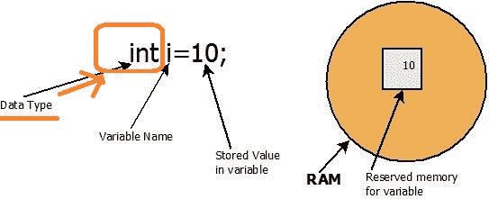

# Java 中的数据类型

> 原文： [https://howtodoinjava.com/java/basics/data-types-in-java/](https://howtodoinjava.com/java/basics/data-types-in-java/)

了解 **Java 数据类型**。 **基本数据类型**和**非基本数据类型**（或引用数据类型）之间的差异。 知道数据类型大小和最佳实践以在 Java 中使用数据类型。

## 1\. 什么是数据类型

在 Java 中，通常**数据类型与变量**关联。 变量具有三个属性：

1.  **变量名**（也称为标识符），用于引用存储器位置
2.  存储在存储位置的数据的**类型（称为数据类型）**
3.  **存储器位置**以保存该值



Java 数据类型

第二个属性（标记为红色）称为**数据类型**。 变量的数据类型决定了存储位置可以保存的值的**范围。 因此，为变量分配的**内存量取决于其数据类型**。 例如，为`'int'`数据类型的变量分配了 32 位内存。**

> Java 是一种静态类型的语言。 这意味着**必须先声明所有变量，然后才能使用**。

```java
boolean flag = true;

int counter = 20;

```

## 2\. Java 中的数据类型

Java 支持**两种数据类型**，即**基本数据类型**和*非基本*或**引用数据类型**。

#### 2.1 原始数据类型

直接*的原始数据类型*在内存中保存一个值。 例如，数字或字符。 原始数据类型不是
对象，也不是对对象的引用。

存储在原始类型中的值称为*字面值*。 **字面值**是固定值的源代码表示； 字面值直接在您的代码中表示，无需计算。

在 Java 中，我们有 8 种原始数据类型。

| 数据类型 | 描述 | 默认值 | 记忆体大小 |
| `boolean` | `true`或`false`的二进制值 | `false` | 1 位 |
| `char` | 任何 Unicode 字符 | `\ u0000（0）` | 16 位 Unicode 字符 |
| `byte` | 值从-128 到 127 | 0 | 8 位有符号值 |
| `short` | 值从-32768 到 32767 | 0 | 16 位有符号值 |
| `int` | 值从-2 <sup>31</sup> 到 2 <sup>31</sup> -1 | 0 | 32 位有符号值 |
| `long` | 值从-2 <sup>63</sup> 到 2 <sup>63</sup> -1 | 0 | 64 位浮点值 |
| `float` | [IEEE 754 浮点](https://en.wikipedia.org/wiki/IEEE_754) | 0.0 | 32 位浮点值 |
| `double` | IEEE 754 浮点 | 0.0 | 64 bit floating point value |

> 在 Java SE 7 和更高版本中，任何数量的**下划线**字符（`'_'`）都可以出现在数字字面值中数字之间的任何位置。 例如 `10_000_000`是 Java 中的有效数字。

#### 2.1.1 原始类型之间的类型转换

除`boolean`之外，您可以将一个原始值分配给另一个原始类型。 但是，当将较大存储容量的图元分配给具有较小存储容量的图元时，有时可能会导致**数据丢失**。 就像您要从大容器中转移水，然后将小容器中的水转​​移一样，所以自然而然地就会流失水。

```java
int counter = 20_000_000;

//Assign int to short (data loss)
short shortCounter = (short) counter;

//assign int to long (no data loss)
long longCounter = counter;

System.out.println(counter);            //20000000
System.out.println(shortCounter);       //11520
System.out.println(longCounter);        //20000000

```

请注意，当 Java 检测到类型转换可能会导致数据丢失（较大的数据类型转换为较小的数据类型）时，会给出**类型不匹配错误**，并明确要求**类型转换为**（例如'int '到'short'分配）。 它有助于检测和解决意外的数据丢失分配。

#### 2.2 非原始数据类型

非原始或引用数据类型将对对象的引用保存在内存中。 使用存储在变量中的引用，您可以访问引用对象的字段和方法。

例如，`java.lang.String`是 Java 库中定义的类，您可以使用它来处理文本（字符序列）。 您将类型为`String`的引用变量声明为：

```java
String str = new String( "Hello World !!" );

```

执行此代码会怎样？ 首先，分配一个存储块，并将变量`str`的名称与该存储位置关联。 此过程与声明原始数据类型变量的过程相同。

代码的第二部分在内存中使用文本`"Hi"`创建一个新的`String`对象，并将`String`对象的引用（或内存地址）存储到变量`'str'`中。

#### 2.2.1 多个引用可以引用同一对象

您还可以将存储在一个引用变量中的对象的引用分配给另一引用变量。 在这种情况下，两个引用变量都将引用内存中的同一对象。

```java
// Declares String reference variable str1 and str2
String str1;
String str2;

// Assigns the reference of a String object "Hello" to str1
str1 = new String( "Hello World !!" );

// Assigns the reference stored in str1 to str2
str2 = str1;

System.out.println( str1 );         //Hello World !!
System.out.println( str2 );         //Hello World !!

```

There is a reference constant (also known as reference literal) **null**, which can be assigned to any reference variable. If `null` is assigned to a reference variable, it means that the reference variable is not referring to any object in memory.

#### 2.2.2 包装类

Wrapper 类是其对象**包装或包含原始数据类型**的类。 换句话说，我们可以将原始值包装到包装类对象中。

请注意，Java 有**一个包装类，映射到每种原始数据类型**。 例如，`java.lang.Integer`类是`int`数据类型的对象版本。 同样，对于所有 8 种基本数据类型，我们总共有 8 个包装器类。

包装器类名称与原始数据类型名称相同，仅以大写字母开头。

这些包装器类别是`Boolean`，`Byte`，`Short`，`Character`，`Integer`，`Long`，`Float`和`Double`。

#### 2.2.3 自动装箱

在 Java 中，可以直接将原始类型值分配给包装器类。 例如，您可以将 **int** 值分配给 **Interger** 类引用。

```java
Integer counter = 20;

static Float PI = 3.14f;

```

> 值得一提的是，所有包装器类实例都是不可变的。 由于性能原因，它们还维护[内部缓存。](https://howtodoinjava.com/java/basics/object-initialization-best-practices-internal-caching-in-wrapper-classes/)

## 3\. 原始和非原始数据类型之间的区别

1.  原始类型直接存储值，称为字面值。 引用类型将对实际对象的引用存储在存储区中。
2.  有 8 种固定的原始数据类型。 在 Java 中，每个类都是包含包装器类的数据类型。

## 4\. 最佳做法

1.  使用 Java 变量命名约定并遵循最佳实践。
2.  将原始类型用于范围内局部变量。 例如 内部方法，用于循环和中间结果的计数器。
3.  在方法或类之间传输数据时，最好使用对象，因为只会复制它们的引用，而不会增加内存开销。
4.  在处理集合（需要对象）时，应使用对象。
5.  通过网络发送数据时，请使用对象并使它们成为**可序列化的**。 包装器类可自动序列化。
6.  始终知道您将需要的数据类型的大小。 使用适当的数据大小。 使用`int`存储`boolean`值（0 和 1）会浪费内存。
7.  在数字中使用下划线（Java 7 以上）。 这使它们**更具可读性**。

学习愉快！

阅读更多：

[SO 线程](https://stackoverflow.com/questions/13902281/best-practices-what-to-use-wrapper-classes-or-primitive-data-types)
[Oracle 文档](https://docs.oracle.com/javase/tutorial/java/nutsandbolts/variablesummary.html)