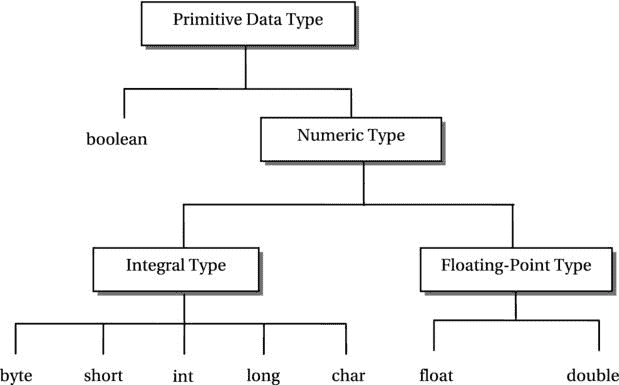

# Java 中的原始数据类型

> 原文： [https://howtodoinjava.com/java/basics/primitive-data-types-in-java/](https://howtodoinjava.com/java/basics/primitive-data-types-in-java/)

了解 Java 中所有八种**基本数据类型**，它们的内存大小，默认值以及最大值和最小值范围。

原始数据类型由语言预先定义，并由**保留关键字**命名。 让我们在下面的图片中查看每种原始数据类型。



Java 中的原始数据类型

## 1.集成数据类型

整数数据类型是数值数据类型，其值为**整数**。 Java 提供**五个整数数据类型**：`byte`，`short`，`int`，`long`和`char`。

#### 1.1。 int 数据类型

*   `int`数据类型是 **32 位带符号的** Java 基本数据类型。 `int`数据类型的变量占用 **32 位内存**。
*   其有效范围是 *-2,147,483,648* 至 *2,147,483,647* （-2 <sup>31</sup> 至 2 <sup>31</sup> – 1）。
*   此范围内的所有整数都称为**整数文字**（或整数常量）。 例如，10，-200、0、30、19 等是 int 的整数文字。

可以将整数文字分配给`int`变量，例如`counter`，如下所示：

```java
int counter = 21;

```

##### 1.1.1。 整数包装器类

Java 有一个名为`Integer`的包装器类，该包装器类定义了两个常量来表示 int 数据类型`Integer.MAX_VALUE`和`Integer.MIN_VALUE`的最大值和最小值。 它是 int 值的对象表示。

```java
int max = Integer.MAX_VALUE; // Assigns maximum int value to max
int min = Integer.MIN_VALUE; // Assigns minimum int value to min

```

#### 1.2。 长数据类型

*   **long 数据类型是 **64 位带符号的** Java 基本数据类型**。
*   当对整数的计算结果可能超出 int 数据类型的范围时，将使用它。
*   其范围是-2 <sup>63</sup> 到 2 <sup>63</sup> – 1。
*   long 范围内的所有整数都称为 long 类型的**整数文字。**

long 类型的整数文字始终以“ L”（或小写的“ l”）结尾。

```java
long num1 = 0L;
long num2 = 401L;
long mum3 = -3556L;

```

##### 1.2.1。 型铸

即使`long`变量中存储的值恰好在`int`数据类型的范围内，也不允许从 long 到 int 的赋值，而无需显式**类型转换**， 如下例所示：

```java
int num1 = 5;
long num2 = 25L;

// A compile-time error. Even if num2's value 25 which is within the range of int.
num1 = num2;

```

**如果要将`long`变量的值分配给`int`变量，则必须在代码**中明确提及这一事实，以便 Java 确保您知道可能存在数据 溢出。 您可以使用 Java 中的“ cast”来执行此操作，如下所示：

```java
long num1 = (int) num2; // Now it is fine because of the "(int)" cast

```

通过编写`(int)num2`，您将指示 Java 将`num2`中存储的值视为 int。 在运行时，Java 将仅使用`num2`的 32 个最低有效位，并将存储在这 32 位中的值分配给`num1`。 如果`num2`的值超出 int 数据类型的范围，则`num1`中不会获得相同的值，并且会导致**数据丢失**。

##### 1.2.2。 长包装类

Java 具有类`Long`（请注意 Long 中的大写 L），该类定义了两个常量来表示长数据类型的最大值和最小值`Long.MAX_VALUE`和`Long.MIN_VALUE`。

```java
long max = Long.MAX_VALUE;
long min = Long.MIN_VALUE;

```

#### 1.3。 字节数据类型

*   **字节数据类型是 **8 位带符号的** Java 基本整数数据类型**。
*   其范围是-128 至 127（-27 至 27 – 1）。 这是 Java 中可用的**最小整数数据类型**。
*   与`int`和`long`文字不同，没有字节文字。
*   但是，您可以将属于 byte 范围的任何 int 文字分配给 byte 变量。

```java
byte b1 = 125;
byte b2 = -11;

```

##### 1.3.1。 型铸

如果将`int`文字分配给`byte`变量，并且该值超出字节数据类型的范围，则 Java 会生成编译器错误。 以下代码段将产生编译器错误：

```java
// An error. 150 is an int literal outside -128 to 127
byte b3 = 150;

```

Java 不允许您将范围较大的数据类型的变量的值分配给范围较小的数据类型的变量，因为在进行这种分配时可能会**失去精度**。 要进行从 int 到 byte 的赋值，必须像在 long to to int 赋值时那样使用强制转换。

```java
b1 = (byte)num1; // Ok

```

##### 1.3.2。 字节包装器类

Java 具有类`Byte`（请注意，字节中的大写 B），该类定义了两个常量来表示字节数据类型的最大值和最小值`Byte.MAX_VALUE`和 `Byte.MIN_VALUE`。

```java
byte max = Byte.MAX_VALUE;
byte min = Byte.MIN_VALUE;

```

#### 1.4。 短数据类型

*   `short`数据类型是 **16 位带符号的** Java 基本整数数据类型。 其范围是-32768 至 32767（或-215 至 215 – 1）。*   与 int 和 long 文字不同，没有 short 文字。*   但是，您可以将任何在 short（-32768 到 32767）范围内的 int 文字分配给 short 变量。

```java
short s1 = 12905;   // ok
short s2 = -11890;  // ok

```

字节变量的值始终可以分配给 short 变量，因为 byte 数据类型的范围在 short 数据类型的范围内。 将值从 int 或 long 变量分配给 short 变量的所有其他规则与字节变量的规则相同。

##### 1.4.1。 短包装类

Java 有一个名为`Short`的类（在缩写中注意大写字母 S），它定义了两个常量来表示 short 数据类型的最大值和最小值`Short.MAX_VALUE`和`Short.MIN_VALUE`。

```java
short max = Short.MAX_VALUE;
short min = Short.MIN_VALUE;

```

#### 1.5。 char 数据类型

*   char 数据类型是 **16 位无符号** Java 基本数据类型。
*   它表示 **Unicode 字符**。
*   请注意，char 是无符号数据类型。 因此，char 变量不能具有负值。
*   char 数据类型的范围是 0 到 65535，与 Unicode 集的范围相同。
*   字符文字表示 char 数据类型的值。

```java
char c1 = 'A';
char c2 = 'L';
char c3 = '5';
char c4 = '/';

```

##### 1.5.1。 字符转义序列

字符文字也可以表示为**字符转义序列**。 字符转义序列以反斜杠开头，后跟一个字符，并且两者都用单引号引起来。

**共有八个预定义的字符转义序列**，如下所示：

| 字符转义序列 | 描述 |
| ‘\ n’ | 换行 |
| ‘\ r’ | 回车 |
| '\F' | 换页 |
| ‘\ b’ | 退格键 |
| ‘\ t’ | 标签 |
| ‘\\’ | 反斜杠 |
| ‘\”‘ | 双引号 |
| ‘\” | 单引号 |

这些只是 Java 中的八个字符转义序列。 您不能定义自己的字符转义序列。

##### 1.5.2。 Unicode 转义序列

字符文字也可以表示为`'\uxxxx'`形式的 Unicode 转义序列，此处 **\ u** （反斜杠紧跟小写的 u）表示 Unicode 转义序列的开始，并且[ **xxxx** 恰好代表四个十六进制数字。

```java
char c1 = 'A';
char c2 = '\u0041';  // Same as c2 = 'A'

```

## 2.浮点数据类型

包含**小数部分**的浮点数被称为**实数**，例如 3.25、0.49，-9.19 等。

#### 数字如何存储在内存中

将实数转换为二进制表示形式时，计算机还必须存储数字中小数点的位置。 有两种策略可以将实数存储在计算机内存中。

1.  **定点数字格式** –仅存储数字的二进制表示，并假定在该点之前和之后始终有固定数量的数字。 一个点在数字的十进制表示形式中称为**小数点**，在二进制表示形式中称为二进制点。 点的位置始终固定在数字中的表示类型称为“定点”数字格式。
2.  **浮点数格式** –存储实数的二进制表示形式以及该点在实数中的位置。 由于在这种实数表示中，点之前和之后的位数可能会有所不同，因此我们说该点可以浮动。 这种表示形式称为“浮点”格式。

与定点表示相比，浮点表示的**速度较慢，准确度较低**。 但是，与定点表示相比，浮点表示可以在相同的计算机内存中处理更大范围的数字。

> Java 支持“浮点”数字格式。


IEEE-754 32 位单精度浮点数

Java 有两种浮点数字数据类型： **float** 和 **double** 。

#### 2.1。 浮动数据类型

float 数据类型使用 **32 位**以 [IEEE 754 标准格式](https://en.wikipedia.org/wiki/IEEE_754)存储浮点数（*单精度浮点数*）。 它的实数大小可小至 1.4 x 10 <sup>-45</sup> ，大至 3.4 x 10 <sup>38</sup> 。 该范围仅包括幅度。 它可以是正面的或负面的。

所有以'f'或'F'结尾的实数都称为**浮点文字**。

```java
float f1 = 8F;
float f2 = 8.F;
float f3 = 8.0F;

```

##### 2.1.1。 正负无穷大

float 数据类型定义两个无限性：正无穷大和负无穷大。 例如，将`2.5F`除以`0.0F`的结果是浮点正无穷大，而`2.5F`除以`-0.0F`的结果是浮点负无穷大。

##### 2.1.2。 NaN（非数字）

未对 float 上的某些操作结果进行定义。 这些结果由称为 NaN（非数字）的 float 数据类型的特殊值表示。

`Float`类定义了三个常量，分别表示 float 数据类型的正无穷大，负无穷大和 NaN。 还有两个常量，它们代表可以存储在 float 变量中的最大值和最小值（大于零）。

```java
Float.POSITIVE_INFINITY - Positive infinity of type float.
Float.NEGATIVE_INFINITY - Negative infinity of type float.
Float.NaN - Not a Number of type float.
Float.MAX_VALUE - The largest positive value that can be represented in a float variable.
Float.MIN_VALUE - The smallest positive value greater than zero that can be represented in a float variable. 

```

Please note that the value of all integral types (int, long, byte, short, and char) can be assigned to a variable of the float data type without using an explicit cast, BUT a float value must be cast before it is assigned to a variable of any integral data type int, long, byte, short, or char.

#### 2.2。 双重数据类型

double 数据类型使用 **64 位**以“ IEEE 754 标准格式”存储浮点数。 根据 IEEE 754 标准，以 64 位表示的浮点数也称为**双精度浮点数**。

所有实数都称为**双字面量**。 双精度文字可以选择以“ d”或“ D”结尾，例如 19.27d。 但是，后缀 d 或 D 在双字面量中是可选的。 也就是说，19.27d 和 19.27d 都代表相同的双字面量。

```java
double d1 = 8D
double d2 = 8.;
double d3 = 8.0;
double d4 = 8.D;

```

像 float 数据类型一样，double 数据类型定义了最大值，最小值，两个整数和一个 NaN 值。

```java
Double.POSITIVE_INFINITY - Positive infinity of type double.
Double.NEGATIVE_INFINITY - Negative infinity of type double.
Double.NaN - Not a Number of type double.
Double.MAX_VALUE - The largest positive value that can be represented in a double variable.
Double.MIN_VALUE - The smallest positive value greater than zero that can be represented in a double variable. 

```

## 3.布尔值

#### 3.1。 布尔数据类型

布尔数据类型只有两个有效值： **true** 和 **false** 。 这两个值称为**布尔文字**。 您可以将布尔文字用作

```java
boolean done; // Declares a boolean variable named done
done = true;  // Assigns true to done

```

需要注意的重要一点是*布尔变量不能转换为任何其他数据类型，反之亦然*。 Java 没有指定布尔数据类型的大小。 它的大小由 JVM 实现决定。 通常，布尔数据类型的值在内部以字节存储。

这就是 Java 中可用的 8 种原始数据类型的全部内容。

学习愉快！

阅读更多：

[Oracle Java 文档](https://docs.oracle.com/javase/tutorial/java/nutsandbolts/datatypes.html)
[数据演示文稿](http://www.ntu.edu.sg/home/ehchua/programming/java/datarepresentation.html)