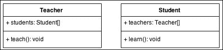
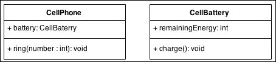
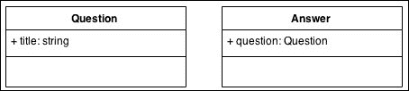
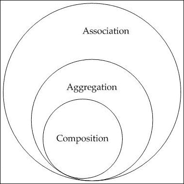

# 关联，聚合和组合

> 原文： [https://howtodoinjava.com/oops/association-aggregation-composition/](https://howtodoinjava.com/oops/association-aggregation-composition/)

关联，聚合和组合是类在面向对象编程中可以具有的三种关系。 让我们了解它们之间的区别。

```java
Table of Contents

1\. Association
2\. Aggregation
3\. Composition
4\. Summary
```

## 1\. Java 关联

我们称其为**关联**的关系，这些关系的**对象具有独立的生命周期**，而在对象之间没有**所有权。**

让我们以老师和学生为例。 多个学生可以与一个老师联系，一个学生可以与多个老师联系，但是两者都有自己的生命周期（可以独立创建和删除）； 因此，当教师离开学校时，我们不需要删除任何学生，而当学生离开学校时，我们不需要删除任何老师。



## 2\. Java 中的聚合

我们将那些**对象具有独立生命周期但有所有权**且子对象不能属于另一个父对象的关系称为**聚合**。

让我们以手机和手机电池为例。 一块电池可以属于一部电话，但是如果该电话停止工作，并且我们从数据库中删除了该电池，则由于该电池仍可以工作，因此不会删除该电池。 因此，总的来说，尽管拥有所有权，但是对象具有自己的生命周期。



## 3\. Java 的组合

我们使用术语**组合**来指代其对象**没有独立生命周期**的关系，而*如果删除了父对象，则所有子对象也将被删除*。

让我们以问题和答案之间的关系为例。 单个问题可以有多个答案，并且答案不能属于多个问题。 如果我们删除问题，答案将自动删除。



## 4\. 总结

有时，决定我们应该使用关联，聚合还是组合可能是一个复杂的过程。 造成此困难的部分原因是聚合和组合是关联的子集，这意味着它们是关联的特定情况。



关联，聚合和构成关系

将我的问题放在评论部分。

学习愉快！