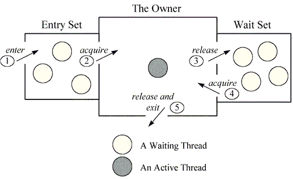

# 锁和监视器之间的区别– Java 并发

> 原文： [https://howtodoinjava.com/java/multi-threading/multithreading-difference-between-lock-and-monitor/](https://howtodoinjava.com/java/multi-threading/multithreading-difference-between-lock-and-monitor/)

您可能在采访中遇到了这个问题，锁和监视器之间的**有什么区别？ 好吧，要回答这个问题，您必须对 Java 多线程如何在后台工作有足够的了解。**

答案很简单，锁为实现监视器提供了必要的支持。 长答案在下面阅读。

## 锁具

**锁是一种数据，在逻辑上是堆内存中对象标头的一部分。** JVM 中的每个对象都具有此锁（或互斥锁），任何程序均可使用该锁来协调对该对象的多线程访问。 如果有任何线程想要访问该对象的实例变量； 那么线程必须“拥有”对象的锁（在锁存储区域中设置一些标志）。 尝试访问该对象变量的所有其他线程必须等待，直到拥有该线程的线程释放该对象的锁（取消设置标志）。

线程拥有锁后，它可以多次请求相同的锁，但是在将锁提供给其他线程之前，必须释放相同的次数。 例如，如果一个线程请求了三次锁定，则该线程将继续拥有该锁定，直到它“释放”了三次。

请注意，当线程明确要求锁时，它是由线程获得的。 在 Java 中，这是通过 synced 关键字或`wait`和`notify`完成的。

## 监控器

**Monitor 是一个同步构造，它允许线程具有互斥（使用锁）和协作**，即使线程能够等待某些条件成立的能力（使用 **wait-set** ） 。

换句话说，每个 Java 对象与实现锁的数据在逻辑上均与实现`wait-set`的数据相关联。 锁可以帮助线程在共享数据上独立工作而不会互相干扰，而等待集可以帮助线程相互协作以共同努力实现一个共同的目标，例如 所有等待线程都将移至该等待集，一旦释放锁定，所有通知线程都将得到通知。 **此等待集通过锁定（mutex）的附加帮助来帮助构建监视器。**

#### 互斥

简单来说，监视器就像一栋建筑物，其中包含一个特殊的房间（对象实例），一次只能占用一个线程。 房间中通常包含一些数据，需要保护这些数据以防止并发访问。 从线程进入该房间的时间到它离开的时间，它可以独占访问该房间中的任何数据。 进入显示器大楼称为“进入显示器”。 进入建筑物内的特别房间称为“获取显示器”。 占领房间称为“拥有显示器”，离开房间称为“释放显示器”。 离开整个建筑物称为“退出监视器”。

当线程到达以访问受保护的数据（进入特殊房间）时，首先将其放入建筑物接收队列中（条目集）。 如果没有其他线程在等待（监视器拥有），则该线程获取锁并继续执行受保护的代码。 线程完成执行后，它将释放锁并退出建筑物（退出监视器）。

如果一个线程到达并且另一个线程已经拥有监视器，则它必须在接收队列中等待（条目集）。 当前所有者退出监视器时，新到达的线程必须与也在入口集中等待的任何其他线程竞争。 只有一个线程会赢得比赛并拥有锁。

**没有等待设置功能。**

#### 合作

通常，互斥仅在多个线程共享数据或其他资源时才重要。 如果两个线程无法使用任何通用数据或资源，则它们通常不会互相干扰，也不必以互斥的方式执行。 互斥有助于防止线程在共享数据时相互干扰，而协作则可以帮助线程共同努力实现某个共同目标。

**当一个线程需要某些数据处于特定状态而另一个线程负责使数据进入该状态时，合作非常重要。 生产者/消费者问题**，其中读取线程需要缓冲区处于“非空”状态才能从缓冲区中读取任何数据。 如果读取线程发现缓冲区为空，则必须等待。 写线程负责用数据填充缓冲区。 一旦写入线程完成了更多写入操作，读取线程便可以进行更多读取操作。 有时也称为“ **等待并通知**”或“ **信号并继续**”监视器，因为它保留了监视器的所有权，并在需要时继续执行监视器区域（继续）。 在稍后的某个时间，通知线程释放监视器，并且等待线程恢复拥有该锁。

**这种合作需要输入集和等待集。** 下面给出的示意图将帮助您理解这种合作。

上图将监视器显示为三个矩形。 在中心，一个大矩形包含一个线程，即显示器的所有者。 在左侧，一个小矩形包含条目集。 在右侧，另一个小矩形包含等待集。

我希望以上讨论将有助于您获得更多见识。 免费免费问任何问题。

学习愉快！