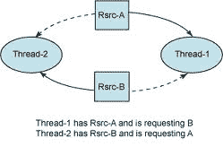

# Java 死锁示例和解决方案

> 原文： [https://howtodoinjava.com/java/multi-threading/writing-a-deadlock-and-resolving-in-java/](https://howtodoinjava.com/java/multi-threading/writing-a-deadlock-and-resolving-in-java/)

通过示例，以编程方式学习在 Java 中创建死锁。 还学习**检测死锁**以及如何**解决源代码**中的死锁情况。

在我以前的文章中，我写了关于 *[当属性文件](//howtodoinjava.com/java-7/auto-reload-of-configuration-when-any-change-happen/ "Auto reload of configuration when any change happen")* 中发生任何更改时自动重载配置的信息，我讨论了有关使用 **Java WatchService** 刷新应用程序配置的信息。 由于配置是共享资源，并且通过[线程](https://docs.oracle.com/javase/6/docs/api/java/lang/Thread.html "Java Thread class")进行访问时，总是有机会编写不正确的代码，而这可能导致死锁。

## 1.死锁

在 Java 中，[死锁](https://en.wikipedia.org/wiki/Deadlock)是这样的情况，其中至少有两个线程在某个不同的资源上持有锁，并且两个线程都在等待其他资源完成其任务。 而且，没有人能够锁定它所持有的资源。



死锁场景

在上述情况下，`Thread-1`具有`A`但需要`B`才能完成处理，类似地`Thread-2`具有资源`B`但首先需要`A`。

```java
package thread;

public class ResolveDeadLockTest {

	public static void main(String[] args) {
		ResolveDeadLockTest test = new ResolveDeadLockTest();

		final A a = test.new A();
		final B b = test.new B();

		// Thread-1
		Runnable block1 = new Runnable() {
			public void run() {
				synchronized (a) {
					try {
						// Adding delay so that both threads can start trying to
						// lock resources
						Thread.sleep(100);
					} catch (InterruptedException e) {
						e.printStackTrace();
					}
					// Thread-1 have A but need B also
					synchronized (b) {
						System.out.println("In block 1");
					}
				}
			}
		};

		// Thread-2
		Runnable block2 = new Runnable() {
			public void run() {
				synchronized (b) {
					// Thread-2 have B but need A also
					synchronized (a) {
						System.out.println("In block 2");
					}
				}
			}
		};

		new Thread(block1).start();
		new Thread(block2).start();
	}

	// Resource A
	private class A {
		private int i = 10;

		public int getI() {
			return i;
		}

		public void setI(int i) {
			this.i = i;
		}
	}

	// Resource B
	private class B {
		private int i = 20;

		public int getI() {
			return i;
		}

		public void setI(int i) {
			this.i = i;
		}
	}
}

```

由于非常明显的原因，上面的代码运行将导致死锁（如上所述）。 现在我们必须解决这个问题。

## 2.如何避免死锁

我相信，解决任何问题的方法都在于确定问题的根源。 在我们的情况下，这是访问资源`A`和`B`的模式，这是主要问题。 因此，要解决此问题，我们将仅对代码访问共享资源的语句重新排序。

```java
       // Thread-1
	Runnable block1 = new Runnable() {
		public void run() {
			synchronized (b) {
				try {
					// Adding delay so that both threads can start trying to
					// lock resources
					Thread.sleep(100);
				} catch (InterruptedException e) {
					e.printStackTrace();
				}
				// Thread-1 have A but need B also
				synchronized (a) {
					System.out.println("In block 1");
				}
			}
		}
	};

	// Thread-2
	Runnable block2 = new Runnable() {
		public void run() {
			synchronized (b) {
				// Thread-2 have B but need A also
				synchronized (a) {
					System.out.println("In block 2");
				}
			}
		}
	};

```

在上课之前再次运行，您将不会遇到任何死锁情况。 我希望，它将帮助您避免死锁，如果遇到死锁，也可以解决死锁。

学习愉快！