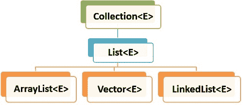

# Java `ArrayList`指南

> 原文： [https://howtodoinjava.com/java-arraylist/](https://howtodoinjava.com/java-arraylist/)

Java 中的 `ArrayList`表示可调整大小的对象列表。 我们可以在此列表中添加，删除，查找，排序和替换元素。 `ArrayList`是 Java 的集合框架的一部分，并实现 Java 的`List`接口。

**`ArrayList`类**的层次结构

Java `ArrayList`类扩展了实现`List`接口的`AbstractList`类。 `List`接口以分层顺序扩展了`Collection`和`Iterable`接口。



ArrayList 层次结构

## 1\. `ArrayList`功能

`ArrayList`具有以下功能：

1.  **有序** – `ArrayList`中的元素保留其顺序，默认情况下是其添加到列表的顺序。
2.  **基于索引** – 可以使用索引位置随机访问元素。 索引以`'0'`开头。
3.  **动态调整大小** – 当需要添加的元素数量超过当前大小时，`ArrayList`动态增长。
4.  **不同步** – 默认情况下，`ArrayList`不同步。 程序员需要适当地使用`synchronized`关键字，或简单地使用`Vector`类。
5.  **允许重复** – 我们可以在`ArrayList`中添加重复元素。 不能成组放置。

## 2\. `ArrayList`的内部工作

`ArrayList`类是围绕后备数组实现的。 从`arraylist`添加或删除的元素实际上是在此后备数组中修改的。 所有`arraylist`方法都访问此数组并获取/设置数组中的元素。

`ArrayList`基本上可以看作是 Java 中可调整大小的数组实现。

```java
public class ArrayList<E> extends AbstractList<E>
        implements List<E>, RandomAccess, 
        		   Cloneable, java.io.Serializable
{
	transient Object[] elementData;		//backing array
	private int size;					//array or list size

	//more code
}

```

## 3\. `ArrayList`示例

#### 3.1 创建`ArrayList`

通常，我们将创建一个空列表并向其中添加元素。 或者，我们将使用另一个现有集合创建一个`arraylist`。

```java
//Empty arraylist
List<String> names = new ArrayList<>(); 

//Arraylist initialized with another collection
List<Integer> numbers = new ArrayList<>(Arrays.asList(1,2,3,4,5)); 

```

#### 3.2 添加和删​​除元素

使用`add()`，`set()`和`remove()`方法添加或更新列表中的元素。

```java
//Create arraylist
List<String> names = new ArrayList<>(); 

names.add("lokesh");    //[lokesh]
names.add("alex");      //[lokesh, alex]

names.set(1, "brian");  //[lokesh, brian]

names.remove(1);        //[lokesh]

```

#### 3.2 迭代

使用`iterator()`或`listIterator()`获取迭代器实例的引用。 该迭代器可用于迭代`arraylist`中的元素。

```java
ArrayList<Integer> digits = new ArrayList<>(Arrays.asList(1,2,3,4,5,6));

Iterator<Integer> iterator = digits.iterator();

while(iterator.hasNext()) {
	System.out.println(iterator.next());
}

```

程序输出。

```java
1
2
3
4
5
6

```

## 4\. `ArrayList`方法

[`ArrayList add()`方法示例](https://howtodoinjava.com/java/collections/arraylist/arraylist-add-example/)

[`ArrayList addAll()`方法示例](https://howtodoinjava.com/java/collections/arraylist/arraylist-addall-method-example/)

[`ArrayList clear()`方法示例](https://howtodoinjava.com/java/collections/arraylist/clear-empty-arraylist/)

[`ArrayList clone()` – 如何克隆`ArrayList`](https://howtodoinjava.com/java/collections/arraylist/arraylist-clone-deep-copy/)

[`ArrayList contains()`方法示例](https://howtodoinjava.com/java/collections/arraylist/arraylist-contains/)

[`ArrayList sureCapacity()`方法示例](https://howtodoinjava.com/java/collections/arraylist/arraylist-ensurecapacity-method/)

[`ArrayList forEach()`方法示例](https://howtodoinjava.com/java/collections/arraylist/arraylist-foreach/)

[`ArrayList get()`方法示例](https://howtodoinjava.com/java/collections/arraylist/arraylist-get-method-example/)

[`ArrayList indexOf()`方法示例](https://howtodoinjava.com/java/collections/arraylist/arraylist-indexof-method/)

[`ArrayList lastIndexOf()`方法示例](https://howtodoinjava.com/java/collections/arraylist/arraylist-lastindexof-example/)

[`ArrayList listIterator()`方法示例](https://howtodoinjava.com/java/collections/arraylist/arraylist-listiterator/)

[`ArrayList remove()`方法示例](https://howtodoinjava.com/java/collections/arraylist/arraylist-remove-example/)

[`ArrayList removeAll()`方法示例](https://howtodoinjava.com/java/collections/arraylist/arraylist-removeall/)

[`ArrayList keepAll()`方法示例](https://howtodoinjava.com/java/collections/arraylist/arraylist-retainall-example/)

[`ArrayList replaceAll()`方法示例](https://howtodoinjava.com/java/collections/arraylist/arraylist-replaceall-example/)

[`ArrayList removeIf()`方法示例](https://howtodoinjava.com/java/collections/arraylist/arraylist-removeif/) 

[`ArrayList sort()`方法示例](https://howtodoinjava.com/java/collections/arraylist/arraylist-sort-objects-by-field/)

[`ArrayList spliterator()`方法示例](https://howtodoinjava.com/java/collections/arraylist/arraylist-spliterator-example/)

[`ArrayList subList()`方法示例](https://howtodoinjava.com/java/collections/arraylist/arraylist-sublist/)

[`ArrayList toArray()`方法示例](https://howtodoinjava.com/java/collections/arraylist/convert-arraylist-to-array/)

## 5\. Java `ArrayList`示例

#### 5.1 创建`ArrayList`

[初始化`ArrayList`](https://howtodoinjava.com/java/collections/arraylist/initialize-arraylist/)

[迭代`ArrayList`](https://howtodoinjava.com/java/collections/arraylist/iterate-through-objects/)

#### 5.2 添加元素并删除元素

[在`ArrayList`的特定索引处添加元素](https://howtodoinjava.com/java/collections/arraylist/add-replace-element-at-index/)

[从`ArrayList`中删除元素](https://howtodoinjava.com/java/collections/arraylist/remove-element-from-arraylist/)

[将多个项目添加到`ArrayList`](https://howtodoinjava.com/java/collections/arraylist/add-multiple-elements-arraylist/)

#### 5.3 排序`ArrayList`

[对`ArrayList`排序](https://howtodoinjava.com/sort/sort-arraylist-strings-integers/)

[使用比较器和可比较对象的`ArrayList`排序](https://howtodoinjava.com/sort/sort-arraylist-objects-comparable-comparator/)

[`ArrayList`分组排序 - 多个比较器示例](https://howtodoinjava.com/sort/groupby-sort-multiple-comparators/)

[使用`Collections.sort())`方法对`ArrayList`排序](https://howtodoinjava.com/sort/collections-sort/)的对象

#### 5.4 获取/搜索

[获取`ArrayList`的子列表](https://howtodoinjava.com/java/collections/arraylist/arraylist-sublist/)

[查找`ArrayList`中元素的最后一个索引](https://howtodoinjava.com/java/collections/arraylist/arraylist-lastindexof-example/)

[获取`ArrayList`中元素的索引](https://howtodoinjava.com/java/collections/arraylist/arraylist-indexof-method/) 

[从`ArrayList`中获取元素](https://howtodoinjava.com/java/collections/arraylist/arraylist-get-method-example/)

[检查 ArrayList](https://howtodoinjava.com/java/collections/arraylist/arraylist-contains/) 中是否存在元素

## 6\. Java ArrayList 上的其他教程

[比较两个`ArrayList`](https://howtodoinjava.com/java/collections/arraylist/compare-two-arraylists/)

[同步`ArrayList`](https://howtodoinjava.com/java/collections/arraylist/synchronize-arraylist/)

[交换`ArrayList`](https://howtodoinjava.com/java/collections/arraylist/swap-two-elements-arraylist/)

[序列化`ArrayList`](https://howtodoinjava.com/java/collections/arraylist/serialize-deserialize-arraylist/)

[连接两个`ArrayList`](https://howtodoinjava.com/java/collections/arraylist/merge-arraylists/)

[清空`ArrayList`](https://howtodoinjava.com/java/collections/arraylist/empty-clear-arraylist/)

[检查`ArrayList`是否为空](https://howtodoinjava.com/java/collections/arraylist/check-arraylist-empty/)

[替换`ArrayList`中现有元素的值](https://howtodoinjava.com/java/collections/arraylist/replace-element-arraylist/)

[删除`ArrayList`中的重复元素](https://howtodoinjava.com/java/collections/arraylist/remove-duplicate-elements/) 

## 7\. 转换

[将`LinkedList`转换为`ArrayList`](https://howtodoinjava.com/java/collections/arraylist/convert-linkedlist-arraylist/)

[将向量转换为`ArrayList`](https://howtodoinjava.com/java/collections/arraylist/convert-vector-to-arraylist/)

[将`ArrayList`转换为字符串数组](https://howtodoinjava.com/java/collections/arraylist/arraylist-to-array/)

[将数组转换为`ArrayList`](https://howtodoinjava.com/java/collections/arraylist/array-to-arraylist/)

[将`HashSet`转换为`ArrayList`](https://howtodoinjava.com/java/collections/arraylist/hashset-to-arraylist/)

## 8\. 差异

[`ArrayList`与向量](https://howtodoinjava.com/java/collections/arraylist/arraylist-vs-vector/)

[`ArrayList`与`LinkedList`](https://howtodoinjava.com/java/collections/arraylist/linkedlist-vs-arraylist/)

参考文献：

[`ArrayList` Java 文档](https://docs.oracle.com/javase/10/docs/api/java/util/ArrayList.html)