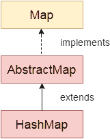

# Java HashMap 指南

> 原文： [https://howtodoinjava.com/java-hashmap/](https://howtodoinjava.com/java-hashmap/)

Java 中的 **HashMap** 在实现 **Map** 接口的集合类中。 它用于存储**键&值**对。 每个键都映射到映射中的单个值。

键是唯一的。 这意味着我们只能在地图中插入键“ K”一次。 不允许重复的密钥。 虽然值`'V'`可以映射到多个键。

## 1\. java.util.HashMap 类

#### 1.1 HashMap 类声明

[HashMap](https://docs.oracle.com/javase/8/docs/api/java/util/HashMap.html) 已声明如下：

```java
public class HashMap<K,V> extends AbstractMap<K,V> 
				implements Map<K,V>, Cloneable, Serializable  

```

#### 1.2 HashMap 类层次结构

如上所示，HashMap 实现`Map`接口并扩展`AbstractMap`类。



HashMap 层次结构

## 2\. Java HashMap 功能

*   HashMap 不能包含重复的键。
*   HashMap 允许多个`null`值，但只允许一个`null`键。
*   HashMap 是**无序集合**。 它不保证元素的任何特定顺序。
*   HashMap 是**不是线程安全的**。 您必须显式同步对 HashMap 的并发修改。 或者，您可以使用 **Collections.synchronizedMap（hashMap）**来获取 HashMap 的同步版本。
*   只能使用关联的键来检索值。
*   HashMap 仅存储对象引用。 因此，必须将原始类型与其对应的包装器类一起使用。 例如`int`
*   将存储为`Integer`。
*   HashMap 实现了**可克隆**和**可序列化**接口。

## 3\. HashMap 内部实现

HashMap 按照哈希原理工作。 在将任何公式/算法应用于其属性之后，散列是一种为任何变量/对象分配唯一代码的方法。 Java 中的每个对象都有其**哈希码**，这样两个相等的对象必须一致地产生相同的哈希码。

#### 3.1 HashMap.Entry 类

键值对存储为内部类`HashMap.Entry`的实例，该内部类将键和值映射存储为属性。 键已标记为`final`。

```java
static class Entry<K ,V> implements Map.Entry<K, V>
{
    final K key;
    V value;

    Entry<K ,V> next;
    final int hash;

    ...//More code goes here
}

```

#### 3.2 内部工作

Entry 类的所有实例都存储在声明为`'transient Entry[] table'`的数组中。 对于要存储在 HashMap 中的每个键值，使用键的哈希码计算哈希值。 该哈希值用于计算数组中用于存储 Entry 对象的**索引**。

在**冲突**的情况下，其中多个键映射到单个索引位置，形成的**链表**用来存储所有应该放在单个数组索引位置的所有键值对。

通过键检索值时，使用键的哈希码可以找到第一个索引位置。 然后，在链表中迭代所有元素，并使用 **equals（）**方法识别正确的键，从而找到正确的值对象。

## 4\. Java HashMap 示例

让我们快速浏览一些示例，以在 Java 中使用 HashMap。

#### 4.1 添加键值– HashMap.put（）

```java
import java.util.HashMap;

public class HashMapExample 
{
    public static void main(String[] args) throws CloneNotSupportedException 
    {
        HashMap<Integer, String> map = new HashMap<>();

        map.put(1,  "A");
        map.put(2,  "B");
        map.put(3,  "C");

        System.out.println(map);
    }
}

```

程序输出。

```java
{1=A, 2=B, 3=C}

```

#### 4.2 通过键获取价值– HashMap.get（）

```java
HashMap<Integer, String> map = new HashMap<>();

map.put(1,  "A");
map.put(2,  "B");
map.put(3,  "C");

String value = map.get(2);

System.out.println("The value is :: "+  value );

```

Program output.

```java
The value is :: B

```

#### 4.3 通过键删除配对– HashMap.remove（）

```java
HashMap<Integer, String> map = new HashMap<>();

map.put(1, "A");
map.put(2, "B");
map.put(3, "C");

System.out.println(map);

map.remove(3);

System.out.println(map);

```

Program output.

```java
{1=A, 2=B, 3=C}
{1=A, 2=B}

```

#### 4.4 迭代 HashMap

请注意，此类的迭代器为**快速失败**，如果在创建迭代器后进行了任何结构修改，它将抛出`ConcurrentModificationException`。

```java
HashMap<Integer, String> map = new HashMap<>();

map.put(1, "A");
map.put(2, "B");
map.put(3, "C");

System.out.println("//Iterate over keys");

Iterator<Integer> itr = map.keySet().iterator();

while (itr.hasNext()) 
{
    Integer key = itr.next();
    String value = map.get(key);

    System.out.println("The key is :: " + key + ", and value is :: " + value );
}

System.out.println("//Iterate over entries set");

Iterator<Entry<Integer, String>> entryIterator = map.entrySet().iterator();

while (entryIterator.hasNext()) 
{
    Entry<Integer, String> entry = entryIterator.next();

    System.out.println("The key is :: " + entry.getKey() + ", and value is :: " + entry.getValue() );
}

```

Program output.

```java
//Iterate over keys
The key is :: 1, and value is :: A
The key is :: 2, and value is :: B
The key is :: 3, and value is :: C

//Iterate over entries set
The key is :: 1, and value is :: A
The key is :: 2, and value is :: B
The key is :: 3, and value is :: C

```

## 5\. HashMap 方法

HashMap 类中的方法列表及其简短描述。

1.  **void clear（）**：从 HashMap 中删除所有键-值对。
2.  **对象 clone（）**：返回指定 HashMap 的浅表副本。
3.  **boolean containsKey（Object key）**：根据是否在地图中找到指定的键，返回`true`或`false`。
4.  **布尔值 containsValue（Object Value）**：类似于 containsKey（）方法，它查找指定的值而不是键。
5.  **Object get（Object key）**：返回 HashMap 中指定键的值。
6.  **boolean isEmpty（）**：检查映射是否为空。
7.  **Set keySet（）**：返回 HashMap 中存储的所有密钥的 **Set** 。
8.  **对象 put（Key k，Value v）**：将键值对插入 HashMap 中。
9.  **int size（）**：返回映射的大小，该大小等于存储在 HashMap 中的键值对的数量。
10.  **集合 values（）**：返回地图中所有值的集合。
11.  **值移除（对象键）**：移除指定键的键值对。
12.  **void putAll（Map m）**：将地图的所有元素复制到另一个指定的地图。

## 6\. HashMap 教程和示例

*   [HashMap 在 Java 中的工作方式](https://howtodoinjava.com/java/collections/how-hashmap-works-in-java/)
*   [不同方式对 HashMap 进行迭代的性能比较](https://howtodoinjava.com/java/collections/performance-comparison-of-different-ways-to-iterate-over-hashmap/)
*   [如何为 HashMap 设计好的自定义键对象](https://howtodoinjava.com/java/collections/design-good-key-for-hashmap/)
*   [Java 中 HashMap 和 Hashtable 之间的区别](https://howtodoinjava.com/java/collections/difference-between-hashmap-and-a-hashtable/)
*   [Java 按键对地图进行排序（升序和降序）](https://howtodoinjava.com/sort/java-sort-map-by-key/)
*   [Java 按值对地图进行排序（升序和降序）](https://howtodoinjava.com/sort/java-sort-map-by-values/)
*   [Java hashCode（）和 equals（）-合同，规则和最佳做法](https://howtodoinjava.com/java/basics/java-hashcode-equals-methods/)
*   [HashMap 和 ConcurrentHashMap 面试问题](https://howtodoinjava.com/interview-questions/hashmap-concurrenthashmap-interview-questions/)
*   [Java ConcurrentHashMap 最佳实践](https://howtodoinjava.com/java/multi-threading/best-practices-for-using-concurrenthashmap/)
*   [将 JSON 转换为 Map 并映射为 JSON](https://howtodoinjava.com/jackson/jackson-json-to-from-hashmap/)
*   [Java 中的 Marshal 和 Unmarshal HashMap](https://howtodoinjava.com/jaxb/jaxb-example-marshalling-and-unmarshalling-hashmap-in-java/)
*   [如何使用 HashMap 查找字符串中的重复单词](https://howtodoinjava.com/java/string/how-to-find-duplicate-words-in-a-string-in-java/)
*   [比较两个哈希图](https://howtodoinjava.com/java/collections/hashmap/compare-two-hashmaps/)
*   [同步 HashMap](https://howtodoinjava.com/java/collections/hashmap/synchronize-hashmap/)
*   [合并两个 HashMaps](https://howtodoinjava.com/java/collections/hashmap/merge-two-hashmaps/)

[如何克隆 HashMap](https://howtodoinjava.com/java/collections/hashmap/shallow-deep-copy-hashmap/)

学习愉快！