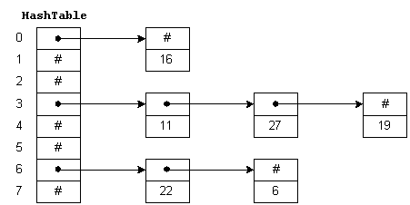
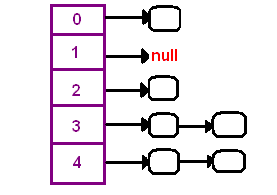

# Java Hashtable 类

> 原文： [https://howtodoinjava.com/java/collections/hashtable-class/](https://howtodoinjava.com/java/collections/hashtable-class/)

**Java Hashtable** 类是哈希表数据结构的实现。 它与 Java 中的 [HashMap](https://howtodoinjava.com/java-hashmap/) 非常相似，最显着的区别是 Hashtable 是**同步的**而 HashMap 不是。

在此**哈希表教程**中，我们将学习它的内部结构，[构造器](https://howtodoinjava.com/oops/java-constructors/)，方法，用例和其他要点。

```java
Table of Contents

1\. How Hashtable Works?
2\. Hashtable Features
3\. Hashtable Constructors
4\. Hashtable Methods
5\. Hashtable Example
6\. Hashtable Performance
6\. Hashtable vs HashMap
8\. Conclusion
```

## 1\. 哈希表如何工作？

Hashtable 内部包含存储键/值对的存储桶。 哈希表使用键的[哈希码](https://howtodoinjava.com/java/basics/java-hashcode-equals-methods/)确定键/值对应映射到哪个存储桶。



Java 哈希表

从 Key 的哈希码中获取存储桶位置的函数称为 [**哈希函数**](https://howtodoinjava.com/security/how-to-generate-secure-password-hash-md5-sha-pbkdf2-bcrypt-examples/) 。 从理论上讲，哈希函数是一种函数，当给定键时，该函数会在表中生成地址。 哈希函数总是返回对象的数字。 两个相等的对象将始终具有相同的数字，而两个不相等的对象可能并不总是具有不同的数字。

当我们将对象放入哈希表时，不同的对象（通过 equals（）方法）可能具有相同的哈希码。 这称为**冲突**。 为了解决冲突，哈希表使用列表的 **[数组](https://howtodoinjava.com/java-array/)。 映射到单个存储桶（数组索引）的对存储在列表中，列表引用存储在数组索引中。**



哈希冲突

#### 1.1 哈希表声明

Hashtable 类在 Java 中声明如下。 它**扩展了字典**类，并且**实现 Map** ，[`Cloneable`](https://howtodoinjava.com/java/cloning/a-guide-to-object-cloning-in-java/)和[`Serializable`](https://howtodoinjava.com/java/serialization/a-mini-guide-for-implementing-serializable-interface-in-java/)接口。 `'K'`是键的类型，`'V'`是键的映射值的类型。

```java
public class Hashtable<K,V>
    extends Dictionary<K,V>
    implements Map<K,V>, Cloneable, java.io.Serializable 
{
	//implementation
}

```

## 2\. 哈希表功能

有关 Java Hashtable 类的重要知识是：

1.  它类似于 HashMap，但是它是同步的，而 HashMap 没有[同步](https://howtodoinjava.com/java/multi-threading/what-is-thread-safety/)。
2.  它不接受`null`键或值。
3.  它不接受重复的密钥。
4.  它将键值对存储在内部维护列表数组的哈希表数据结构中。 每个列表可以被称为桶。 如果发生冲突，则将对存储在此列表中。
5.  Hashtable 中的枚举器不是快速失败的。

## 3\. 哈希表构造器

Hashtable 类具有四个构造器。

*   **Hashtable（）：**这是默认构造器。 它使用默认的初始容量（11）和负载因子（0.75）构造一个新的空哈希表。
*   **Hashtable（整数大小）：**它构造一个具有指定初始大小的新的空哈希表。
*   **Hashtable（int size，float fillRatio）：**构造一个具有指定初始大小和填充率的新的空哈希表。
*   **Hashtable（Map m）：**构造一个哈希表，该哈希表使用指定映射中的键值对初始化。

请注意，**初始容量**是指哈希表中的存储桶数。 需要最佳数量的存储桶来存储具有最小冲突（以提高性能）和有效内存利用率的键值对。

**填充率**确定在增加哈希表的容量之前可以达到多少。 它的值介于 0.0 到 1.0 之间。

## 4\. 哈希表方法

Hashtable 类中的方法与 HashMap 非常相似。 看一看。

*   **void clear（）**：用于删除哈希表中的所有对。
*   **boolean contains（Object value）**：如果哈希表中存在任何对，则返回`true`，否则返回`false`。 注意，该方法的功能与`containsValue()`功能相同。
*   **boolean containsValue（Object value）**：如果哈希表中存在任何对，则返回`true`，否则返回`false`。
*   **boolean containsKey（Object key）**：如果哈希表中存在任何对，则返回`true`，否则返回`false`。
*   **boolean isEmpty（）**：如果哈希表为空，则返回`true`；否则，返回 0。 如果它包含至少一个密钥，则返回`false`。
*   **void rehash（）**：用于增加哈希表的大小并重新哈希其所有键。
*   **Object get（对象键）**：它返回指定键所映射到的值。 如果找不到这样的密钥，则返回 null。
*   **对象 put（对象键，对象值）**：它将哈希表中指定的`key`映射到指定的`value`。 键和值都不能为`null`。
*   **Object remove（Object key）**：它从哈希表中删除键（及其对应的值）。
*   **int size（）**：它返回哈希表中的条目数。

## 5\. 哈希表示例

我们来看一个有关如何在 Java 程序中使用哈希表的示例。

```java
import java.util.Hashtable;
import java.util.Iterator;

public class HashtableExample 
{
    public static void main(String[] args) 
    {
        //1\. Create Hashtable
        Hashtable<Integer, String> hashtable = new Hashtable<>();

        //2\. Add mappings to hashtable 
        hashtable.put(1,  "A");
        hashtable.put(2,  "B" );
        hashtable.put(3,  "C");

        System.out.println(hashtable);

        //3\. Get a mapping by key
        String value = hashtable.get(1);        //A
        System.out.println(value);

        //4\. Remove a mapping
        hashtable.remove(3);            //3 is deleted

        //5\. Iterate over mappings
        Iterator<Integer> itr = hashtable.keySet().iterator();

        while(itr.hasNext()) 
        {
            Integer key = itr.next();
            String mappedValue = hashtable.get(key);

            System.out.println("Key: " + key + ", Value: " + mappedValue);
        }
    }
}

```

程序输出。

```java
{3=C, 2=B, 1=A}
A
Key: 2, Value: B
Key: 1, Value: A

```

## 6\. 哈希表性能

对于大多数常见操作（例如 get（），put（），contains（）等），与 Hashtable 中的 O（n）相比，性能明智的 HashMap 在 O（log（n））中执行。

Hashtable 中天真的线程安全方法（“同步每个方法”）使线程应用程序变得更加糟糕。 我们最好从外部同步 HashMap。 一个经过深思熟虑的设计将比 Hashtable 表现更好。

哈希表已过时。 最好是使用 [**ConcurrentHashMap**](https://howtodoinjava.com/java/multi-threading/best-practices-for-using-concurrenthashmap/) 类，它们提供更高的并发度。

## 7\. Hashtable 与 HashMap

让我们快速列出 Java 中 hashmap 和 hashtable 之间的**差异。**

1.  HashMap 不同步。 哈希表已同步。
2.  HashMap 允许一个空键和多个空值。 哈希表不允许使用任何 null 键或值。
3.  HashMap 很快。 由于增加了同步，哈希表很慢。
4.  HashMap 被 Iterator 遍历。 Hashtable 被 Enumerator 和 Iterator 遍历。
5.  HashMap 中的迭代器是快速失败的。 Hashtable 中的枚举器不是快速失败的。
6.  HashMap 继承 AbstractMap 类。 Hashtable 继承 Dictionary 类。

## 8\. 结论

在本教程中，我们了解了 Java Hashtable 类，其构造器，方法，现实用例，并比较了它们的性能。 我们还了解了 hastable 与 Java 中的 hashmap 有何不同。

不要在新应用程序中使用哈希表。 如果不需要并发，请使用 HashMap。 在并发环境中，更喜欢使用 ConcurrentHashMap。

在评论中把您的问题交给我。

学习愉快！

参考：

[哈希表 Java 文档](https://docs.oracle.com/javase/10/docs/api/java/util/Hashtable.html)