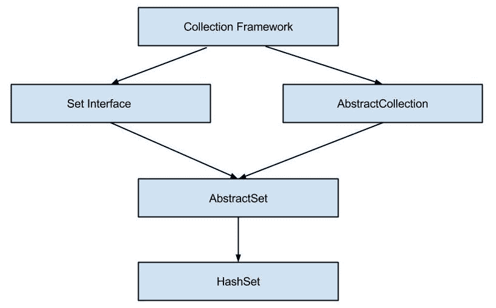

# Java HashSet 类

> 原文： [https://howtodoinjava.com/java/collections/java-hashset/](https://howtodoinjava.com/java/collections/java-hashset/)

**Java HashSet** 类实现了`Set`接口，由哈希表（实际上是[`HashMap`](https://howtodoinjava.com/java-hashmap/)实例）支持。 如果不对迭代顺序提供任何保证，并允许`null`元素。

```java
Table of Contents

1\. HashSet Hierarchy
2\. HashSet Features
3\. HashSet Constructors
4\. HashSet Methods
5\. HashSet Example
6\. HashSet Usecases
7\. HashSet Performance
8\. Conclusion
```

## 1\. HashSet 层次结构

HashSet 类扩展了实现`Set`接口的`AbstractSet`类。 Set 接口以层次结构顺序继承`Collection`和`Iterable`接口。

```java
public class HashSet<E> extends AbstractSet<E> 
				implements Set<E>, Cloneable, Serializable 
{
	//implementation
}

```



哈希集层次结构

## 2\. HashSet 功能

*   它实现了`Set`接口。
*   HashSet 中不允许重复的值。
*   HashSet 中允许一个 NULL 元素。
*   它是无序集合，并且不保证集合的迭代顺序。
*   此类为基本操作（添加，删除，包含和调整大小）提供恒定的时间性能。
*   HashSet 不同步。 如果多个线程同时访问哈希集，并且至少有一个线程修改了哈希集，则必须在外部对其进行同步。
*   使用 **Collections.synchronizedSet（new HashSet（））**方法来获取同步的哈希集。
*   此类的迭代器方法返回的迭代器为**快速失败**，并且如果在创建迭代器后的任何时间修改了集合，则可能会抛出`ConcurrentModificationException`，除了通过迭代器自己的`remove()`方法之外 。
*   HashSet 还实现了 Searlizable 和 [Cloneable](https://howtodoinjava.com/java/cloning/a-guide-to-object-cloning-in-java/) 接口。

#### 2.1 初始容量

初始容量表示创建哈希集时（在支持 HashMap 中）的存储桶数。 如果当前大小已满，则存储桶数将自动增加。

默认初始容量为 **16** 。 我们可以通过在构造器 **HashSet（int initialCapacity）**中传递默认容量来覆盖此默认容量。

#### 2.2 负载系数

负载因子是在自动增加 HashSet 容量之前允许其充满的度量。 默认负载系数为 **0.75** 。

这称为**阈值**，等于（DEFAULT_LOAD_FACTOR * DEFAULT_INITIAL_CAPACITY）。 当 HashSet 元素计数超过此阈值时，将调整 HashSet 的大小，并且新容量将是先前容量的两倍。

使用默认的 HashSet 时，内部容量为 16，负载系数为 0.75。 当表格中有 12 个元素时，存储桶数将自动增加。

## 3\. HashSet 构造器

HashSet 具有四种类型的构造器：

1.  **HashSet（）：**使用默认的初始容量（16）和默认的负载因子（0.75）初始化默认的 HashSet 实例。
2.  **HashSet（整数容量）：**初始化具有指定容量和默认加载因子（0.75）的 HashSet。
3.  **HashSet（整数容量，浮点 loadFactor）：**使用指定的初始容量和指定的负载系数初始化 HashSet。
4.  **HashSet（Collection c）：**使用与指定集合相同的元素初始化 HashSet。

## 4\. HashSet 方法

1.  **public boolean add（E e）**：如果指定的元素尚不存在，则将其添加到 Set 中。 此方法在内部使用 **equals（）**方法检查重复项。 如果元素重复，则元素被拒绝，并且不替换值。
2.  **public void clear（）**：从哈希集中删除所有元素。
3.  **public boolean contains（Object o）**：如果哈希集包含指定的元素 othrweise `false`，则返回`true`。
4.  **public boolean isEmpty（）**：如果哈希集不包含任何元素，则返回`true`，否则返回`false`。
5.  **public int size（）**：返回哈希集中的元素数。
6.  **公共迭代器< E > iterator（）**：在此哈希集中的元素上返回迭代器。 从迭代器返回的元素没有特定的顺序。
7.  **public boolean remove（Object o）**：从哈希集中删除指定的元素（如果存在）并返回`true`，否则返回`false`。
8.  **public boolean removeAll（Collection <？> c）**：删除哈希集中所有属于指定集合的​​元素。
9.  **公共对象 clone（）**：返回哈希集的浅表副本。
10.  **公共拆分器< E > spliterator（）**：在此哈希集中的元素上创建后绑定且故障快速的**拆分器**。

## 5\. Java HashSet 示例

#### 5.1 HashSet 添加，删除，迭代器示例

```java
//1\. Create HashSet
HashSet<String> hashSet = new HashSet<>();

//2\. Add elements to HashSet 
hashSet.add("A");
hashSet.add("B");
hashSet.add("C");
hashSet.add("D");
hashSet.add("E");

System.out.println(hashSet);

//3\. Check if element exists
boolean found = hashSet.contains("A");        //true
System.out.println(found);

//4\. Remove an element
hashSet.remove("D");

//5\. Iterate over values
Iterator<String> itr = hashSet.iterator();

while(itr.hasNext()) 
{
    String value = itr.next();

    System.out.println("Value: " + value);
}

```

程序输出。

```java
[A, B, C, D, E]
true
Value: A
Value: B
Value: C
Value: E

```

#### 5.2 将 HashSet 转换为数组示例

Java 示例，使用 **toArrray（）**方法将哈希集转换为[数组](https://howtodoinjava.com/java-array/)。

```java
HashSet<String> hashSet = new HashSet<>();

hashSet.add("A");
hashSet.add("B");
hashSet.add("C");
hashSet.add("D");
hashSet.add("E");

String[] values = new String[hashSet.size()];

hashSet.toArray(values);

System.out.println(Arrays.toString(values));

```

程序输出：

```java
[A, B, C, D, E]

```

#### 5.3 将 HashSet 转换为 ArrayList 示例

使用 [Java 8 流 API](https://howtodoinjava.com/java8/java-8-tutorial-streams-by-examples/) 将哈希集转换为[数组列表](https://howtodoinjava.com/java-arraylist/)的 Java 示例。

```java
HashSet<String> hashSet = new HashSet<>();

hashSet.add("A");
hashSet.add("B");
hashSet.add("C");
hashSet.add("D");
hashSet.add("E");

List<String> valuesList = hashSet.stream().collect(Collectors.toList());

System.out.println(valuesList);

```

程序输出：

```java
[A, B, C, D, E]

```

## 6\. HashSet 用例

HashSet 非常类似于 **ArrayList** 类。 此外，它还会限制重复值。 因此，当我们有一个只需要存储不同元素的需求时，我们可以选择 HashSet。

HashSet 的真实用例可以存储流中的数据，其中流可能包含重复的记录，而我们仅对不同的记录感兴趣。

另一个用例是在给定的句子中找到不同的单词。

## 7\. Java HashSet 性能

*   HashSet 类为基本操作（添加，删除，包含和大小）提供 O（1）的**恒定时间性能，假设哈希函数将元素正确分散在存储桶中。**
*   对此集合进行迭代需要的时间与 HashSet 实例的大小（元素的数量）加上后备 HashMap 实例的“容量”（存储桶的数量）之和成比例。 因此，如果迭代性能很重要，则不要将初始容量设置得过高（或负载因子过低），这一点非常重要。

## 8\. 结论

从上面的讨论中可以明显看出，在我们要处理重复记录的情况下，HashSet 是非常有用的集合类。 它为基本操作提供了可预测的性能。

在评论中向我发送有关 Java 中 **HashSet 的问题。**

学习愉快！

参考：

[HashSet Java 文档](https://docs.oracle.com/javase/10/docs/api/java/util/HashSet.html)