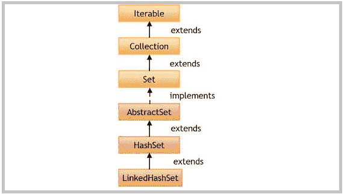

# Java LinkedHashSet 类

> 原文： [https://howtodoinjava.com/java/collections/java-linkedhashset/](https://howtodoinjava.com/java/collections/java-linkedhashset/)

**Java LinkedHashSet** 类**扩展了 HashSet** 和`implements Set`接口。 除了提供 ***可预测的迭代顺序*** 以外，它与 [HashSet](https://howtodoinjava.com/java/collections/java-hashset/) 类非常相似。

```java
Table of Contents

1\. LinkedHashSet Hierarchy
2\. LinkedHashSet Features
3\. LinkedHashSet Constructors
4\. LinkedHashSet Methods
5\. LinkedHashSet Example
6\. LinkedHashSet Usecases
7\. LinkedHashSet Performance
8\. Conclusion
```

## 1\. LinkedHashSet 层次结构

LinkedHashSet 类扩展了`HashSet`类并实现了`Set`接口。 Set 接口以层次结构顺序继承`Collection`和`Iterable`接口。

```java
public class LinkedHashSet<E> extends HashSet<E> 
				implements Set<E>, Cloneable, Serializable 
{
	//implementation
}

```



LinkedHashSet 层次结构

## 2\. LinkedHashSet 功能

*   它扩展了`HashSet`类，扩展了`AbstractSet`类。
*   它实现了`Set`接口。
*   **LinkedHashSet 中不允许重复的值**。
*   LinkedHashSet 中允许一个 NULL 元素。
*   这是一个**有序集合**，这是元素插入到集合中的顺序（**插入顺序**）。
*   与 HashSet 一样，此类为基本操作（添加，删除，包含和调整大小）提供**恒定时间性能**。
*   LinkedHashSet 未同步。 如果多个线程同时访问哈希集，并且至少有一个线程修改了哈希集，则必须在外部对其进行同步。
*   使用 **Collections.synchronizedSet（new LinkedHashSet（））**方法来获取同步的 LinkedHashSet。
*   此类的迭代器方法返回的迭代器为**快速失败**，并且如果在创建迭代器后的任何时间修改了集合，则可能会抛出`ConcurrentModificationException`，除了通过迭代器自己的`remove()`方法之外 。
*   LinkedHashSet 还实现了 Searlizable 和 [Cloneable](https://howtodoinjava.com/java/cloning/a-guide-to-object-cloning-in-java/) 接口。

#### 2.1 初始容量

初始容量是指创建 LinkedHashSet 时的存储桶数（在支持 [HashMap](https://howtodoinjava.com/java-hashmap/) 中）。 如果当前大小已满，则存储桶数将自动增加。

默认初始容量为 **16** 。 我们可以通过在构造函数 **LinkedHashSet（int initialCapacity）**中传递默认容量来覆盖此默认容量。

#### 2.2 负载系数

负载因子是在自动增加 LinkedHashSet 的容量之前允许其充满的度量。 默认负载系数为 **0.75** 。

这称为**阈值**，等于（DEFAULT_LOAD_FACTOR * DEFAULT_INITIAL_CAPACITY）。 当 LinkedHashSet 元素计数超过此阈值时，将调整 LinkedHashSet 的大小，并且新容量是先前容量的两倍。

使用默认的 LinkedHashSet 时，内部容量为 16，负载系数为 0.75。 当表格中有 12 个元素时，存储桶数将自动增加。

## 3\. LinkedHashSet 构造函数

LinkedHashSet 具有四种构造函数：

1.  **LinkedHashSet（）：**使用默认的初始容量（16）和负载因子（0.75）初始化默认的 LinkedHashSet 实例。
2.  **LinkedHashSet（int Capacity）：**使用指定的容量和负载因子（0.75）初始化 LinkedHashSet。
3.  **LinkedHashSet（int Capacity，float loadFactor）：**使用指定的初始容量和负载因子初始化 LinkedHashSet。
4.  **LinkedHashSet（Collection c）：**使用与指定集合相同的元素初始化 LinkedHashSet。

## 4\. LinkedHashSet 方法

1.  **public boolean add（E e）**：如果指定的元素尚不存在，则将其添加到 Set 中。 此方法在内部使用 **equals（）**方法检查重复项。 如果元素重复，则元素被拒绝，并且不替换值。
2.  **public void clear（）**：从 LinkedHashSet 中删除所有元素。
3.  **public boolean contains（Object o）**：如果 LinkedHashSet 包含指定的元素 othrweise `false`，则返回`true`。
4.  **public boolean isEmpty（）**：如果 LinkedHashSet 不包含任何元素，则返回`true`，否则返回`false`。
5.  **public int size（）**：返回 LinkedHashSet 中的元素数。
6.  **公共迭代器< E > iterator（）**：在此 LinkedHashSet 中的元素上返回迭代器。 从迭代器返回的元素没有特定的顺序。
7.  **public boolean remove（Object o）**：从 LinkedHashSet 中删除指定的元素（如果存在）并返回`true`，否则返回`false`。
8.  **public boolean removeAll（Collection <？> c）**：删除 LinkedHashSet 中属于指定集合的​​所有元素。
9.  **公共对象 clone（）**：返回 LinkedHashSet 的浅表副本。
10.  **公共拆分器< E > spliterator（）**：在此 LinkedHashSet 中的元素上创建后绑定和故障快速的 Spliterator。 它具有以下初始化属性`Spliterator.DISTINCT`和`Spliterator.ORDERED`。

## 5\. LinkedHashSet 示例

#### 5.1 LinkedHashSet 添加，删除，迭代器示例

```java
//1\. Create LinkedHashSet
LinkedHashSet<String> LinkedHashSet = new LinkedHashSet<>();

//2\. Add elements to LinkedHashSet 
LinkedHashSet.add("A");
LinkedHashSet.add("B");
LinkedHashSet.add("C");
LinkedHashSet.add("D");
LinkedHashSet.add("E");

System.out.println(LinkedHashSet);

//3\. Check if element exists
boolean found = LinkedHashSet.contains("A");        //true
System.out.println(found);

//4\. Remove an element
LinkedHashSet.remove("D");

//5\. Iterate over values
Iterator<String> itr = LinkedHashSet.iterator();

while(itr.hasNext()) 
{
    String value = itr.next();

    System.out.println("Value: " + value);
}

```

程序输出。

```java
[A, B, C, D, E]
true
Value: A
Value: B
Value: C
Value: E

```

#### 5.2 将 LinkedHashSet 转换为数组示例

Java 示例，使用 **toArrray（）**方法将 LinkedHashSet 转换为数组。

```java
LinkedHashSet<String> LinkedHashSet = new LinkedHashSet<>();

LinkedHashSet.add("A");
LinkedHashSet.add("B");
LinkedHashSet.add("C");
LinkedHashSet.add("D");
LinkedHashSet.add("E");

String[] values = new String[LinkedHashSet.size()];

LinkedHashSet.toArray(values);

System.out.println(Arrays.toString(values));

```

Program Output.

```java
[A, B, C, D, E]

```

#### 5.3 将 LinkedHashSet 转换为 ArrayList 示例

使用 *[Java 8 流 API](https://howtodoinjava.com/java8/java-8-tutorial-streams-by-examples/)* 将 LinkedHashSet 转换为 arraylist 的 Java 示例。

```java
LinkedHashSet<String> LinkedHashSet = new LinkedHashSet<>();

LinkedHashSet.add("A");
LinkedHashSet.add("B");
LinkedHashSet.add("C");
LinkedHashSet.add("D");
LinkedHashSet.add("E");

List<String> valuesList = LinkedHashSet.stream().collect(Collectors.toList());

System.out.println(valuesList);

```

Program Output.

```java
[A, B, C, D, E]

```

## 6\. LinkedHashSet 用例

LinkedHashSet 非常类似于 **[ArrayList](https://howtodoinjava.com/java-arraylist/)** （有序）和 HashSet（唯一元素）。 此外，它还保证了元素的迭代顺序（按插入元素的顺序）。

LinkedHashSet 的实际用例可以存储流中的数据，其中流可能包含按所需顺序的重复记录，我们只对不同的记录感兴趣，但顺序完全相同。

另一个用例是在给定的句子中找到不同的单词，并且单词的顺序应该固定，因为它们出现在句子中。

## 7\. LinkedHashSet 性能

*   LinkedHashSet 类为基本操作（添加，删除，包含和大小）提供 O（1）的**恒定时间性能，假设哈希函数将元素正确分散在存储桶中。**
*   Performance is likely to be just slightly below that of HashSet, due to the added expense of maintaining the linked list, with one exception of iteration.

    在 LinkedHashSet 上进行迭代需要的时间与集合的大小成正比，而不管其容量如何。 在 HashSet 上进行迭代可能会更昂贵，需要的时间与其容量成正比。 因此，LinkedHashSet 可以在迭代时提供比 HashSet 更好的性能。

## 8\. 结论

从上面的讨论中可以明显看出，LinkedHashSet 在我们要以某种固定顺序处理重复记录的情况下是非常有用的集合类。 它为基本操作提供了可预测的性能。

如果不需要元素的迭代顺序，则建议改用较轻量的 HashSet 和 HashMap。

在评论中向我发送与 Java 中的 **LinkedHashSet 有关的问题。**

学习愉快！

参考：

[LinkedHashSet Java 文档](https://docs.oracle.com/javase/10/docs/api/java/util/LinkedHashSet.html)