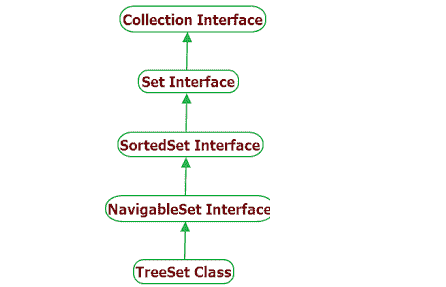

# Java `TreeSet`类

> 原文： [https://howtodoinjava.com/java/collections/java-treeset-class/](https://howtodoinjava.com/java/collections/java-treeset-class/)

Java `TreeSet`类扩展了 `AbstractSet`和实现了`NavigableSet`接口。 它与`HashSet`类非常相似，除了它以**排序顺序**存储元素。

排序顺序可以是自然顺序，也可以是树集合创建时提供的[比较器](https://howtodoinjava.com/java8/using-comparator-becomes-easier-with-lambda-expressions-java-8/)的排序顺序，具体取决于所使用的[构造器](https://howtodoinjava.com/oops/java-constructors/)。

```java
Table of Contents

1\. TreeSet Hierarchy
2\. TreeSet Features
3\. TreeSet Constructors
4\. TreeSet Methods
5\. TreeSet Example
6\. TreeSet Usecases
7\. TreeSet Performance
8\. Conclusion
```

## 1\. `TreeSet`层次结构

`TreeSet`类扩展了`AbstractSet`类并实现了`NavigableSet`接口。 `NavigableSet`接口以层次结构顺序扩展`SortedSet`。

```java
class TreeSet<E> extends AbstractSet<E> 
				implements NavigableSet<E>, Cloneable, Serializable 
{
	//implementation
}

```



树集合层次结构

## 2\. TreeSet 功能

*   它扩展了`AbstractSet`类，扩展了`AbstractCollection`类。
*   它实现了`NavigableSet`接口，该接口扩展了`SortedSet`接口。
*   `TreeSet`中不允许重复的值。
*   在`TreeSet`中不允许`NULL`。
*   这是一个**有序集合**，它按排序顺序存储元素。
*   像[`HashSet`](https://howtodoinjava.com/java/collections/java-hashset/)一样，此类为基本操作（添加，删除，包含和调整大小）提供恒定的时间性能。
*   `TreeSet`不允许插入异构对象，因为它必须比较对象以确定排序顺序。
*   `TreeSet`没有[同步](https://howtodoinjava.com/java/multi-threading/wait-notify-and-notifyall-methods/)。 如果多个线程同时访问哈希集合，并且至少有一个线程修改了哈希集合，则必须在外部对其进行同步。
*   使用`Collections.synchronizedSortedSet(new TreeSet())`方法来获取同步的`TreeSet`。
*   此类的迭代器方法返回的迭代器为**快速失败**，并且如果在创建迭代器后的任何时间修改了集合，则可能会抛出`ConcurrentModificationException`，除了通过迭代器自己的`remove()`方法之外 。
*   `TreeSet`还实现了`Searlizable`和[`Cloneable`](https://howtodoinjava.com/array/java-array-clone-shallow-copy/)接口。

## 3\. `TreeSet`构造器

`TreeSet`具有四个可能的构造器：

1.  **`TreeSet()`**：创建一个新的空树集合，并根据其元素的自然顺序对其进行排序。
2.  **`TreeSet(Comparator c)`**：创建一个新的空树集合，该树集合根据指定的比较器进行排序。
3.  **`TreeSet(SortedSet s)`**：创建一个新树集合，其中包含与指定排序集相同的元素并使用相同的顺序。
4.  **`TreeSet(Collection c)`**：创建一个新树集合，其中包含指定集合中的元素，并根据其元素的自然顺序对其进行排序。

## 4\. `TreeSet`方法

1.  **`boolean add(E e)`**：如果指定的元素尚不存在，则将其添加到`Set`中。
2.  **`Comparator comparator()`**：返回用于对该集合中的元素进行排序的比较器；如果此集合使用其元素的自然排序，则返回`null`。
3.  **`Object first()`**：返回此集合中当前的第一个（最小）元素。
4.  **`Object last()`**：返回当前在此集合中的最后一个（最大）元素。
5.  **`void clear()`**：从`TreeSet`中删除所有元素。
6.  **`boolean contains(Object o)`**：如果`TreeSet`包含指定的元素，则返回`true`，否则返回`false`。
7.  **`boolean isEmpty()`**：如果`TreeSet`不包含任何元素，则返回`true`，否则返回`false`。
8.  **`int size()`**：返回`TreeSet`中的元素数。
9.  **`Iterator<E> iterator()`**：以**升序**返回此集合中元素的迭代器。
10.  **`Iterator<E> endingIterator()`**：以降序返回此集合中元素的迭代器。
11.  **`NavigableSet<E> endingSet()`**：返回此集合中包含的元素的逆序视图。
12.  **`boolean remove(Object o)`**：从`TreeSet`中删除指定的元素（如果存在）并返回`true`，否则返回`false`。
13.  **`Object clone()`**：返回`TreeSet`的浅表副本。
14.  **`Spliterator<E> spliterator()`**：在此`TreeSet`中的元素上创建后绑定和快速失败的分隔符。 它与树集合提供的顺序相同。

## 5\. `TreeSet`示例

#### 5.1 `TreeSet`添加，删除，迭代器示例

```java
//1\. Create TreeSet
TreeSet<String> TreeSet = new TreeSet<>();

//2\. Add elements to TreeSet 
TreeSet.add("A");
TreeSet.add("B");
TreeSet.add("C");
TreeSet.add("D");
TreeSet.add("E");

System.out.println(TreeSet);

//3\. Check if element exists
boolean found = TreeSet.contains("A");        //true
System.out.println(found);

//4\. Remove an element
TreeSet.remove("D");

//5\. Iterate over values
Iterator<String> itr = TreeSet.iterator();

while(itr.hasNext()) 
{
    String value = itr.next();

    System.out.println("Value: " + value);
}

```

程序输出。

```java
[A, B, C, D, E]
true
Value: A
Value: B
Value: C
Value: E

```

#### 5.2 将`TreeSet`转换为数组示例

Java 示例，使用`toArrray()`方法将`TreeSet`转换为[数组](https://howtodoinjava.com/java-array/)。

```java
TreeSet<String> TreeSet = new TreeSet<>();

TreeSet.add("A");
TreeSet.add("B");
TreeSet.add("C");
TreeSet.add("D");
TreeSet.add("E");

String[] values = new String[TreeSet.size()];

TreeSet.toArray(values);

System.out.println(Arrays.toString(values));

```

程序输出：

```java
[A, B, C, D, E]

```

#### 5.3 将`TreeSet`转换为`ArrayList`示例

使用 Java 8 流 API 将`TreeSet`转换为[`ArrayList`](https://howtodoinjava.com/java-arraylist/)的 Java 示例。

```java
TreeSet<String> TreeSet = new TreeSet<>();

TreeSet.add("A");
TreeSet.add("B");
TreeSet.add("C");
TreeSet.add("D");
TreeSet.add("E");

List<String> valuesList = TreeSet.stream().collect(Collectors.toList());

System.out.println(valuesList);

```

程序输出：

```java
[A, B, C, D, E]

```

## 6\. `TreeSet`用例

`TreeSet`非常类似于`HashSet`（唯一元素），并提供可预测的迭代顺序（排序）。 排序顺序可以使用自定义比较器覆盖。

`TreeSet`在引擎盖下使用**红黑树**。 因此，该集合可以视为动态搜索树。 当您需要一个经常进行读写操作并应保持秩序的结构时，`TreeSet`是一个不错的选择。

如果您想使集合保持排序，并且主要是在追加元素，那么带`Comparator`的`TreeSet`是最好的选择。

## 7\. 树集合性能

*   `TreeSet`为基本操作（添加，删除和包含）提供了保证的`log(n)`时间成本。
*   像对元素进行排序一样的迭代操作需要花费`O(n)`的时间。

## 8\. 总结

从上面的讨论中可以明显看出，在我们要以排序方式处理重复记录的情况下，`TreeSet`是非常有用的集合类。 它还为基本操作提供了可预测的性能。

如果不需要元素的排序顺序，则建议改用较轻量的`HashSet`和`HashMap`。

在评论中向我发送有关 Java 中 **`TreeSet`的问题**。

学习愉快！

参考：

[`TreeSet` Java 文档](https://docs.oracle.com/javase/10/docs/api/java/util/TreeSet.html)