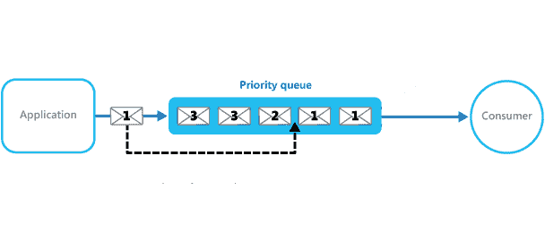

# Java `PriorityBlockingQueue`类

> 原文： [https://howtodoinjava.com/java/collections/java-priorityblockingqueue/](https://howtodoinjava.com/java/collections/java-priorityblockingqueue/)

Java `PriorityBlockingQueue`类是**并发**阻塞队列数据结构实现，其中根据对象的**优先级**处理对象。 添加名称的“阻塞”部分意味着**线程将阻塞等待**，直到队列上有可用的项目为止。

在`PriorityBlockingQueue`中，添加的对象根据其优先级进行排序。 默认情况下，优先级由对象的自然顺序决定。 队列构建时提供的[比较器](https://howtodoinjava.com/java/collections/java-comparator/)可以覆盖默认优先级。



优先阻塞队列

## 1\. `PriorityBlockingQueue`特性

让我们记下`PriorityBlockingQueue`上的几个要点。

*   `PriorityBlockingQueue`是一个无界队列，并且会动态增长。 默认初始容量为`'11'`，可以在适当的构造器中使用`initialCapacity`参数来覆盖。
*   它提供了阻塞检索操作。
*   它不允许使用`NULL`对象。
*   添加到`PriorityBlockingQueue`的对象必须具有可比性，否则会抛出`ClassCastException`。
*   默认情况下，优先级队列的对象以自然顺序排序。
*   比较器可用于队列中对象的自定义排序。
*   优先级队列的**头**是基于自然排序或基于比较器排序的**最小**元素。 当我们轮询队列时，它从队列中返回头对象。
*   如果存在多个具有相同优先级的对象，则它可以随机轮询其中的任何一个。
*   `PriorityBlockingQueue`是**线程安全的**。
*   方法`iterator()`中提供的`Iterator`不能保证以任何特定顺序遍历`PriorityBlockingQueue`的元素。 如果需要有序遍历，请考虑使用`Arrays.sort(pbq.toArray())`。
*  `rainToTo()`可用于按优先级顺序删除部分或全部元素，并将它们放置在另一个集合中。

## 2\. Java `PriorityBlockingQueue`示例

让我们看看对象的排序如何影响`PriorityBlockingQueue`中的添加和删除操作。 在给定的示例中，对象的类型为`Employee`。 `Employee`类实现[`Comparable`](https://howtodoinjava.com/java/collections/java-comparable-interface/)接口，默认情况下，该接口使对象可与员工`'id'`字段进行比较。

```java
public class Employee implements Comparable<Employee> {

    private Long id;
    private String name;
    private LocalDate dob;

    public Employee(Long id, String name, LocalDate dob) {
        super();
        this.id = id;
        this.name = name;
        this.dob = dob;
    }

    @Override
    public int compareTo(Employee emp) {
        return this.getId().compareTo(emp.getId());
    }

    //Getters and setters

    @Override
    public String toString() {
        return "Employee [id=" + id + ", name=" + name + ", dob=" + dob + "]";
    }
}

```

#### 2.1 自然排序

Java `PriorityBlockingQueue`示例，用于添加和轮询根据自然顺序进行比较的元素。

```java
PriorityBlockingQueue<Employee> PriorityBlockingQueue = new PriorityBlockingQueue<>();

PriorityBlockingQueue.add(new Employee(1l, "AAA", LocalDate.now()));
PriorityBlockingQueue.add(new Employee(4l, "CCC", LocalDate.now()));
PriorityBlockingQueue.add(new Employee(5l, "BBB", LocalDate.now()));
PriorityBlockingQueue.add(new Employee(2l, "FFF", LocalDate.now()));
PriorityBlockingQueue.add(new Employee(3l, "DDD", LocalDate.now()));
PriorityBlockingQueue.add(new Employee(6l, "EEE", LocalDate.now()));

while(true) 
{
    Employee e = PriorityBlockingQueue.poll();
    System.out.println(e);

    if(e == null) break;
}

```

程序输出。

```java
Employee [id=1, name=AAA, dob=2018-10-31]
Employee [id=2, name=FFF, dob=2018-10-31]
Employee [id=5, name=BBB, dob=2018-10-31]
Employee [id=4, name=CCC, dob=2018-10-31]
Employee [id=3, name=DDD, dob=2018-10-31]
Employee [id=6, name=EEE, dob=2018-10-31]

```

#### 2.2 `PriorityBlockingQueue`比较器示例

让我们使用[**基于 Java 8 lambda 的比较器**](https://howtodoinjava.com/java8/using-comparator-becomes-easier-with-lambda-expressions-java-8/)语法重新定义自定义顺序，并验证结果。 我们正在使用构造器`PriorityBlockingQueue(int initialCapacity, Comparator comparator）`。

```java
//Comparator for name field
Comparator<Employee> nameSorter = Comparator.comparing(Employee::getName);

PriorityBlockingQueue<Employee> PriorityBlockingQueue = new PriorityBlockingQueue<>( 11, nameSorter );

PriorityBlockingQueue.add(new Employee(1l, "AAA", LocalDate.now()));
PriorityBlockingQueue.add(new Employee(4l, "CCC", LocalDate.now()));
PriorityBlockingQueue.add(new Employee(5l, "BBB", LocalDate.now()));
PriorityBlockingQueue.add(new Employee(2l, "FFF", LocalDate.now()));
PriorityBlockingQueue.add(new Employee(3l, "DDD", LocalDate.now()));
PriorityBlockingQueue.add(new Employee(6l, "EEE", LocalDate.now()));

while(true) 
{
    Employee e = PriorityBlockingQueue.poll();
    System.out.println(e);

    if(e == null) break;
}

```

程序输出：

```java
Employee [id=1, name=AAA, dob=2018-10-31]
Employee [id=5, name=BBB, dob=2018-10-31]
Employee [id=4, name=CCC, dob=2018-10-31]
Employee [id=3, name=DDD, dob=2018-10-31]
Employee [id=6, name=EEE, dob=2018-10-31]
Employee [id=2, name=FFF, dob=2018-10-31]

```

#### 2.3 `PriorityBlockingQueuerainTo()`示例

Java 示例，使用`drianTo()`方法在一条语句中从队列中获取多个元素。

```java
PriorityBlockingQueue<Integer> priorityBlockingQueue = new PriorityBlockingQueue<>();

priorityBlockingQueue.add(1);
priorityBlockingQueue.add(3);
priorityBlockingQueue.add(2);
priorityBlockingQueue.add(6);
priorityBlockingQueue.add(4);
priorityBlockingQueue.add(5);

ArrayList<Integer> list = new ArrayList<>();

//Drain first 3 elements
priorityBlockingQueue.drainTo(list, 3);

System.out.println(list);

//Drain all elements
priorityBlockingQueue.drainTo(list);

System.out.println(list);

```

程序输出：

```java
[1, 2, 3]
[1, 2, 3, 4, 5, 6]

```

#### 2.4 `PriorityBlockingQueue`阻塞检索示例

Java 示例，它使用阻塞检索从`PriorityBlockingQueue`中获取元素。 线程将等待，直到队列中存在某个元素。

在给定的示例中，线程正在使用`take()`方法以无限循环在队列中等待。 等待 1 秒钟，然后再次检查。 一旦我们将元素添加到队列中，它就会轮询该项目并打印到控制台。

```java
import java.util.concurrent.PriorityBlockingQueue;
import java.util.concurrent.TimeUnit;

public class PriorityQueueExample 
{
    public static void main(String[] args) throws InterruptedException 
    {
        PriorityBlockingQueue<Integer> priorityBlockingQueue = new PriorityBlockingQueue<>();

        new Thread(() -> 
        {
          System.out.println("Waiting to poll ...");

          try 
          {
              while(true) 
              {
                  Integer poll = priorityBlockingQueue.take();
                  System.out.println("Polled : " + poll);

                  Thread.sleep(TimeUnit.SECONDS.toMillis(1));
              }

          } catch (InterruptedException e) {
              e.printStackTrace();
          }

        }).start();

        Thread.sleep(TimeUnit.SECONDS.toMillis(2));
        priorityBlockingQueue.add(1);

        Thread.sleep(TimeUnit.SECONDS.toMillis(2));
        priorityBlockingQueue.add(2);

        Thread.sleep(TimeUnit.SECONDS.toMillis(2));
        priorityBlockingQueue.add(3);
    }
}

```

程序输出：

```java
Waiting to poll ...
Polled : 1
Polled : 2
Polled : 3

```

## 3\. Java `PriorityBlockingQueue`构造器

`PriorityBlockingQueue`类提供了 4 种不同的方法来用 Java 构造优先级队列。

*   **`PriorityBlockingQueue()`**：构造一个空队列，其默认初始容量为（11），该初始容量根据其元素的自然顺序对其进行排序。
*   **`PriorityBlockingQueue(Collection c)`**：构造一个空队列，其中包含指定集合中的元素。
*   **`PriorityBlockingQueue(int initialCapacity)`**：构造具有指定初始容量的空队列，该队列根据其自然顺序对其元素进行排序。
*   **`PriorityBlockingQueue(int initialCapacity, Comparator comparator)`**：构造具有指定初始容量的空队列，该队列根据指定的比较器对其元素进行排序。

## 4\. Java `PriorityBlockingQueue`方法

您应该知道`PriorityBlockingQueue`类下面提供了重要的方法。

*   **`boolean add(object)`**：将指定的元素插入此优先级队列。
*   **`boolean offer(object)`**：将指定的元素插入此优先级队列。
*   **`boolean remove(object)`**：从此队列中移除指定元素的单个实例（如果存在）。
*   **`Object poll()`**：检索并删除此队列的头，如果有必要使元素可用，则等待指定的等待时间。
*   **`Object poll(timeout, timeUnit)`**：检索并删除此队列的开头，并在必要时等待指定的等待时间以使元素可用。
*   **`Object take()`**：检索并删除此队列的头，如有必要，请等待直到元素可用。
*   **`void put(Object o)`**：将指定的元素插入此优先级队列。
*   **`void clear()`**：从此优先级队列中删除所有元素。
*   **`Comparator comparator()`**：返回用于对此队列中的元素进行排序的比较器；如果此队列是根据其元素的自然顺序排序的，则返回`null`。
*   **`boolean contains(Object o)`**：如果此队列包含指定的元素，则返回`true`。
*   **`Iterator iterator()`**：在此队列中的元素上返回一个迭代器。
*   **`int size()`**：返回此队列中的元素数。
*   **`int drainTo(Collection c)`**：从此队列中删除所有可用元素，并将它们添加到给定的集合中。
*   **`int drainTo(Collection c, int maxElements)`**：从此队列中最多移除给定数量的可用元素，并将其添加到给定的集合中。
*   **`int remainingCapacity()`**：由于`PriorityBlockingQueue`不受容量限制，因此始终返回`Integer.MAX_VALUE`。
*   **`Object[] toArray()`**：返回包含此队列中所有元素的数组。

> 请注意`take()`和`poll()`方法之间的**区别**。 `poll()`检索并删除此队列的头部，如果此队列为空，则返回`null`。 它不阻止操作。
> 
> `take()`检索并删除此队列的头部，如有必要，请等待直到元素可用。 它正在阻止操作。

## 5\. 总结

在此 **Java`PriorityBlockingQueue`教程**中，我们学习了使用`PriorityBlockingQueue`类的特性，该类可以按默认的自然顺序或自定义顺序（比较器）存储元素。

我们还了解了`PriorityBlockingQueue`类的一些重要方法和[构造器](https://howtodoinjava.com/oops/java-constructors/)。

将我的问题放在评论部分。

学习愉快！

参考文献：

[`PriorityBlockingQueue`类 Java 文档](https://docs.oracle.com/javase/8/docs/api/java/util/PriorityBlockingQueue.html)