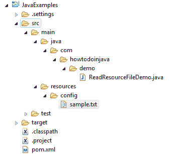

# 从资源文件夹读取文件 – Spring 示例

> 原文： [https://howtodoinjava.com/java/io/read-file-from-resources-folder/](https://howtodoinjava.com/java/io/read-file-from-resources-folder/)

**的两个 Java 示例从简单 Java 应用程序或任何 **spring mvc** / **spring boot** 应用程序中的资源文件夹**读取文件。

```java
Table of Contents

Project Structure
Read file using ClassLoader.getResource().toURI()
Read file using Spring's ResourceUtils.getFile()
```

## 项目结构

下图描述了此示例中使用的文件夹结构。 注意**资源**文件夹中的文件`sample.txt`。



从资源文件夹读取文件

## 使用 ClassLoader.getResource（）。toURI（）从资源文件夹中读取文件

我们可以使用类实例的`ClassLoader`引用从应用程序的资源包中读取文件。

```java
package com.howtodoinjava.demo;

import java.io.File;
import java.io.IOException;
import java.nio.file.Files;

public class ReadResourceFileDemo 
{
	public static void main(String[] args) throws IOException 
	{
		String fileName = "config/sample.txt";
		ClassLoader classLoader = new ReadResourceFileDemo().getClass().getClassLoader();

		File file = new File(classLoader.getResource(fileName).getFile());

		//File is found
		System.out.println("File Found : " + file.exists());

		//Read File Content
		String content = new String(Files.readAllBytes(file.toPath()));
		System.out.println(content);
	}
}

```

如果我们使用系统类加载器实例，则可以避免创建不必要的类实例，如下所示：

```java
String fileName = "config/sample.txt";

ClassLoader classLoader = ClassLoader.getSystemClassLoader();

File file = new File(classLoader.getResource(fileName).getFile());

//File is found
System.out.println("File Found : " + file.exists());

//Read File Content
String content = new String(Files.readAllBytes(file.toPath()));
System.out.println(content);

```

**程序输出**如下所示。

```java
Output:

File Found : true
Test Content
```

## 在春季读取文件 – ResourceUtils.getFile（）

如果您的应用程序是基于 **spring** 或 **spring boot** 的应用程序，则您可以直接利用`ResourceUtils`类。

```java
File file = ResourceUtils.getFile("classpath:config/sample.txt")

//File is found
System.out.println("File Found : " + file.exists());

//Read File Content
String content = new String(Files.readAllBytes(file.toPath()));
System.out.println(content);

```

**Program output** is shown below.

```java
Output:

File Found : true
Test Content
```

学习愉快！

参考文献：

[Spring ResourceUtils](https://docs.spring.io/spring/docs/current/javadoc-api/org/springframework/util/ResourceUtils.html)
[ClassLoader.getResource（）](https://docs.oracle.com/javase/7/docs/api/java/lang/ClassLoader.html#getResource%28java.lang.String%29)