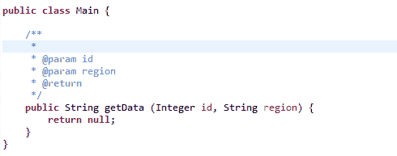
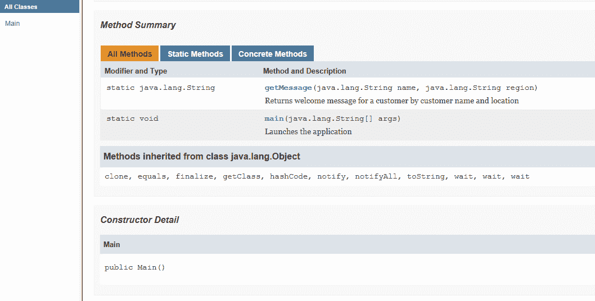
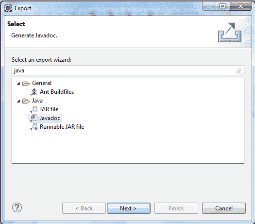
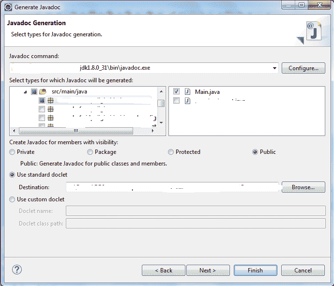

# Java 注释

> 原文： [https://howtodoinjava.com/java/basics/java-comments/](https://howtodoinjava.com/java/basics/java-comments/)

了解有关 **Java 注释**，**Java 注释的类型**， **Javadoc** 工具，**注释的性能影响**和需要遵循的**最佳做法**的所有信息。

## 1\. 为什么要编写 Java 注释？

顾名思义， [Java](https://howtodoinjava.com/java/basics/what-is-java-programming-language/) 注释是出于各种原因在程序之间编写的注释。 例如，您可以将注释写给：

*   编写有关变量，方法，类或任何语句的信息或说明。
*   编写可在 Java 文档中使用的文本。
*   隐藏特定时间的程序代码，等等。

#### 1.1 Java 注释示例

给定的代码是 Java 注释的**示例**，以及如何使用它们。

```java
/**
 * Contains method to greet users by their name and location.
 * 
 * @author Lokesh Gupta
 */
public class Main {

	/**
	 * Launches the application
	 * 
	 * @param args - Application startup arguments
	 */
	public static void main(String[] args) {
		getMessage("Lokesh", "India");
	}

	/**
	 * Returns welcome message for a customer by customer name and location
	 * 
	 * @param name - Name of the visitor
	 * @param region - Location
	 * @return - Welcome message
	 */
	public static String getMessage (String name, String region) 
	{
		StringBuilder builder = new StringBuilder();
		builder.append("Hello ");
		builder.append(name);
		builder.append(", Welcome to ");
		builder.append(region);
		builder.append(" !!");
		return builder.toString();
	}
}

```

## 2\. Java 注释的类型

Java 中有 **3 种类型的注释**。

1.  #### 单行注释

    当注释只能写在一行中时，请使用单行注释。 这些注释是通过 Java 语句编写的，以阐明它们在做什么。

    ```java
    //Initialize the counter variable to 0
    int counter = 0;

    ```

2.  #### 多行注释

    当您需要在源代码中添加超过一行的信息时，请使用多行注释。 多行注释通常用于代码块上方，这些代码块具有无法单行编写的复杂逻辑。

    ```java
    /*
     * This function returns a variable which shall be used as a counter for any loop.
     * Counter variable is of integer type and should not be reset during execution.
     */
    public int getCounter() {
    	//
    }

    ```

3.  #### 文档注释

    当您想公开要由`javadoc`工具获取的信息时，将使用文档注释。 这是您在使用**自动完成**特性时在编辑器（例如，日食）中看到的信息。 这些注释位于类，接口和方法定义之上。

    > 文档注释以`/**`开头，以`*/`结尾。

    您可以在这些注释中使用 **javadoc 注解**，例如 `@param`和`@return`。

    ```java
    /**
      * This function returns a variable which shall be used as a counter for any loop.
      * Counter variable is of integer type and should not be reset during execution.
      *
      * @param seed - initial value of the counter
      * @return counter value
      */
    public int getCounter(int seed) {
    	//
    }

    ```

    文档注释是编程不可或缺的一部分，不应跳过。

## 3\. 注释快捷方式

在 Eclipse IDE 中，只需在公共方法或类之前键入`/**[Enter]`，它将自动在所有必要的`@param`，`@author`和`@return`属性中生成。



Eclipse 中的 Java 注释快捷方式

## 4\. `javadoc`工具

**javadoc** 工具与 JDK 发行版捆绑在一起。 它将它们转换为标准化，格式清晰，易于阅读的网页。 它从文档注释生成 **API 文档**。

#### 4.1 从命令提示符运行`javadoc`

首先，确保`javadoc`工具位于**路径**中。 如果没有，则将 JDK `/bin`文件夹添加到`PATH`变量。

```java
$ set PATH=.;C:\BAML\DFCCUI\installs\jdk1.8.0_31\bin

```

要生成 Java 文档，请执行带有两个参数的工具。 首先是生成的 Java 文档的**位置**，其次是 **Java 源文件**。 在我们的情况下，我从`Main.java`所在的位置执行了此命令。

```java
$ javadoc -d C:/temp Main.java

```

它生成了这些 Java 文档 HTML 文件。



生成的 Java 文档

#### 4.2 从 Eclipse 运行`javadoc`

您也可以从 Eclipse IDE 生成 Java 文档。 遵循以下简单步骤：

1.  在**包浏览器**中，右键单击所需的项目/包。
2.  选择`Export.../Javadoc`并点击`Next`.

    

    导出 Java 文档选项

3.  默认情况下，将选择整个源代码。 验证并更改您的选择。

    

    Eclipse 中的 Java Doc 选项

4.  您可以选择“ `Private`”来生成可见性级别。 这将生成所有可能的 Javadocs，即使是私有方法也是如此。
5.  选择“ `standard doclet`”，它是文档的目标文件夹。
6.  点击`Next`。
7.  输入一个有意义的`Document title`并单击`Finish`。

如果正确执行上述所有步骤，则将生成与我们在命令提示符选项中看到的类似的 Java 文档文件。

## 5\. Java 注释对性能的影响

Java 代码中的实现注释仅供人们阅读。 Java 注释是编译器未编译的语句，因此它们不包含在已编译的字节码（`.class`文件）中。

这就是 **Java 注释对应用程序性能**也没有影响的原因。

## 6\. Java 注释最佳实践

请遵循这些**最佳做法**在您的应用程序源代码中包含适当的注释。

1.  不要在源代码中使用不必要的注释。 如果您的代码需要比正常解释更多的内容，则可以重构您的代码。
2.  保持注释缩进一致并匹配以实现最佳可读性。
3.  注释是针对人类的，因此请使用简单的语言进行解释。
4.  始终在源代码中添加文档注释。

学习愉快！

阅读更多：

[Oracle 针对 Javadoc 的建议](http://www.oracle.com/technetwork/java/javase/documentation/index-137868.html)

[Javadoc 标记参考](https://docs.oracle.com/javase/7/docs/technotes/tools/windows/javadoc.html#javadoctags)