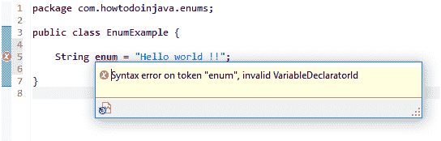

# Java 枚举

> 原文： [https://howtodoinjava.com/java/enum/enum-tutorial/](https://howtodoinjava.com/java/enum/enum-tutorial/)

**Java 枚举**，也称为 Java **枚举类型**，是一种其字段由固定的**常数集**组成的类型。 枚举的主要目的是**加强编译时类型的安全性**。 `enum`关键字是 Java 中的保留关键字。

当我们知道在编译时或设计时变量的所有可能值时，我们应该使用枚举，尽管将来在标识变量时可以添加更多值。 在此 *Java 枚举教程*中，我们将学习什么是枚举以及它们解决了哪些问题？

```java
Table of Contents

1\. What is enum in Java
2\. enum constructors
3\. enum methods
4\. enum inheritance
5\. Compare enums
6\. EnumMap and EnumSet
7\. Summary
```

## 1\. Java 中的枚举

[枚举](https://en.wikipedia.org/wiki/Enumeration "Enumeration")（通常）通常是一组相关的常数。 从一开始，它们就已经使用其他编程语言，例如 C ++。 在 JDK 1.4 之后，Java 设计人员决定也用 Java 支持它，并且**在 JDK 1.5 版本中正式发布。**

关键字`enum`支持 Java 中的**枚举。 枚举是一种特殊类型的类，始终扩展 [java.lang.Enum](https://docs.oracle.com/javase/10/docs/api/java/lang/Enum.html "java.lang.Enum") 。**

## 1.1 枚举是保留关键字

Java 中的`enum`是保留关键字。 这意味着您不能定义名称为`enum`的变量。 例如 这将导致编译时错误`"invalid VariableDeclaratorId"`。



枚举是保留关键字

#### 1.2 Java 枚举声明

**创建枚举**的简单示例。 众所周知，通常我们在日常生活中要处理四个方向。 它们的名称，角度和其他属性是固定的。 因此，在程序中，我们可以为它们创建枚举。 创建枚举的**语法**如下：

```java
public enum Direction 
{
   EAST, WEST, NORTH, SOUTH;
}
```

从逻辑上讲，**每个枚举都是**枚举类型本身的一个实例。 因此给定的枚举可以看作是下面的声明。 **JVM 在内部向此类添加序数和值方法**，我们可以在使用枚举时调用它。

```java
final class Direction extends Enum<Direction> 
{
    public final static Direction EAST = new Direction();
    public final static Direction WEST = new Direction();
    public final static Direction NORTH = new Direction();
    public final static Direction SOUTH = new Direction();
}

```

#### 1.3 Java 枚举示例

我们可以像使用`final` `static`类字段一样使用枚举。

```java
public class EnumExample 
{
    public static void main(String[] args) 
    {
        Direction north = Direction.NORTH;

        System.out.println(north);        //Prints NORTH
    }
}

```

#### 1.4 枚举 ordinal（）

`ordinal()`方法返回枚举实例的顺序。 它表示枚举声明中的**序列，其中初始常量分配为`'0'`的序数。 它非常类似于**数组索引**。**

它设计用于供基于复杂枚举的数据结构使用，例如`EnumSet`和`EnumMap`。

```java
Direction.EAST.ordinal();     //0

Direction.NORTH.ordinal();    //2

```

#### 1.5 枚举 values（）和 valueOf（）

**枚举值（）**方法返回**枚举数组**中的所有枚举值。

```java
Direction[] directions = Direction.values();

for (Direction d : directions) {
    System.out.println(d);
}

//Output:

EAST
WEST
NORTH
SOUTH

```

**枚举 valueOf（）**方法有助于**将字符串转换为枚举**实例。

```java
Direction east = Direction.valueOf("EAST");

System.out.println(east);

//Output:

EAST

```

#### 1.6 枚举命名约定

按照惯例，枚举是**常量**。 在 Java 中，常量在所有 **UPPER_CASE** 字母中定义。 这也是枚举。

*   枚举名称应为[标题大小写](https://howtodoinjava.com/java/string/convert-string-to-titlecase/)（与类名相同）。
*   枚举字段应全部大写（与静态最终常量相同）。

## 2\. 枚举构造函数

默认情况下，**枚举不需要构造函数**定义，并且它们的默认值始终是声明中使用的字符串。 不过，您可以定义自己的构造函数来初始化枚举类型的状态。

例如，我们可以在方向上添加`angle`属性。 所有方向都有一定角度。 因此，让我们添加它们。

```java
public enum Direction 
{
    // enum fields
    EAST(0), WEST(180), NORTH(90), SOUTH(270);

    // constructor
    private Direction(final int angle) {
        this.angle = angle;
    }

    // internal state
    private int angle;

    public int getAngle() {
        return angle;
    }
}

```

如果要访问任何方向的角度，可以在枚举字段引用中进行简单的方法调用。

```java
Direction north = Direction.NORTH;

System.out.println( north );                      //NORTH

System.out.println( north.getAngle() );           //90

System.out.println( Direction.NORTH.getAngle() ); //90

```

## 3\. 枚举方法

请记住，枚举基本上是一种特殊的类类型，并且可以像其他任何类一样具有方法和字段。 您可以添加**抽象**以及**具体方法**的方法。 枚举中允许两种方法。

#### 3.1 枚举的具体方法

在枚举中添加具体方法类似于在其他任何类中添加相同方法。 您可以使用任何访问说明符，例如 `public`，`private`或`protected`。 您可以从枚举方法返回值，也可以简单地使用它们执行内部逻辑。

```java
public enum Direction 
{
    // enum fields
    EAST, WEST, NORTH, SOUTH;

    protected String printDirection() 
    {
        String message = "You are moving in " + this + " direction";
        System.out.println( message );
        return message;
    }
}

```

您可以像对**枚举实例**进行简单方法调用一样，调用`printDirection()`方法。

```java
Direction.NORTH.printDirection(); //You are moving in NORTH direction

Direction.EAST.printDirection();  //You are moving in EAST direction

```

#### 3.2 枚举中的抽象方法

我们可以在枚举中添加**抽象方法。 在这种情况下，我们必须**在每个枚举字段**上单独实现抽象方法。**

```java
public enum Direction 
{
    // enum fields
    EAST {
        @Override
        public String printDirection() {
            String message = "You are moving in east. You will face sun in morning time.";
            return message;
        }
    },
    WEST {
        @Override
        public String printDirection() {
            String message = "You are moving in west. You will face sun in evening time.";
            return message;
        }
    },
    NORTH {
        @Override
        public String printDirection() {
            String message = "You are moving in north. You will face head in daytime.";
            return message;
        }
    },
    SOUTH {
        @Override
        public String printDirection() {
            String message = "You are moving in south. Sea ahead.";
            return message;
        }
    };

    public abstract String printDirection();
}

```

重新运行上面的示例。

```java
Direction.NORTH.printDirection(); //You are moving in north. You will face head in daytime.

Direction.EAST.printDirection();  //You are moving in east. You will face sun in morning time.

```

您可以为以这种方式创建的所有枚举强制执行契约。 它可以用作创建枚举的**模板。**

例如，如果我们希望`Direction`的每个枚举类型都应能够在需要时打印带有自定义消息的路线名称。 这可以通过在`Direction`中定义`abstract`方法来完成，每个枚举都必须重写该方法。 将来，将在更多方向上添加（真的吗？），那么我们还必须添加自定义消息。

## 4\. 枚举继承

如前所述，**枚举扩展了 Enum** 类。 `java.lang.Enum`是一个抽象类。 这是所有 Java 枚举类型的通用基类。

```java
public abstract class Enum<E extends Enum<E>> 
					extends Object 
					implements Comparable<E>, Serializable {

}

```

这意味着所有枚举都是 **[**可比**](//howtodoinjava.com/search-sort/when-to-use-comparable-and-comparator-interfaces-in-java/ "When to use comparable and comparator interfaces in java") 和 [**可序列化的**](//howtodoinjava.com/java/serialization/a-mini-guide-for-implementing-serializable-interface-in-java/ "A mini guide for implementing serializable interface in java") 隐式**。 此外，Java 中的所有枚举类型默认为 **[**单例**](//howtodoinjava.com/design-patterns/singleton-design-pattern-in-java/ "Singleton design pattern in java")** 。

如前所述，所有枚举都扩展了`java.lang.Enum`，因此**枚举不能扩展任何其他类**，因为 Java 不支持 [**多继承**](https://howtodoinjava.com/oops/multiple-inheritance-in-java/) 。 但是枚举可以实现任何数量的接口。

## 5\. 比较枚举

默认情况下，所有枚举都是**可比较的，单例也是**。 这意味着即使使用`"=="`运算符，也可以使用`equals()`方法进行比较。

```java
Direction east = Direction.EAST;
Direction eastNew = Direction.valueOf("EAST");

System.out.println( east == eastNew );           //true
System.out.println( east.equals( eastNew ) );    //true

```

> 您可以使用`'=='`运算符或`equals()`方法比较**枚举类型**，因为默认情况下枚举是 singlton 且可比较。

## 6\. 枚举集合– EnumSet 和 EnumMap

`java.util`包中添加了两个类以支持枚举– [`EnumSet`](https://docs.oracle.com/javase/7/docs/api/java/util/EnumSet.html)（用于枚举的高性能 Set 实现；枚举集的所有成员必须具有相同的枚举类型）和[`EnumMap`](https://docs.oracle.com/javase/7/docs/api/java/util/EnumMap.html)（高枚举， 与枚举键配合使用的性能地图实现）。

#### 6.1 java.util.EnumSet

**EnumSet** 类的定义如下：

```java
public abstract class EnumSet<E extends Enum<E>> 
						extends AbstractSet<E> 
						implements Cloneable, Serializable {

}

```

一种专门用于枚举类型的`Set`实现。 枚举集中的所有元素都必须来自创建集时明确或隐式指定的单个枚举类型。

#### 6.1.1 EnumSet 示例

```java
public class Test 
{
   public static void main(String[] args) 
   {
     Set enumSet = EnumSet.of(  Direction.EAST,
                                Direction.WEST,
                                Direction.NORTH,
                                Direction.SOUTH
                              );
   }
 }
```

像大多数集合实现一样 **`EnumSet`不同步**。 如果多个线程同时访问一个枚举集，并且至少有一个线程修改了该枚举集，则应在外部对其进行同步。

不允许`null`元素。 同样，这些集合可确保基于声明枚举常量中元素的顺序来对元素进行排序。 与常规集合实现相比，性能和内存优势非常高。

#### 6.2 java.util.EnumMap

**EnumMap** 声明为：

```java
public class EnumMap<K extends Enum<K>,V> extends AbstractMap<K,V> implements Serializable, Cloneable {

}

```

一种专门用于枚举类型键的`Map`实现。 同样，枚举映射中的所有键都必须来自创建映射时显式或隐式指定的单个枚举类型。

像`EnumSet`一样，不允许`null`键，并且**也不同步**。

#### 6.2.1 EnumMap 示例

```java
public class Test 
{
  public static void main(String[] args)
  {
    //Keys can be only of type Direction
    Map enumMap = new EnumMap(Direction.class);

    //Populate the Map
    enumMap.put(Direction.EAST, Direction.EAST.getAngle());
    enumMap.put(Direction.WEST, Direction.WEST.getAngle());
    enumMap.put(Direction.NORTH, Direction.NORTH.getAngle());
    enumMap.put(Direction.SOUTH, Direction.SOUTH.getAngle());
  }
}

```

## 7\. 总结

1.  枚举是`java.lang.Enum`类的**最终子类**
2.  如果枚举是类的成员，则隐式地`static`
3.  `new`关键字即使在枚举类型本身内也不能用于初始化枚举
4.  `name()`和`valueOf()`方法仅使用枚举常量的文本，而`toString()`方法可能会被覆盖以提供任何内容（如果需要）
5.  对于**枚举常量**，`equals()`和`"=="`得出相同的结果，可以互换使用
6.  枚举常量隐式`public static final`
7.  枚举常量列表的出现顺序**称为“ **自然顺序**”，并且还定义了其他项使用的顺序：`compareTo()`方法，值的迭代顺序 `EnumSet`，`EnumSet.range()`。**
8.  枚举构造函数应声明为`private`。 编译器允许**非私有构造函数**，但这对读者来说似乎是一种误导，因为 new 永远不能与枚举类型一起使用。
9.  由于这些枚举实例都是有效的单例，因此可以使用标识（`"=="`）比较它们的相等性。
10.  您可以在开关语句中使用**枚举，例如 int 或 char 原始数据类型**

在本文中，我们从语言基础到更高级，更有趣的实际用例，探讨了 **Java 枚举**。

学习愉快！

参考文献：

[SO 线程](https://stackoverflow.com/questions/18883646/java-enum-methods/18883717)
[枚举 Java 文档](https://docs.oracle.com/javase/tutorial/java/javaOO/enum.html)
[Java 1.5 枚举](http://www.ntu.edu.sg/home/ehchua/programming/java/javaenum.html)