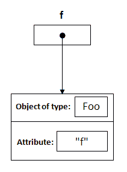
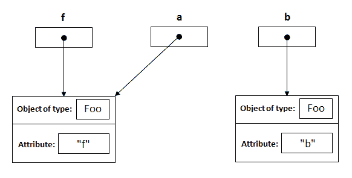
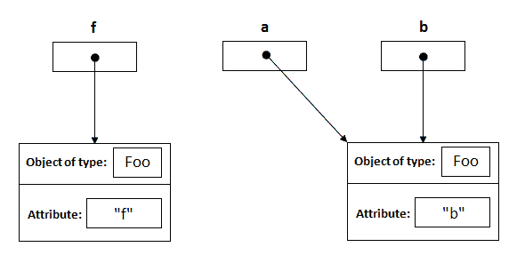
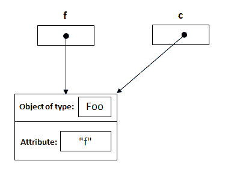
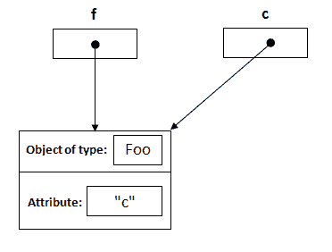

# Java 按值传递与按引用传递

> 原文： [https://howtodoinjava.com/java/basics/java-is-pass-by-value-lets-see-how/](https://howtodoinjava.com/java/basics/java-is-pass-by-value-lets-see-how/)

关于“ *java 是按值传递还是按引用*传递？”的争论很多。 好吧，让我们最后一次总结一下， **Java 是按值传递而不是引用**传递。 如果已经按引用传递了代码，那么我们应该能够像对象交换那样使用 C 语言，但是我们不能在 Java 中做到这一点。 我们已经知道了吧？

当您将实例传递给方法时，其内存地址会一点一点地复制到新的引用变量中，因此它们都指向同一实例。 但是，如果您在方法内部更改了引用，原始引用将不会更改。 如果它按引用传递，那么它也将被更改。

为了证明这一点，让我们看一下内存分配在运行时如何发生。 如果有任何疑问，它应该可以解决。 我正在使用以下程序演示该概念。

```java
public class Foo
{
	private String attribute;

	public Foo (String a){
		this.attribute = a;
	}
	public String getAttribute() {
		return attribute;
	}
	public void setAttribute(String attribute) {
		this.attribute = attribute;
	}
}

public class Main
{
     public static void main(String[] args){
          Foo f = new Foo("f");
          changeReference(f); // It won't change the reference!
          modifyReference(f); // It will change the object that the reference variable "f" refers to!
     }
     public static void changeReference(Foo a) {
          Foo b = new Foo("b");
          a = b;
     }
     public static void modifyReference(Foo c) {
          c.setAttribute("c");
     }
}

```

让我们逐步查看运行时发生的情况：

**1）Foo f =新的 Foo（“ f”）;**

该语句将创建 Foo 类的实例，并将“属性”初始化为“ f”。 对该创建实例的引用分配给变量 f；

[](https://howtodoinjava.files.wordpress.com/2013/03/1.png)

**2）公共静态无效值 changeReference（Foo a）**

执行此操作后，将声明名称为 a 的类型为 Foo 的引用，并将其最初分配为 null。

[](https://howtodoinjava.files.wordpress.com/2013/03/2.png)

**3）changeReference（f）;**

调用方法 changeReference 时，会将引用 a 分配给作为参数传递的对象。

[](https://howtodoinjava.files.wordpress.com/2013/03/3.png)

**4）Foo b =新的 Foo（“ b”）;** 内部第一种方法

这将与第一步完全相同，并创建一个新的 Foo 实例，并将其分配给 b;

[](https://howtodoinjava.files.wordpress.com/2013/03/4.png)

**5）a = b;**

这是重点。 在这里，我们有三个参考变量，当执行语句时，a 和 b 将指向在该方法内部创建的同一实例。 注意：f 不变，它一直指向实例，它原来是指向的。 没变 ！！

[](https://howtodoinjava.files.wordpress.com/2013/03/5.png)

**6）ModifyReference（Foo c）;**

现在，当该语句执行引用时，将创建 c 并将其分配给具有属性“ f”的对象。

[](https://howtodoinjava.files.wordpress.com/2013/03/6.png)

**7）c.setAttribute（“ c”）;**

这将更改引用 c 指向它的对象的属性，以及引用 f 指向它的对象的同一对象。

[](https://howtodoinjava.files.wordpress.com/2013/03/8.png)

我希望这个解释足够清楚，以使您更好地理解（如果尚未理解）。

学习愉快！