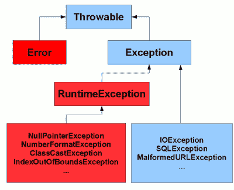

# Java 受检与非受检的异常

> 原文： [https://howtodoinjava.com/java/exception-handling/checked-vs-unchecked-exceptions-in-java/](https://howtodoinjava.com/java/exception-handling/checked-vs-unchecked-exceptions-in-java/)

在此 Java 异常教程中，了解 Java 中的异常是什么，什么是受检的异常以及它与非受检的异常有何不同。 我们还将学习有关 Java 检查的异常的一些最佳实践。

```java
Table of Contents

1\. What is an exception in Java?
2\. Checked vs unchecked exceptions in Java
3\. Java exception handling best practices
```

## 1\. Java 中有什么异常？

> “异常是在程序执行期间发生的意外事件，它破坏了正常的指令流。”

在 Java 中，所有错误和异常都用 **Throwable** 类表示。 当方法中发生错误时，该方法将创建一个对象（`Throwable`的任何子类型）并将其交给运行时系统。 该对象称为异常对象。

异常对象包含有关错误的信息，包括错误的类型和发生错误时程序的状态。 创建异常对象并将其交给运行时系统称为**，引发异常**。

#### 1.1 异常处理

在应用程序中创建异常对象时，我们有两种选择。

*   我们要么在方法中处理它
*   或者我们可以将其传递给调用方方法以使其处理。

在设置方法责任时，这是非常重要的决定。 一种方法应该清楚地表明它将处理所有异常情况，而不会处理哪些异常情况。 它是使用 **throws 子句**在方法语法中定义的。

要处理异常，我们必须在 **try-catch** 块的 catch 部分中捕获异常。

> 如果在应用程序中未处理异常，则该异常将传播到 JVM，并且 JVM 通常将终止程序本身。

## 2\. Java 中的受检与非受检异常

#### 2.1 异常层次

在 Java 中，异常大致分为两部分：**检查的异常和非受检的异常**。



#### 2.2 检查异常

Java 迫使您在应用程序代码中以某种方式处理这些错误情况。 一旦您开始编译程序，它们将立即出现在您的脸上。 您绝对可以忽略它们，而让它们传递给 JVM，但这是一个坏习惯。 理想情况下，您必须在应用程序内部的适当级别上处理这些异常，以便可以通知用户有关失败的信息并要求他重试/稍后再来。

通常，检查的异常表示程序无法直接控制的错误情况。 它们通常发生在与外部资源/网络资源例如数据库问题，网络连接错误，文件丢失等

> 检查的异常是**异常**类的子类。

**受检查的异常**的示例是： **ClassNotFoundException** ， **IOException** ， **SQLException** 等。

##### 检查异常示例

`FileNotFoundException`是 Java 中的一个受检异常。 任何时候，我们都想从文件系统中读取文件，Java 会强制我们处理文件可能不存在的错误情况。

```java
public static void main(String[] args) 
{
    FileReader file = new FileReader("somefile.txt");
}

```

在上述情况下，您将获得消息 – `Unhandled exception type FileNotFoundException`的编译时错误。

为了使程序能够编译，您必须在`try-catch`块中处理此错误情况。 下面给出的代码将完全可以编译。

```java
public static void main(String[] args) 
{
    try 
    {
		FileReader file = new FileReader("somefile.txt");
	} 
    catch (FileNotFoundException e) 
    {
    	//Alternate logic
		e.printStackTrace();
	}
}

```

#### 2.3 非受检的异常

Java 还提供了 UncheckedExceptions，编译器不会检查**的出现。 一旦执行了任何错误代码，它们就会生效/出现在您的程序中。**

编译器不强制方法声明其实现引发的非受检的异常。 通常，此类方法几乎总是也不会声明它们。

非受检的异常是 **RuntimeException** 的子类。 **非受检的异常**的示例是：`ArithmeticException`，`ArrayStoreException`，`ClassCastException`等。

“The strange thing is that `RuntimeException` is itself subclass of `Exception` i.e. all unchecked exception classes should have been checked exceptions implicitly, BUT they are not.”

##### 非受检的异常示例

在下面检查给定的代码。 上面的代码没有给出任何编译时错误。 但是当您举这个例子时，它抛出`NullPointerException`。 **NullPointerException** 是 Java 中非受检的异常。

```java
public static void main(String[] args) 
{
    try 
    {
		FileReader file = new FileReader("pom.xml");

		file = null;

		file.read();
	} 
    catch (IOException e) 
    {
    	//Alternate logic
		e.printStackTrace();
	}
}

```

请记住，受检的异常和非受检的异常之间最大的**区别在于，受检的异常是由编译器强制执行的，用于指示不受程序控制的异常情况（例如，I/O 错误），而非受检的异常在运行时发生，用于指示编程错误（例如，空指针）。**

## 3\. Java 异常处理最佳实践

1.  **当方法无法执行其名称所说明的功能时，可以使用检查的异常**。 例如预先准备好配置文件并使用配置文件进行配置的名为 prepareSystem（）的方法可以声明抛出`FileNotFoundException`，这意味着该方法使用了文件系统中的配置文件。
2.  理想情况下，绝对不应将检查异常用于编程错误，而在此类情况下，绝对不应将**资源错误**用于流控制。
3.  仅抛出方法无法以任何方式处理的那些异常。 方法应首先尝试在遇到它时立即对其进行处理。 仅当无法处理内部方法时才引发异常。
4.  A good way to define method signatures is to declare exceptions close to method name. If your method is named `openFile`, then it is expected to throw `FileNotFoundException`?. If your method is named `findProvider`, then it is expected to throw `NoSuchProviderException`.

    同样，应将这些类型的异常设置为检查异常，因为它会强制调用者处理方法语义所固有的问题。

5.  Rule is if a client can reasonably be expected to recover from an exception, make it a checked exception. If a client cannot do anything to recover from the exception, make it an unchecked exception.

    实际上，大多数应用程序必须从几乎所有异常中恢复，包括`NullPointerException`，`IllegalArgumentExceptions`和许多其他非受检的异常。 失败的操作/事务将被中止，但应用程序必须保持活动状态并准备为下一个操作/事务提供服务。

    通常只有在启动期间关闭应用程序才是合法的。 例如，如果缺少配置文件，并且没有该配置文件，应用程序将无法执行任何明智的操作，则关闭该应用程序是合法的。

## 4。总结

在本文中，我们了解了 Java 中受检异常与非受检异常之间的区别，以及**如何处理非受检异常**（带有示例的 Java 中的异常层次结构）。

随时在评论中提问。

学习愉快！

阅读更多：

*   [异步和同步异常](//howtodoinjava.com/java/exception-handling/asynchronous-and-synchronous-exceptions-in-java/ "Asynchronous and synchronous exceptions in java")
*   使用内部类的[异常处理](//howtodoinjava.com/best-practices/best-practices-for-for-exception-handling/ "Best practices for Exception handling")
*   [异常处理最佳做法](//howtodoinjava.com/best-practices/java-exception-handling-best-practices/ "Java exception handling best practices")
*   [有效处理 NullPointerException](//howtodoinjava.com/java/exception-handling/how-to-effectively-handle-nullpointerexception-in-java/ "How to effectively handle NullPointerException in java")
*   [**Java 中的自定义异常**](//howtodoinjava.com/best-practices/best-practices-for-for-exception-handling/ "Best practices for Exception handling")
*   [Java 异常文档](https://docs.oracle.com/javase/tutorial/essential/exceptions/runtime.html)