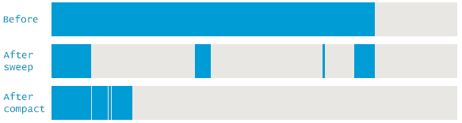
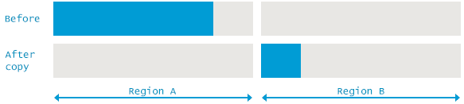

# Java 垃圾收集算法[直到 Java 9]

> 原文： [https://howtodoinjava.com/java/garbage-collection/all-garbage-collection-algorithms/](https://howtodoinjava.com/java/garbage-collection/all-garbage-collection-algorithms/)

**垃圾收集**（GC）一直是 Java 受欢迎的重要特征之一。 垃圾回收是 Java 中用来释放未使用的内存的机制。 本质上，它是**跟踪所有仍在使用的对象，并将其余对象标记为垃圾**。 Java 的垃圾回收被认为是一种自动内存管理架构，因为程序员不必将对象指定为可以被重新分配的对象。 垃圾回收在低优先级线程上运行。

在本教程中，我们将介绍与内存分配/解除分配，在后台运行的算法以及自定义此行为所需的选项有关的各种概念。

```java
Table of Contents

Object Life Cycle
Garbage collection algorithms
	Mark and sweep
	Concurrent mark sweep (CMS) garbage collection
	Serial garbage collection
	Parallel garbage collection
	G1 garbage collection
Customization Options
Summary
```

## 对象生命周期

一个 Java 对象的生命周期可以分为三个阶段：

1.  #### 对象创建

    为了[创建对象](https://howtodoinjava.com/puzzles/how-to-create-an-instance-of-any-class-without-using-new-keyword/)，通常我们使用`new`关键字。 例如

    ```java
    Object obj = new Object();
    ```

    创建对象时，将分配特定数量的内存来存储该对象。 分配的内存量可能会根据架构和 JVM 而有所不同。

2.  #### 使用中的物件

    到那时为止，对象被应用程序的其他对象使用（其他活动对象具有指向它的引用）。 在使用过程中，对象驻留在内存中，并且可能包含对其他对象的引用。

3.  #### 对象破坏

    垃圾收集系统监视对象，并在可行的情况下计算对每个对象的引用数。 如果没有对对象的引用，则无法使用当前正在运行的代码来访问它，因此取消分配关联的内存是很有意义的。

## 垃圾收集算法

对象创建由您编写的代码完成； 以及用于使用其提供的功能的框架。 作为 Java 开发人员，我们不需要取消分配内存或取消引用对象。 gargabe 收集器会在 JVM 级别自动完成此操作。 自 Java 诞生以来，在算法上进行了大量更新，这些算法在后台运行以释放内存。 让我们看看它们如何工作？

#### 扫一扫

它是初始且非常基本的算法，分为两个阶段运行：

1.  **标记活动对象** – 找出所有仍然存在的对象。
2.  **删除无法访问的对象** – 摆脱所有其他东西 – 所谓的已死和未使用的对象。

首先，GC 将某些特定对象定义为**垃圾收集根**。 例如当前执行方法的局部变量和输入参数，活动线程，已加载类的静态字段和 JNI 引用。 现在，GC 遍历了内存中的整个对象图，从这些根开始，然后是从根到其他对象的引用。 GC 访问的每个对象都被标记为活动对象。

> 需要停止应用程序线程以进行标记，因为如果它不断变化，它将无法真正遍历图形。 它被称为 **Stop The World pause** 。

第二阶段是清除未使用的对象以释放内存。 这可以通过多种方式来完成，例如

*   **Normal deletion** – Normal deletion removes unreferenced objects to free space and leave referenced objects and pointers. The memory allocator (kind of hashtable) holds references to blocks of free space where new object can be allocated.

    通常被称为`mark-sweep`算法。

    

    正常删除-扫一扫

*   **Deletion with compacting** – Only removing unused objects is not efficient because blocks of free memory is scattered across storage area and cause [OutOfMemoryError](https://docs.oracle.com/javase/9/docs/api/java/lang/OutOfMemoryError.html), if created object big enough and does not find large enough memory block.

    为了解决此问题，删除未引用的对象后，将对其余的引用对象进行压缩。 这里的压缩指的是将参考对象一起移动的过程。 这使得新的内存分配变得更加容易和快捷。

    通常被称为`mark-sweep-compact`算法。

    

    压实删除

*   **Deletion with copying** – It is very similar to mark and compacing approach as they too relocate all live objects. The important difference is that the target of relocation is a different memory region.

    通常被称为`mark-copy`算法。

    

    删除并复制 – 扫一扫

Before reading further, I will sincerely advise you to read [java memory management](https://howtodoinjava.com/java/garbage-collection/revisiting-memory-management-and-garbage-collection-mechanisms-in-java/) first. It talks about young generation, old generation and permanent generation in pretty detail.

#### 并发标记清除（CMS）垃圾收集

CMS 垃圾回收实质上是一种升级的标记和清除方法。 它使用多个线程扫描堆内存**。 对其进行了修改，以利用更快的系统并增强了性能。**

它尝试通过与应用程序线程同时执行大多数垃圾收集工作来最大程度地减少由于垃圾收集而造成的暂停。 它在年轻一代中使用并行的**标记复制**算法，在老一代中使用大多数并发的**标记清除**算法。

要使用 CMS GC，请使用以下 JVM 参数：

```java
-XX:+UseConcMarkSweepGC
```

###### CMS GC 优化选项

| 旗 | 描述 |
| -XX：+仅使用 CMS 发起\占用 | 表示您只想使用占用率作为启动 CMS 收集操作的条件。 |
| -XX：CMSInitiating \ OccupancyFraction = 70 | 设置 CMS 生成占用率以启动 CMS 收集周期。 |
| -XX：CMSTriggerRatio = 70 | 这是在 CMS 周期开始之前分配的 CMS 生成中`MinHeapFreeRatio`的百分比。 |
| -XX：CMSTriggerPermRatio = 90 | 设置在开始 CMS 收集周期之前已分配的 CMS 永久代中`MinHeapFreeRatio`的百分比。 |
| -XX：CMSWaitDuration = 2000 | 使用参数指定允许 CMS 等待年轻集合的时间。 |
| -XX：+ UseParNewGC | 选择使用并行算法收集年轻空间。 |
| -XX：+ CMSConcurrentMTEnabled | 允许在并发阶段使用多个线程。 |
| -XX：ConcGCThreads = 2 | 设置用于并发阶段的并行线程数。 |
| -XX：ParallelGCThreads = 2 | 设置要用于*世界各地*阶段的并行线程数。 |
| -XX：+ CMSIncrementalMode | 启用增量 CMS（iCMS）模式。 |
| -XX：+ CMSClassUnloadingEnabled | 如果未启用此功能，CMS 将不会清除永久空间。 |
| -XX：+ ExplicitGCInvokes \并发 | 这允许`System.gc()`触发并发收集，而不是整个垃圾收集周期。 |

#### 串行垃圾收集

该算法为年轻一代使用*标记复制*，为老一代使用*标记扫描紧凑*。 它在单个线程上工作。 执行时，它将冻结所有其他线程，直到垃圾回收操作结束。

由于串行垃圾回收具有线程冻结特性，因此仅适用于非常小的程序。

要使用串行 GC，请使用以下 JVM 参数：

```java
-XX:+UseSerialGC
```

#### 并行垃圾收集

Simimar 是串行 GC，在年轻一代中使用`mark-copy`，在老一代中使用`mark-sweep-compact`。 多个并发线程用于标记和复制/压缩阶段。 您可以使用`-XX:ParallelGCThreads=N`选项配置线程数。

如果您的主要目标是通过有效利用现有系统资源来提高吞吐量，那么 Parallel Garbage Collector 将适用于多核计算机。 使用这种方法，可以大大减少 GC 循环时间。

Till Java 8, we have seen Parallel GC as default garbage collector. Java 9 onwards, G1 is the default garbage collector on 32- and 64-bit server configurations. – [JEP [248]](https://openjdk.java.net/jeps/248)

要使用并行 GC，请使用以下 JVM 参数：

```java
-XX:+UseParallelGC
```

#### G1 垃圾收集

G1（垃圾优先）垃圾收集器已在 Java 7 中提供，旨在长期替代 CMS 收集器。 G1 收集器是并行的，并发的，渐进压缩的低暂停垃圾收集器。

此方法涉及将内存堆分段为多个小区域（通常为 2048）。 每个区域都被标记为年轻一代（进一步划分为伊甸园地区或幸存者地区）或老一代。 这样，GC 可以避免立即收集整个堆，而可以逐步解决问题。 这意味着一次只考虑区域的一个子集。


标记为 – G1 的内存区域

G1 跟踪每个区域包含的实时数据量。 此信息用于确定包含最多垃圾的区域。 因此它们是首先收集的。 这就是为什么将其命名为**垃圾优先**集合的原因。

与其他算法一样，不幸的是，压缩操作是使用 *Stop the World* 方法进行的。 但是，根据设计目标，您可以为其设置特定的性能目标。 您可以配置暂停持续时间，例如在任何给定的秒内不超过 10 毫秒。 垃圾优先 GC 将尽最大可能（但不能确定，由于 OS 级线程管理，这很难实时实现）来尽力实现该目标。

如果要在 Java 7 或 Java 8 计算机中使用，请使用 JVM 参数，如下所示：

```java
-XX:+UseG1GC
```

###### G1 优化选项

| Flag | Description |
| -XX：G1HeapRegionSize = 16m | 堆区域的大小。 该值为 2 的幂，范围为 1MB 至 32MB。 目标是根据最小 Java 堆大小具有大约 2048 个区域。 |
| -XX：MaxGCPauseMillis = 200 | 为所需的最大暂停时间设置目标值。 默认值为 200 毫秒。 指定的值不适合您的堆大小。 |
| -XX：G1ReservePercent = 5 | 这确定堆中的最小保留量。 |
| -XX：G1ConfidencePercent = 75 | 这就是置信系数暂停预测启发式算法。 |
| -XX：GCPauseIntervalMillis = 200 | 这是每个 MMU 的暂停间隔时间片，以毫秒为单位。 |

## GC 自定义选项

#### GC 配置标志

| Flag | Description |
| -Xms2048m -Xmx3g | 设置初始和最大堆大小（年轻空间加上租用空间）。 |
| -XX：+ DisableExplicitGC | 这将导致 JVM 忽略应用程序对 System.gc（）方法的任何调用。 |
| -XX：+ UseGCOverheadLimit | 这是用于限制在抛出 OutOfMemory 错误之前在垃圾回收上花费的时间的使用策略。 |
| -XX：GCTimeLimit = 95 | 这限制了在引发`OutOfMemory`错误之前在垃圾回收上花费的时间比例。 与`GCHeapFreeLimit`一起使用。 |
| -XX：GCHeapFreeLimit = 5 | 这设置了在抛出`OutOfMemory`错误之前，在进行完全垃圾回收之后的最小可用空间百分比。 与`GCTimeLimit`一起使用。 |
| -XX：InitialHeapSize = 3g | 设置初始堆大小（年轻空间加上租用空间）。 |
| -XX：MaxHeapSize = 3g | 设置最大堆大小（年轻空间加租用空间）。 |
| -XX：NewSize = 128m | 设置年轻空间的初始大小。 |
| -XX：MaxNewSize = 128m | 设置年轻空间的最大大小。 |
| -XX：SurvivorRatio = 15 | 将单个幸存者空间的大小设置为 Eden 空间大小的一部分。 |
| -XX：PermSize = 512m | 设置永久空间的初始大小。 |
| -XX：MaxPermSize = 512m | 设置永久空间的最大大小。 |
| -Xss512k | 设置每个线程专用的堆栈区域的大小（以字节为单位）。 |

#### GC 记录标志

| Flag | Description |
| -verbose：gc 或-XX：+ PrintGC | 这将打印基本的垃圾收集信息。 |
| -XX：+ PrintGC 详细信息 | 这将打印更详细的垃圾收集信息。 |
| -XX：+ PrintGCTimeStamps | 您可以为每个垃圾收集事件打印时间戳。 这些秒是连续的，并且从 JVM 启动时间开始。 |
| -XX：+ PrintGCDateStamps | 您可以为每个垃圾收集事件打印日期戳。 |
| -Xloggc： | 使用此方法，您可以将垃圾回收输出重定向到文件而不是控制台。 |
| -XX：+打印\ TenuringDistribution | 您可以在每个收集周期之后打印有关年轻空间的详细信息。 |
| -XX：+ PrintTLAB | 您可以使用此标志来打印 TLAB 分配统计信息。 |
| -XX：+ PrintReferenceGC | 使用此标志，您可以打印世界暂停期间进行参考处理的时间（即弱，弱等）。 |
| -XX：+ HeapDump \ OnOutOfMemoryError | 这将在内存不足的情况下创建堆转储文件。 |

## 总结

因此，在此 **Java 垃圾回收教程**中，我们学习了以下内容 – 

1.  对象生命周期分为三个阶段，即对象创建，对象使用和对象销毁。
2.  `mark-sweep`，`mark-sweep-compact`和`mark-copy`机制如何运作。
3.  不同的单线程和并发 GC 算法。
4.  直到 Java 8，并行 GC 才是默认算法。
5.  从 Java 9 开始，将 G1 设置为默认 GC 算法。
6.  此外，还有各种标志来控制垃圾收集算法的行为并记录任何应用程序的有用信息。

将我的问题放在评论部分。

学习愉快！