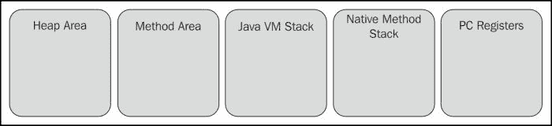

# JVM 内存模型/结构和组件

> 原文： [https://howtodoinjava.com/java/garbage-collection/jvm-memory-model-structure-and-components/](https://howtodoinjava.com/java/garbage-collection/jvm-memory-model-structure-and-components/)

每当执行 Java 程序时，都会保留一个单独的存储区，用于存储应用程序代码的各个部分，这些部分您大致称为 **JVM 内存**。 尽管不是必需的，但是具有一定的知识对该存储区进行构造是有益的。 当您开始进行更深层次的工作（例如性能调整）时，它变得尤为重要。 如果没有很好地了解 JVM 实际如何使用内存以及垃圾回收器如何使用该内存的不同部分，您可能会错过一些重要的注意事项，以进行更好的内存管理。 从而获得更好的性能。

在本教程中，我将讨论 **JVM 内存**内部的各个部分，然后您将在以后的一篇文章中讨论如何使用此信息进行应用程序的性能调整。

```java
Table of Contents

JVM memory areas / components
	- Heap area
	- Method area and runtime constant pool
	- JVM stack
	- Native method stacks
	- PC registers
```

## JVM 内存模型/结构

Java 虚拟机定义了在程序执行期间使用的各种**运行时数据区域**。 其中一些数据区域是在 Java 虚拟机启动时创建的，仅在 Java 虚拟机退出时才被销毁。 其他数据区域是每个线程的。 在创建线程时创建每个线程的数据区域，并在线程退出时销毁每个数据区域。

让我们看一下运行时内存中各个部分的最基本分类。

[](//howtodoinjava.com/wp-content/uploads/2014/08/JVM-Memory-Area-Parts.jpg)

JVM 内存区域部分

让我们根据 JVM 规范中提到的内容，快速浏览每个组件。

## 堆面积

堆区代表运行时数据区，从中为所有类实例和数组分配内存，并在虚拟机启动期间创建。

自动存储管理系统回收对象的堆存储。 堆可以是固定大小，也可以是动态大小（基于系统的配置），并且分配给堆区域的内存不必是连续的。

*Java 虚拟机实现可以为程序员或用户提供对堆初始大小的控制，并且，如果可以动态扩展或收缩堆，则可以控制最大和最小堆大小。*

If a computation requires more heap than can be made available by the automatic storage management system, the Java Virtual Machine throws an `OutOfMemoryError`.

## 方法区域和运行时常量池

方法区域存储每个类的结构，例如运行时常量池； 领域和方法数据； 方法和构造器的代码，包括用于类，实例和接口初始化的特殊方法。

方法区域是在虚拟机启动时创建的。 尽管从逻辑上讲它是堆的一部分，但是可以或不能将其进行垃圾收集，而我们已经读到堆中的垃圾收集不是可选的； 这是强制性的。 方法区域可以是固定大小的，或者可以根据计算的需要进行扩展，如果不需要更大的方法区域，则可以缩小。 方法区域的内存不必是连续的。

If memory in the method area cannot be made available to satisfy an allocation request, the Java Virtual Machine throws an `OutOfMemoryError`.

## JVM 堆栈

每个 JVM 线程都有一个与该线程同时创建的私有堆栈。 堆栈存储帧。 框架用于存储数据和部分结果，并执行动态链接，方法的返回值和调度异常。

它保存局部变量和部分结果，并在方法调用和返回中起作用。 因为除了压入和弹出帧外，从不直接操纵此堆栈，所以可以对帧进行堆分配。 与堆类似，此堆栈的内存不必是连续的。

该规范允许堆栈的大小可以是固定的，也可以是动态的。 如果具有固定大小，则在创建该堆栈时可以独立选择每个堆栈的大小。

If the computation in a thread requires a larger Java Virtual Machine stack than is permitted, the Java Virtual Machine throws a `StackOverflowError`.If Java Virtual Machine stacks can be dynamically expanded, and expansion is attempted but insufficient memory can be made available to effect the expansion, or if insufficient memory can be made available to create the initial Java Virtual Machine stack for a new thread, the Java Virtual Machine throws an `OutOfMemoryError`.

## 本机方法堆栈

本机方法堆栈称为 C 堆栈； 它支持本机方法（用 Java 编程语言以外的其他语言编写的方法），通常在创建每个线程时为每个线程分配。 无法加载本机方法并且自身不依赖于常规堆栈的 Java 虚拟机实现不需要提供本机方法堆栈。

本机方法堆栈的大小可以是固定的，也可以是动态的。

If the computation in a thread requires a larger native method stack than is permitted, the Java Virtual Machine throws a `StackOverflowError`.If native method stacks can be dynamically expanded and native method stack expansion is attempted but insufficient memory can be made available, or if insufficient memory can be made available to create the initial native method stack for a new thread, the Java Virtual Machine throws an `OutOfMemoryError`.

## PC 寄存器

每个 JVM 线程都有其自己的程序计数器（pc）寄存器。 在任何时候，每个 JVM 线程都在执行单个方法的代码，即该线程的当前方法。

由于 Java 应用程序可以包含一些本机代码（例如，使用本机库），因此本机和非本机方法有两种不同的方式。 如果该方法不是本机的（即 Java 代码），则 PC 寄存器包含当前正在执行的 JVM 指令的地址。 如果该方法是本地方法，则未定义 JVM 的 PC 寄存器的值。

Java 虚拟机的 pc 寄存器足够宽，可以在特定平台上保存返回地址或本机指针。

目前，这一切都与 JVM 内部的内存区域结构有关。 在接下来的文章中，我将提出一些想法，以使用此信息进行性能调整。

**祝您学习愉快！**

**参考：** http://docs.oracle.com/javase/specs/jvms/se7/html/jvms-2.html