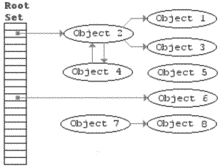

# Java 内存管理 – 垃圾回收算法

> 原文： [https://howtodoinjava.com/java/garbage-collection/revisiting-memory-management-and-garbage-collection-mechanisms-in-java/](https://howtodoinjava.com/java/garbage-collection/revisiting-memory-management-and-garbage-collection-mechanisms-in-java/)

我们都知道 Java 中 [**垃圾收集器**](https://en.wikipedia.org/wiki/Garbage_collection_%28computer_science%29 "Garbage collector") [GC]的功能职责。 但是只有极少数的尝试深入研究**垃圾收集的工作原理**。 您不是其中之一，这就是为什么您在这里。

在本 Java 内存管理教程中，我们将尝试了解 Java 垃圾回收的最新算法，并了解这些算法的发展。

```java
Table of Contents

1\. Memory management in Java
2\. Reference counting mechanism
3\. Mark and sweep mechanism
4\. Stop and copy GC
5\. Generational stop and copy
6\. How to improve memory utilization in Java
```

## 1\. Java 中的内存管理

[Java 中的内存管理](http://www.oracle.com/technetwork/java/javase/memorymanagement-whitepaper-150215.pdf "java memory management")是垃圾收集器的职责。 这与 Java 之前的实践相反，在 Java 之前，程序员负责分配程序中的内存。

正式而言，**垃圾收集器负责** – 

*   分配内存
*   确保所有引用的对象都保留在内存中，并且
*   恢复由执行代码中的引用无法访问的对象使用的内存。

在应用程序运行时，应用程序会创建许多对象，每个对象都有其生命周期。 在内存中，被其他对象引用的对象称为**活动对象**。 不再由任何活动对象引用的对象被视为**死对象**，并被称为*垃圾*。 查找和释放（也称为回收）这些对象使用的空间的过程称为**垃圾回收**。

垃圾回收解决了许多但不是全部的内存分配问题。 例如，我们可以无限期地创建对象并继续引用它们，直到没有更多可用的内存为止（ [***内存不足错误***](https://en.wikipedia.org/wiki/Out_of_memory "Out of memory") ）。 垃圾收集是一项复杂的任务，需要花费时间和资源。 它在通常由称为堆的大型内存池分配的空间上运行。

垃圾收集的**定时由垃圾收集器决定。 通常，整个堆或堆的一部分会在堆满或达到占用率的百分比时收集。**

从 J2SE 5.0 开始，Java HotSpot 虚拟机包括四个垃圾收集器。 所有的收藏家都是世代相传的。 我们将在后面的部分中了解有关世代 GC 的更多信息。

> 阅读更多：[垃圾收集算法[针对 Java 9 更新]](https://howtodoinjava.com/java/garbage-collection/all-garbage-collection-algorithms/)

## 2\. 引用计数机制

从初始版本开始，这已经是非常古老的 GC 机制。 在引用计数技术中，每个对象都有从其他对象和堆栈指向该对象的指针数。 每次引用新对象时，计数器都会增加一。 同样，当任何对象丢失其引用时，计数器将减一。 当计数达到“ 0”时，垃圾回收器可以取消分配对象。

引用计数算法的主要**优势**在分配给新对象时，每次写入内存的工作量很少。 但是，它具有**数据周期**的**严重问题**。 这意味着当第一个对象被第二个对象引用，第二个对象被第一个对象引用（**循环引用**）时，计数永远不会为零，因此它们永远也不会被垃圾回收。

## 3\. 打标扫机制



标记和扫描算法

标记清除算法是第一个要开发的垃圾收集算法，它能够回收循环数据结构。 在这种算法中，GC 将首先将某些对象标识为默认可达对象，这些对象通常是堆栈中的全局变量和局部变量。 有所谓的活动对象。

在下一步中，算法开始从这些活动对象中跟踪对象，并将它们也标记为活动对象。 继续执行此过程，直到检查所有对象并将其标记为活动。 完全跟踪后未标记为活动的对象被视为死对象。

使用标记扫描时，未引用的对象不会立即被回收。 取而代之的是，允许垃圾收集累积，直到所有可用内存都用完为止。 发生这种情况时，该程序的执行将暂时暂停（称为 **Stop the world** ），而标记清除算法将收集所有垃圾。 一旦回收了所有未引用的对象，就可以恢复程序的正常执行。

除了暂停应用程序一段时间外，此技术还需要经常对内存地址空间进行**碎片整理**，这是另一项开销。

## 4\. 停止并复制 GC

像“标记和清除”一样，该算法还取决于识别活动对象并对其进行标记。 区别在于它处​​理活动对象的方式。

停止和复制技术将整个堆设计在两个**半空间**中。 一次只有一个半空间处于活动状态，而为新创建的对象分配的内存仅发生在单个半空间中，而另一个保持平静。

GC 运行时，它将开始标记当前半空间中的活动对象，完成后，它将所有活动对象复制到其他半空间中。 当前半空间中的所有其余对象都被视为已死，并已被垃圾回收。

与以前的方法一样，它具有**的一些优点**，就像它仅接触活动物体一样。 另外，不需要分段，因为在切换半空间时，会完成**内存收缩**。

这种方法的主要缺点是需要将所需的内存大小增加一倍，因为在给定的时间点仅使用了一半。 除此之外，它还需要在切换半空间时停止世界。

## 5\. 世代停止和复制

像“停止并复制”技术一样，它也将内存划分为半空间，但现在它们是三个半空间。 这些半空间在这里称为世代。 因此，该技术中的内存分为三代-**年轻一代**，**老一代**和**永久一代**。

大多数对象最初是在年轻一代中分配的。 老一代包含的对象在许多年轻一代集合中幸存下来，还有一些大型对象可以直接在老一代中分配。 永久生成包含 JVM 认为便于垃圾回收器管理的对象，例如描述类和方法的对象，以及类和方法本身。

当年轻一代填满时，将执行该一代的年轻一代垃圾回收（有时称为**次要垃圾回收**）。 当老一代或永久一代填满时，通常会完成所谓的完整垃圾收集（有时称为**主要收集**）。 即，收集了所有的世代。

通常，首先使用专门为该代设计的垃圾收集算法来收集年轻代，因为它通常是识别年轻代中最有效的垃圾算法。 幸存于 GC 跟踪中的对象被推入更早的年代。 出于明显的原因，较老的一代被收集的频率较低，即他们在那里的原因是时间更长。 除上述情况外，如果发生碎片/压缩，则每一代都将单独压缩。

该技术的主要优点是在较年轻的一代中早期回收死对象，而无需每次都扫描整个内存以识别死对象。 较早的对象已经经历了一些 GC 周期，因此假定它们在系统中的存在时间更长，因此无需频繁扫描它们（不是每次都完美的情况，但大多数情况下应该如此）。

**的缺点**仍然相同，即在 GC 运行全扫描时，需要对存储区进行碎片整理，并且需要停止世界（应用程序）。

## 6\. 如何提高 Java 的内存利用率

1.  不要分配过多的内存。 仅根据需要分配内存。 这特别适用于 Java 数组。
2.  不要坚持引用。 一旦使用了对象且不再需要该对象，则为其分配`null`引用。
3.  查找并解析内存 [**泄漏**](https://en.wikipedia.org/wiki/Memory_leak "memory leaks")
4.  在每个发行版上执行 [**系统配置文件**](https://en.wikipedia.org/wiki/Profiling_%28computer_programming%29 "profiling") 来验证内存增加
5.  不要依赖 **System.gc（）**运行垃圾收集

希望对**垃圾收集机制**有所帮助，该机制可为 Java 程序实现自动内存管理。 这可以帮助您回答 Java 内存管理[面试问题](https://howtodoinjava.com/java-interview-questions/)。

学习愉快！