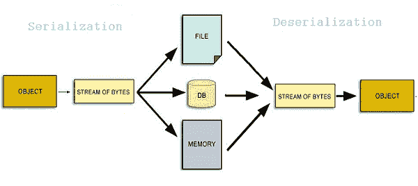

# Java serialVersionUID –如何生成 serialVersionUID

> 原文： [https://howtodoinjava.com/java/serialization/serialversionuid/](https://howtodoinjava.com/java/serialization/serialversionuid/)

**Java 序列化**是将对象转换为字节流的过程，因此我们可以执行类似的操作，例如将其存储在磁盘上或通过网络发送。 反序列化是相反的过程–将字节流转换为内存中的对象。

在序列化期间，java 运行时将版本号与每个可序列化的类相关联。 称为 **serialVersionUID** 的数字，在反序列化期间用于验证序列化对象的发送者和接收者是否已加载了该对象的与序列化兼容的类。 如果接收者为对象加载的类`serialVersionUID`与相应发送者的类不同，则反序列化将导致`InvalidClassException`。

## 1\. Java serialVersionUID 语法

可序列化的类可以通过声明一个名为“ `serialVersionUID`”的字段来显式声明其自己的 serialVersionUID，该字段必须是静态的，最终的且类型为 long。

```java
private static final long serialVersionUID = 4L;
```

在这里，serialVersionUID 表示类的版本，如果您对类的当前版本进行了修改，以使其不再与先前的版本向后兼容，则应该对它进行递增。



## 2\. Java 序列化和反序列化示例

让我们看一个如何将类序列化然后反序列化的示例。

```java
package com.howtodoinjava.demo.serialization;

import java.io.*;
import java.util.logging.Logger;

public class DemoClass implements java.io.Serializable {

	private static final long serialVersionUID = 4L;			//Default serial version uid
	private static final String fileName = "DemoClassBytes.ser"; //Any random name
	private static final Logger logger = Logger.getLogger("");
	//Few data fields
	//Able to serialize
	private static String staticVariable;
	private int intVariable;

	//Not able to serialize
	transient private String transientVariable = "this is a transient instance field";
	private Thread threadClass;

	public static void main(String[] args) throws IOException, ClassNotFoundException 
	{
		//Serialization

	    DemoClass test = new DemoClass();
	    test.intVariable = 1;
	    staticVariable = "this is a static variable";
	    writeOut(test);
	    System.out.println("DemoClass to be saved: " + test);

	    //De-serialization

	    System.out.println("DemoClass deserialized: " + readIn());
	}

	private static Object readIn() throws IOException, ClassNotFoundException {
	    ObjectInputStream ois = new ObjectInputStream(new FileInputStream(new File(fileName)));
	    return ois.readObject();
	}

	private static void writeOut(java.io.Serializable obj) throws IOException {
	    ObjectOutputStream oos = new ObjectOutputStream(new FileOutputStream(new File(fileName)));
	    oos.writeObject(obj);
	    oos.close();
	}

	@Override public String toString() {
	    return "DemoClass: final static fileName=" + fileName + ", final static logger=" + logger
	            + ", non-final static staticVariable=" + staticVariable + ", instance intVariable=" + intVariable
	            + ", transient instance transientVariable=" + transientVariable + ", non-serializable instance field threadClass:=" + threadClass;
	}
}

```

程序输出。

```java
DemoClass to be saved: DemoClass: 
final static fileName=DemoClassBytes.ser, 
final static logger=java.util.logging.LogManager$RootLogger@1d99a4d, 
non-final static staticVariable=this is a static variable, 
instance intVariable=1, 
transient instance transientVariable=this is a transient instance field, 
non-serializable instance field threadClass:=null

//Execute readIn() function from a separate main() method 
//to get given below output correctly. It will flush out the static fields.

DemoClass deserialized: DemoClass: 
final static fileName=DemoClassBytes.ser, 
final static logger=java.util.logging.LogManager$RootLogger@cd2c3c, 
non-final static staticVariable=null, 
instance intVariable=1, 
transient instance transientVariable=null, 
non-serializable instance field threadClass:=null

```

> 如果可序列化的类未显式声明`serialVersionUID`，则序列化运行时将根据该类的各个方面计算该类的默认`serialVersionUID`值。

## 3\. 如何生成 serialVersionUID

约书亚·布洛赫（Joshua Bloch）在有效 Java 中说，自动生成的 UID 是基于类名称，已实现的接口以及所有公共和受保护成员生成的。 以任何方式更改其中任何一个都将更改 serialVersionUID。

但是，强烈建议所有可序列化的类显式声明 serialVersionUID 值，因为默认的`serialVersionUID`计算对类详细信息高度敏感，类详细信息可能会根据编译器的实现而有所不同，并且可以在不同的环境中产生**不同的 serialVersionUID。 这可能导致反序列化期间出现意外的 [**InvalidClassException**](https://docs.oracle.com/javase/10/docs/api/java/io/InvalidClassException.html "InvalidClassException") 。**

因此，为了在不同的 Java 编译器实现中保证**一致的 serialVersionUID** 值，可序列化的类必须声明一个显式的`serialVersionUID`值。 强烈建议在可能的情况下，显式`serialVersionUID`声明在 *serialVersionUID* 中使用`private`修饰符，因为此类声明仅适用于立即声明的类。

另请注意，`serialVersionUID`字段不能用作继承成员。

基于我的短暂职业，我可以说长时间存储序列化数据[ ***空间序列化*** ]并不是很常见的用例。 使用序列化机制将数据临时写入 ***时间序列化*** ]到例如高速缓存，或通过网络将其发送到另一个程序以利用信息，这是更为常见的。

在这种情况下，我们对保持向后兼容性不感兴趣。 我们只关心确保在网络上通信的代码库确实具有相同版本的相关类。 为了方便进行此类检查，我们必须保持 serialVersionUID 不变，并且不要对其进行更改。 另外，在网络上的两个应用程序上对类进行不兼容的更改时，请不要忘记更新它。

## 4\. 没有 serialVersionUID 的 Java 类

这不是我们永远想要面对的情况。 但是，这是现实，有时甚至会发生（我应该很少说吗？）。 如果我们需要以不兼容的方式更改此类，但又想使用该类的旧版本维护序列化/反序列化功能，则可以**使用 JDK 工具“ [serialver](https://docs.oracle.com/javase/7/docs/technotes/tools/solaris/serialver.html "serialver command") ”。 该工具在旧类**上生成 serialVersionUID，并在新类上显式设置它。 不要忘记实现`readObject()`和`writeObject()`方法，因为内置的反序列化机制（`in.defaultReadObject()`）将拒绝从旧版本的数据中反序列化。

如果我们定义自己的`readObject()`函数，可以读取回旧数据。 此自定义代码应检查`serialVersionUID`，以便了解数据所在的版本并决定如何对其进行反序列化。 如果我们存储可以在您的代码的多个版本中保留的序列化数据，则此版本控制技术很有用。

> 阅读更多： [Java 序列化兼容和不兼容的更改](https://howtodoinjava.com/java/serialization/a-mini-guide-for-implementing-serializable-interface-in-java/)

## 5\. Java serialVersionUID –摘要

1.  `transient` and `static` fields are ignored in serialization. After deserialization `transient` fields and non-final static fields will be null.

    `final`和`static`字段仍具有值，因为它们是类数据的一部分。

2.  `ObjectOutputStream.writeObject(obj)`和`ObjectInputStream.readObject()`用于序列化和反序列化。
3.  在序列化期间，我们需要处理`IOException`； 在反序列化期间，我们需要处理`IOException`和`ClassNotFoundException`。 因此，反序列化的类类型必须在类路径中。
4.  Uninitialized non-serializable, non-transient instance fields are tolerated.

    添加“ `private Thread th;`”时，可序列化没有错误。 但是，“ `private Thread threadClass = new Thread();`”将导致异常：

    ```java
    Exception in thread "main" java.io.NotSerializableException: java.lang.Thread
    at java.io.ObjectOutputStream.writeObject0(Unknown Source)
    at java.io.ObjectOutputStream.defaultWriteFields(Unknown Source)
    at java.io.ObjectOutputStream.writeSerialData(Unknown Source)
    at java.io.ObjectOutputStream.writeOrdinaryObject(Unknown Source)
    at java.io.ObjectOutputStream.writeObject0(Unknown Source)
    at java.io.ObjectOutputStream.writeObject(Unknown Source)
    at com.howtodoinjava.demo.serialization.DemoClass.writeOut(DemoClass.java:42)
    at com.howtodoinjava.demo.serialization.DemoClass.main(DemoClass.java:27)

    ```

5.  序列化和反序列化可用于复制和克隆对象。 它比常规克隆慢，但是 [**可以很容易地产生深拷贝**](//howtodoinjava.com/java/serialization/how-to-do-deep-cloning-using-in-memory-serialization-in-java/ "How to do deep cloning using in memory serialization in java") 。
6.  如果我需要序列化`Serializable`类`Employee`，但是其超类之一不是可序列化的，`Employee`类是否仍可以序列化和反序列化？ 答案是肯定的，前提是不可序列化的超类具有 no-arg 构造函数，在反序列化时调用该构造函数以初始化该超类。
7.  We must be careful while modifying a class implementing `java.io.Serializable`. If class does not contain a `serialVersionUID` field, its *serialVersionUID* will be automatically generated by the compiler.

    不同的编译器或同一编译器的不同版本将生成潜在的不同值。

8.  `serialVersionUID`的计算不仅基于字段，而且还基于类的其他方面，例如 Implement 子句，构造函数等。因此，最佳实践是显式声明`serialVersionUID`字段以保持向后兼容性。 如果我们需要实质性地修改可序列化的类，并希望它与以前的版本不兼容，则需要增加 serialVersionUID 以避免混合使用不同的版本。

学习愉快！