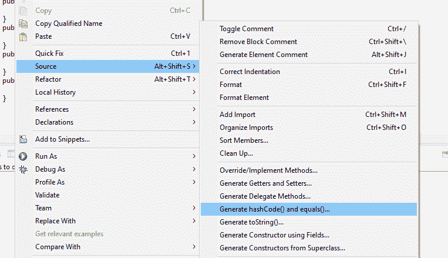

# Java `hashCode()`和`equals()` – 契约，规则和最佳实践

> 原文： [https://howtodoinjava.com/java/basics/java-hashcode-equals-methods/](https://howtodoinjava.com/java/basics/java-hashcode-equals-methods/)

了解 Java **`hashCode()`和`equals()`方法**，它们的**默认实现以及如何正确覆盖它们**的信息。 另外，请学习使用 Apache Commons 软件包的实用程序类`HashCodeBuilder`和`EqualsBuilder`实现这些方法。

> `**[hashCode()](https://docs.oracle.com/javase/7/docs/api/java/lang/Object.html#hashCode%28%29)**`和`**[equals()](https://docs.oracle.com/javase/7/docs/api/java/lang/Object.html#equals%28java.lang.Object%29)**`方法已在`Object`类中定义，该类是 Java 对象的父类。 因此，所有 java 对象都继承这些方法的默认实现。

```java
Table of Contents:

1) Usage of hashCode() and equals() Methods
2) Override the default behavior
3) EqualsBuilder and HashCodeBuilder
4) Generate hashCode() and equals() using Eclipse
5) Important things to remember
6) Special Attention When Using in ORM
```

## 1\. `hashCode()`和`equals()`方法的用法

1.  `equals(Object otherObject)` –顾名思义，该方法用于简单地验证两个对象的相等性。 默认实现是简单地检查两个对象的对象引用以验证它们的相等性。 *默认情况下，当且仅当两个对象存储在相同的内存地址中时，两个对象才相等。*
2.  ``hashcode()`` –在运行时为对象返回唯一的整数值。 默认情况下，整数值主要来自堆中对象的内存地址（但并非总是强制性的）。
    当此对象需要存储在某些 [HashTable](https://en.wikipedia.org/wiki/Hash_table "Hashtable") 之类的数据结构中时，此哈希码用于确定存储桶位置。

#### 1.1 `hashCode()`和`equals()`之间的协定

通常，无论何时重写`equals()`方法，都必须重写`hashCode()`方法，以维护`hashCode()`方法的常规协定，该协定规定**相等的对象必须具有相等的哈希码**。

*   在 Java 应用程序执行期间，只要在同一个对象上多次调用它，`hashCode`方法必须一致地返回相同的整数，前提是未修改该对象在`equals`比较中使用的信息。
    从一个应用程序的一次执行到同一应用程序的另一次执行，此整数不必保持一致。
*   如果根据`equals(Object)`方法两个对象相等，则在两个对象中的每个对象上调用`hashCode`方法必须产生相同的整数结果。
*   如果*不是*，则根据 [`equals(java.lang.Object)`](https://docs.oracle.com/javase/8/docs/api/java/lang/Object.html#equals-java.lang.Object-) 方法如果两个对象不相等，则在两个对象中的每一个上调用`hashCode`方法必须产生不同的整数结果。
    但是，程序员应该意识到，为不相等的对象生成不同的整数结果可能会提高哈希表的性能。

## 2\. 覆盖`hashCode()`和`equals()`的默认行为

一切正常，直到您没有在类中覆盖这些方法中的任何一个。 但是，有时应用程序需要更改某些对象的默认行为。 让我们理解**为什么我们需要重写 equals 和哈希码**方法。

#### 2.1 默认行为

让我们以您的应用程序具有`Employee`对象的示例为例。 让我们创建`Employee`类的最小可能结构：

```java
public class Employee
{
	private Integer id;
	private String firstname;
	private String lastName;
	private String department;

	//Setters and Getters
}
```

在`Employee`类之上具有一些非常基本的属性及其访问器方法。 现在考虑一个简单的情况，您需要**比较两个员工对象**。

```java
public class EqualsTest {
	public static void main(String[] args) {
		Employee e1 = new Employee();
		Employee e2 = new Employee();

		e1.setId(100);
		e2.setId(100);

		System.out.println(e1.equals(e2));	//false
	}
}

```

没有猜中奖。 上述方法将打印`"false"`。 但是，在知道两个对象代表同一位员工之后，这真的正确吗？ 在实时应用程序中，这应该返回`true`。

#### 2.2 我们应该只覆盖`equals()`方法吗？

为了实现正确的应用程序行为，我们需要重写`equals()`方法，如下所示：

```java
public boolean equals(Object o) {
	if(o == null)
	{
		return false;
	}
	if (o == this)
	{
		return true;
	}
	if (getClass() != o.getClass())
	{
		return false;
	}

	Employee e = (Employee) o;
	return (this.getId() == e.getId());
}

```

将此方法添加到`Employee`类中，`EqualsTest`将开始返回`"true"`。

我们完成了吗？ 还没。 让我们以不同的方式再次在修改后的`Employee`类上进行测试。

```java
import java.util.HashSet;
import java.util.Set;

public class EqualsTest
{
	public static void main(String[] args)
	{
		Employee e1 = new Employee();
		Employee e2 = new Employee();

		e1.setId(100);
		e2.setId(100);

		//Prints 'true'
		System.out.println(e1.equals(e2));

		Set<Employee> employees = new HashSet<Employee>();
		employees.add(e1);
		employees.add(e2);

		System.out.println(employees);	//Prints two objects
	}
}
```

上面的类在第二个打印语句中打印两个对象。 如果两个员工对象都相等，则在仅存储唯一对象的`Set`中，在所有两个对象都引用同一员工之后，`HashSet`中必须只有一个实例。 我们缺少什么？

#### 2.3 还重写`hashCode()`方法

我们缺少第二种重要方法`hashCode()`。 如 Java 文档所述，如果您覆盖`equals()`方法，则 ***必须*** 覆盖`hashCode()`方法。 因此，让我们在`Employee`类中添加另一个方法。

```java
@Override
public int hashCode()
{
	final int PRIME = 31;
	int result = 1;
	result = PRIME * result + getId();
	return result;
}
```

在`Employee`类中添加上述方法后，第二条语句仅开始打印第二条语句中的单个对象，并且**从而验证`e1`和`e2`** 的真实相等性。

## 3\. `EqualsBuilder`和`HashCodeBuilder`实用程序类

[Apache Commons](https://commons.apache.org/proper/commons-lang/) 提供了两个出色的实用程序类[，HashCodeBuilder](https://commons.apache.org/proper/commons-lang/apidocs/org/apache/commons/lang3/builder/HashCodeBuilder.html) 和 [EqualsBuilder](https://commons.apache.org/proper/commons-lang/apidocs/org/apache/commons/lang3/builder/EqualsBuilder.html) ，用于生成哈希码和 equals 方法。 以下是其用法：

```java
import org.apache.commons.lang3.builder.EqualsBuilder;
import org.apache.commons.lang3.builder.HashCodeBuilder;
public class Employee
{
	private Integer id;
	private String firstname;
	private String lastName;
	private String department;

	//Setters and Getters

	@Override
	public int hashCode()
	{
		final int PRIME = 31;
		return new HashCodeBuilder(getId()%2==0?getId()+1:getId(), PRIME).toHashCode();
	}

	@Override
	public boolean equals(Object o) {
	if (o == null)
	   return false;

	if (o == this)
	   return true;

	if (o.getClass() != getClass())
	   return false;

	Employee e = (Employee) o;

	return new EqualsBuilder().
			  append(getId(), e.getId()).
			  isEquals();
	}
}
```

## 4\. 使用 Eclipse 生成`hashCode()`和`equals()`

如果您使用任何代码编辑器，那么大多数编辑器也能够为您生成一些良好的结构。 例如， **Eclipse IDE** 可以为您生成`hashCode()`和`equals()`的非常好的实现。

> 右键单击 Java 文件->源->生成 hashCode（）和 equals（）…



在 Eclipse 中生成 hashCode（）和 equals（）

## 5\. Java `hashCode()`和`equals()`最佳实践

1.  始终使用对象的相同属性来生成`hashCode()`和`equals()`。 在本例中，我们使用了`id`雇员。
2.  `equals()`必须与*一致*（如果未修改对象，则它必须保持返回相同的值）。
3.  每当 **a.equals（b）**时，则 *a.hashCode（）*必须与 *b.hashCode（）*相同。
4.  如果覆盖一个，则应覆盖另一个。

## 6\. 在 *ORM* 中使用时应特别注意

如果您要处理 ORM，请确保**始终使用吸气剂，并且切勿在`hashCode()`和`equals()`** 中使用字段引用。 这是有原因的，在 ORM 中，字段有时是延迟加载的，直到调用它们的 getter 方法才可用。

例如，在我们的`Employee`类中，如果我们使用`*e1.id == e2.id*`。 id 字段很可能是延迟加载的。 因此，在这种情况下，一个可能为零或为 null，从而导致错误的行为。

但是如果使用`*e1.getId() == e2.getId()*`，即使字段是延迟加载，我们也可以确保； 调用 getter 将首先填充该字段。

这就是我对 **`hashCode()`和`equals()`方法**所了解的全部。 我希望这会对某人有所帮助。

如果您感觉到我在某处缺少任何东西或有什么不对，请发表评论。 我将再次更新此帖子以帮助他人。

学习愉快！

[Download Source Code](https://app.box.com/s/weem0lzhdg98s28k1sgm "Download Source Code")