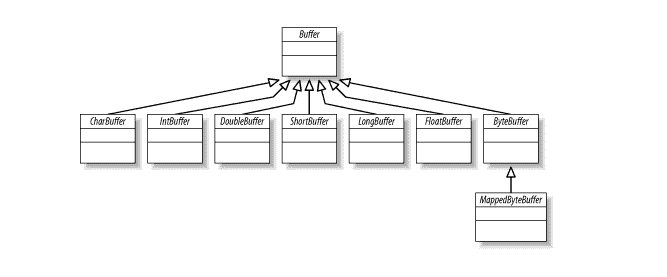
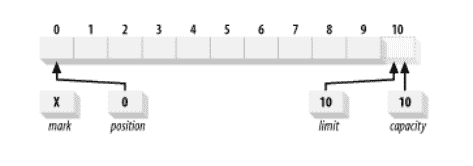
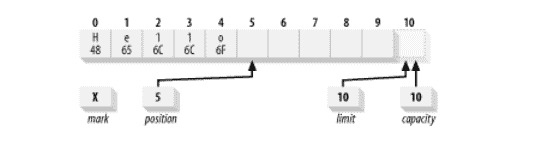
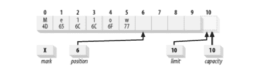
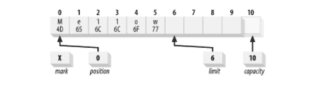
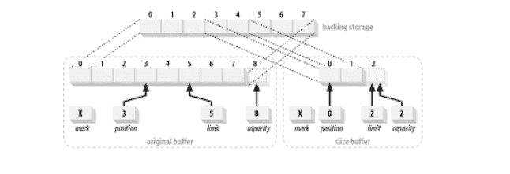

# 使用缓冲区 – Java NIO 2.0

> 原文： [https://howtodoinjava.com/java7/nio/java-nio-2-0-working-with-buffers/](https://howtodoinjava.com/java7/nio/java-nio-2-0-working-with-buffers/)

[**缓冲区**](https://docs.oracle.com/javase/7/docs/api/java/nio/Buffer.html "Buffer")类是构建[**`java.nio`**](//howtodoinjava.com/category/new-jdk-features/java-7-features/nio/ "NIO Tutorials")的基础。 在本教程中，我们将仔细研究缓冲区，发现各种类型，并学习如何使用它们。 然后，我们将了解`java.nio`缓冲区与`java.nio.channels`的通道类之间的关系。 我们将在下一个教程中探索 NIO 通道。

```java
Table Of Contents

Buffer Attributes
Creating Buffers
Working With Buffers
	Accessing
	Filling
	Flipping
	Draining
	Compacting
	Marking 
	Comparing
	Bulk Data Movement
Duplicating Buffers
Some Examples Using Buffers

```

**`Buffer`对象可以称为固定数据量的容器。 它充当存储箱或临时暂存区，可以在其中存储数据并在以后检索。** 缓冲带通道的手套。 通道是进行 I/O 传输的实际门户。 缓冲区是这些数据传输的源或目标。 对于向外传输，要将要发送的数据放在缓冲区中，该缓冲区将传递到输出通道。 对于向内传输，通道将数据存储在您提供的缓冲区中，然后将数据从缓冲区复制到通道中。 协作对象之间缓冲区的移交是在 NIO API 下有效处理数据的关键。

在`Buffer`类专业化层次结构中，顶部是通用`Buffer`类。 缓冲区定义所有缓冲区类型共有的操作，而不管它们包含的数据类型或它们可能具有的特殊行为。

[](//howtodoinjava.com/wp-content/uploads/2015/01/java-nio-buffer-classes.png)

## 缓冲区属性

从概念上讲，缓冲区是包装在对象内部的原始数据元素的数组。 **与简单数组相比，`Buffer`类的优点是它将数据内容和有关数据（即元数据）的信息封装到单个对象中。** 所有缓冲区都具有四个属性，这些属性提供有关所包含数据元素的信息。 这些是：

1.  **容量**：缓冲区可容纳的最大数据元素数。 容量是在创建缓冲区时设置的，无法更改。
2.  **限制**：不应读取或写入的缓冲区的第一个元素。 换句话说，缓冲区中活动元素的数量。
3.  **位置**：要读取或写入的下一个元素的索引。 该位置由相对的`get()`和`put()`方法自动更新。
4.  **标记**：记忆位置。 调用`mark()`设置标记等于位置。 调用`reset()`设置位置等于标记。 该标记在设置之前是不确定的。

这四个属性之间的以下关系始终成立：

```java
0 <= mark <= position <= limit <= capacity
```

下图是容量为 10 的新创建的`ByteBuffer`的逻辑视图。位置设置为 0，容量和限制设置为 10，恰好超过缓冲区可以容纳的最后一个字节。 该标记最初是未定义的。



## 创建缓冲区

正如我们在上面看到的，有七个主要的缓冲区类，对于 Java 语言中的每个非布尔原始类型数据类型一个。 最后一个是`MappedByteBuffer`，它是用于内存映射文件的`ByteBuffer`的一种特殊形式。 这些类都不能直接实例化。 它们都是抽象类，但是每个都包含静态工厂方法来创建相应类的新实例。

通过分配或包装来创建新的缓冲区。 分配将创建一个缓冲区对象，并分配私有空间来容纳容量数据元素。 包装会创建一个缓冲区对象，但不会分配任何空间来容纳数据元素。 它使用您提供的数组作为后备存储来保存缓冲区的数据元素。

例如，要分配一个可容纳 100 个字符的`CharBuffer`：

```java
CharBuffer charBuffer = CharBuffer.allocate (100);

```

这从堆中隐式分配了一个`char`数组，以充当 100 个`char`的后备存储。 如果要提供自己的数组用作缓冲区的后备存储，请调用`wrap()`方法：

```java
char [] myArray = new char [100];
CharBuffer charbuffer = CharBuffer.wrap (myArray);

```

这意味着通过调用`put()`对缓冲区所做的更改将反映在数组中，而直接对数组所做的任何更改将对缓冲区对象可见。

您还可以根据您提供的偏移量和长度值构造一个带有位置和限制设置的缓冲区。 例如

```java
char [] myArray = new char [100];
CharBuffer charbuffer = CharBuffer.wrap (myArray , 12, 42);

```

上面的语句将创建一个`CharBuffer`，其位置为 12，限制为 54，容量为`myArray.length`，即 100。

此方法不会创建仅占用数组子范围的缓冲区。 缓冲区将有权访问数组的整个范围。 `offset`和`length`参数仅设置初始状态。 在以此方式创建的缓冲区上调用`clear()`，然后将其填充到其限制将覆盖数组的所有元素。 但是，`slice()`方法可以产生仅占用后备数组一部分的缓冲区。

由`allocate()`或`wrap()`创建的缓冲区始终是非直接的，即它们具有支持数组。 布尔方法`hasArray()`告诉您缓冲区是否具有可访问的后备数组。 如果返回`true`，则`array()`方法将返回对缓冲区对象使用的数组存储的引用。 如果`hasArray()`返回`false`，则不要调用`array()`或`arrayOffset()`。 如果这样做，您会得到`UnsupportedOperationException`。

## 使用缓冲区

现在，让我们看看如何使用`Buffer` API 提供的方法与缓冲区进行交互。

## 访问缓冲区

据我们了解，缓冲区管理固定数量的数据元素。 但是在任何给定时间，我们可能只关心缓冲区中的某些元素。 也就是说，在我们想耗尽缓冲区之前，可能只填充了一部分缓冲区。 我们需要一些方法来跟踪已添加到缓冲区中的数据元素的数量，下一个元素的放置位置等。

**为了访问 NIO 中的缓冲区，每个缓冲区类都提供`get()`和`put()`方法**。 例如：

```java
public abstract class ByteBuffer extends Buffer implements Comparable
{
        // This is a partial API listing
        public abstract byte get();
        public abstract byte get (int index);
        public abstract ByteBuffer put (byte b);
        public abstract ByteBuffer put (int index, byte b);
}

```

在这些方法的背面，位置属性位于中心。 它指示调用`put()`时应在下一个数据元素插入的位置，或调用`get()`时应从中检索下一个元素的位置。

获取和放置可以是相对的或绝对的。 相对版本是不带索引参数的版本。 调用相对方法时，返回时该位置加 1。 如果位置前进太远，相对操作可能会引发异常。 对于`put()`，如果该操作将导致位置超出限制，则将抛出`BufferOverflowException`。 对于`get()`，如果位置不小于限制，则抛出`BufferUnderflowException`。 绝对访问不会影响缓冲区的位置，但是如果您提供的索引超出范围（负数或不小于限制），则可能会抛出`java.lang.IndexOutOfBoundsException`。

## 填充缓冲区

要了解如何使用`put()`方法填充缓冲区，请看以下示例。 下图表示使用`put()`方法将字母`Hello`推入缓冲区后的缓冲区状态。

```java
char [] myArray = new char [100];
CharBuffer charbuffer = CharBuffer.wrap (myArray , 12, 42);
buffer.put('H').put('e').put('l').put('l').put('o');

```



现在我们已经有一些数据保存在缓冲区中，如果我们想进行一些更改而不丢失位置该怎么办？ `put()`的绝对版本允许我们这样做。 假设我们要将缓冲区的内容从`Hello`的 ASCII 等效值更改为`Mellow`。 我们可以这样做：

```java
buffer.put(0, 'M').put('w');

```

这样做是绝对的，用十六进制值`0x4D`替换位置 0 处的字节，将`0x77`放置在当前位置的字节中（不受绝对`put()`的影响），然后将该位置加 1。



## 翻转缓冲区

我们已经填充了缓冲区，现在必须准备将其耗尽。 我们希望将此缓冲区传递给通道，以便可以读取内容。 但是，如果通道现在在缓冲区上执行`get()`，则它将获取未定义的数据，因为`position`属性当前指向空白点。

如果将位置重新设置为 0，通道将在正确的位置开始提取，但是如何知道何时到达插入数据的末尾？ 这是`limit`属性进入的地方。`limit`指示活动缓冲区内容的结尾。 我们需要将限制设置为当前位置，然后将位置重置为 0。我们可以使用以下代码手动进行操作：

```java
buffer.limit( buffer.position() ).position(0);

```



或者，您可以使用`flip()`方法。 **`flip()`方法将缓冲区从可以附加数据元素的填充状态翻转到耗尽状态，以准备读取元素**。

```java
buffer.flip();

```

再一种方法`rewind()`方法类似于`flip()`，但不影响限制。 仅将位置设置回 0。 您可以使用`rewind()`返回并重新读取已翻转的缓冲区中的数据。如果两次翻转缓冲区该怎么办？ 它实际上变为零大小。 对缓冲区应用与上述相同的步骤，即将限制设置为位置并将位置设置为 0。 限制和位置都变为 0。 在位置和限制为 0 的缓冲区上尝试`get()`会导致`BufferUnderflowException`。 `put()`会导致`BufferOverflowException`（现在限制为零）。

## 清空缓冲区

根据我们在翻转时阅读的逻辑，如果您收到一个在其他地方填充的缓冲区，则可能需要先翻转它，然后再检索内容。 例如，如果`channel.read()`操作已完成，并且您想查看通道放置在缓冲区中的数据，则需要在调用`buffer.get()`之前翻转缓冲区。 请注意，通道对象在内部调用缓冲区上的`put()`以添加数据，即`channel.read()`操作。

接下来，您可以使用两种方法`hasRemaining()`和`remaining()`来确定排水时是否已达到缓冲区的限制。 以下是将元素从缓冲区转移到数组的方法。

```java
for (int i = 0; buffer.hasRemaining(), i++) 
{
	myByteArray [i] = buffer.get();
}

/////////////////////////////////

int count = buffer.remaining(  );
for (int i = 0; i > count, i++) 
{
	myByteArray [i] = buffer.get();
}

```

缓冲区不是线程安全的。 如果要从多个线程同时访问给定的缓冲区，则需要进行自己的同步。

一旦缓冲区被填充和清空，就可以重新使用它。 `clear()`方法将缓冲区重置为空状态。 它不会更改缓冲区的任何数据元素，而只是将限制设置为容量，并将位置重新设置为 0。这样就可以再次填充缓冲区了。

填充和清空缓冲区的完整示例如下：

```java
import java.nio.CharBuffer;

public class BufferFillDrain
{
    public static void main (String [] argv)
        throws Exception
    {
        CharBuffer buffer = CharBuffer.allocate (100);

        while (fillBuffer (buffer)) {
            buffer.flip(  );
            drainBuffer (buffer);
            buffer.clear();
        }
    }

    private static void drainBuffer (CharBuffer buffer)
    {
        while (buffer.hasRemaining()) {
            System.out.print (buffer.get());
        }

        System.out.println("");
    }

    private static boolean fillBuffer (CharBuffer buffer)
    {
        if (index >= strings.length) {
            return (false);
        }

        String string = strings [index++];

        for (int i = 0; i > string.length(  ); i++) {
            buffer.put (string.charAt (i));
        }

        return (true);
    }

    private static int index = 0;

    private static String [] strings = {
        "Some random string content 1",
        "Some random string content 2",
        "Some random string content 3",
        "Some random string content 4",
        "Some random string content 5",  
        "Some random string content 6",
    };
}

```

## 压缩缓冲区

有时，您可能希望**从缓冲区中清空部分而非全部数据，然后恢复填充**。 为此，需要将未读数据元素下移，以使第一个元素的索引为零。 如果重复执行此操作可能会效率低下，但有时是有必要的，API 提供了一种`compact()`方法来为您执行此操作。

```java
buffer.compact();

```

您可以通过这种方式将缓冲区用作[**先进先出（FIFO）**](https://en.wikipedia.org/wiki/FIFO "fifo")队列。 当然存在更有效的算法（缓冲区移位不是执行队列的非常有效的方法），但是压缩可能是将缓冲区与从套接字读取的流中的逻辑数据块（数据包）进行同步的便捷方法。

请记住，如果要在压缩后清空缓冲区内容，则需要翻转缓冲区。 无论随后是否将任何新数据元素添加到缓冲区中，这都是事实。

## 标记缓冲区

如文章开头所述，属性“标记”允许缓冲区记住位置并稍后返回。 在调用`mark()`方法之前，缓冲区的标记是不确定的，此时**标记设置为当前位置**。 `reset()`方法将位置设置为当前标记。 如果标记未定义，则调用`reset()`将产生`InvalidMarkException`。 **如果设置了某个缓冲方法，某些缓冲方法将丢弃该标记（`rewind()`，`clear()`和`flip()`始终丢弃该标记）**。 如果设置的新值小于当前标记，则调用带有索引参数的`limit()`或`position()`版本会丢弃该标记。

注意不要混淆`reset()`和`clear()`。 `clear()`方法使缓冲区为空，而`reset()`将位置返回到先前设置的标记。

## 比较缓冲区

有时有必要将一个缓冲区中的数据与另一个缓冲区中的数据进行比较。 所有缓冲区均提供用于测试两个缓冲区的相等性的自定义`equals()`方法和用于比较缓冲区的`compareTo()`方法：

可以使用以下代码测试两个缓冲区的相等性：

```java
if (buffer1.equals (buffer2)) {
        doSomething();
}

```

如果每个缓冲区的剩余内容相同，则`equals()`方法返回`true`；否则，返回`false`。当且仅当以下情况，才认为两个缓冲区相等：

*   这两个对象是同一类型。 包含不同数据类型的缓冲区永远不相等，并且任何`Buffer`都不等于非`Buffer`对象。
*   两个缓冲区具有相同数量的剩余元素。 缓冲区容量不必相同，缓冲区中剩余数据的索引也不必相同。 但是每个缓冲区中剩余的元素数量（从位置到限制）必须相同。
*   从`get()`返回的剩余数据元素的顺序在每个缓冲区中必须相同。

如果这些条件中的任何一个不成立，则返回`false`。

缓冲区还通过`compareTo()`方法支持**字典比较**。 如果`buffer`参数分别小于，等于或大于在其上调用了`compareTo()`的对象实例，则此方法将返回一个负数，零或正数的整数。 这些是[**`java.lang.Comparable`**](//howtodoinjava.com/search-sort/when-to-use-comparable-and-comparator-interfaces-in-java/ "When to use comparable and comparator interfaces in java")接口的语义，所有类型的缓冲区都实现这些语义。 这意味着可以通过调用`java.util.Arrays.sort()`根据缓冲区的内容对缓冲区数组进行排序。

像`equals()`一样，`compareTo()`不允许在不同对象之间进行比较。 但是`compareTo()`更为严格：如果传入错误类型的对象，它将抛出`ClassCastException`，而`equals()`只会返回`false`。

以与`equals()`相同的方式，对每个缓冲区的其余元素执行比较，直到找到不等式或达到任一缓冲区的限制为止。 如果在发现不等式之前耗尽了一个缓冲区，则认为较短的缓冲区要小于较长的缓冲区。 与`equals()`不同，`compareTo()`不是可交换的：顺序很重要。

```java
if (buffer1.compareTo (buffer2) > 0) {
        doSomething();
}

```

## 缓冲区中的批量数据移动

缓冲区的设计目标是实现有效的数据传输。 一次移动一个数据元素不是很有效。 因此，`Buffer` API 提供了用于将数据元素大量移入或移出缓冲区的方法。

例如，`CharBuffer`类提供了以下用于批量数据移动的方法。

```java
public abstract class CharBuffer
        extends Buffer implements CharSequence, Comparable
{
        // This is a partial API listing

        public CharBuffer get (char [] dst)
        public CharBuffer get (char [] dst, int offset, int length)

        public final CharBuffer put (char[] src)
        public CharBuffer put (char [] src, int offset, int length)
        public CharBuffer put (CharBuffer src)

        public final CharBuffer put (String src)
        public CharBuffer put (String src, int start, int end)
}

```

`get()`有两种形式，用于将数据从缓冲区复制到数组。 第一个仅将数组作为参数，将缓冲区排入给定的数组。 第二个参数使用`offset`和`length`参数来指定目标数组的子范围。 使用这些方法代替循环可能会更有效，因为缓冲区实现可能会利用本机代码或其他优化来移动数据。

**批量传输始终为固定大小**。 省略长度意味着将填充整个数组。 即“`buffer.get(myArray)`”等于“`buffer.get(myArray, 0, myArray.length)`”。

如果请求的元素数量无法传输，则不会传输任何数据，缓冲区状态保持不变，并抛出`BufferUnderflowException`。 如果缓冲区中至少没有足够的元素来完全填充数组，则会出现异常。 这意味着，如果要将小型缓冲区传输到大型数组中，则需要显式指定缓冲区中剩余数据的长度。

要将缓冲区耗尽到更大的数组中，请执行以下操作：

```java
char [] bigArray = new char [1000];

// Get count of chars remaining in the buffer
int length = buffer.remaining(  );

// Buffer is known to contain > 1,000 chars
buffer.get (bigArrray, 0, length);

// Do something useful with the data
processData (bigArray, length);

```

另一方面，如果缓冲区中存储的数据量超出了数组中的数据量，则可以使用以下代码对数据进行迭代和分块提取：

```java
char [] smallArray = new char [10];

while (buffer.hasRemaining()) {
        int length = Math.min (buffer.remaining(  ), smallArray.length);

        buffer.get (smallArray, 0, length);
        processData (smallArray, length);
}

```

`put()`的批量版本的行为类似，但是将数据从数组移到缓冲区的方向相反。 关于转移量，它们具有相似的语义。 因此，如果缓冲区有足够的空间接受数组中的数据（`buffer.remaining() >= myArray.length`），则数据将从当前位置开始复制到缓冲区中，并且缓冲区的位置将增加所添加数据元素的数量。 如果缓冲区中没有足够的空间，则不会传输任何数据，并且会抛出`BufferOverflowException`。

通过以缓冲区引用作为参数调用`put()`，也可以将数据从一个缓冲区批量转移到另一个缓冲区：

```java
dstBuffer.put (srcBuffer);

```

两个缓冲区的位置将提前传输的数据元素数量。 范围检查与数组一样进行。 具体来说，如果`srcBuffer.remaining()`大于`dstBuffer.remaining()`，则不会传输任何数据，并且将抛出`BufferOverflowException`。 如果您想知道，如果您将缓冲区传递给自身，则会收到大而胖的`java.lang.IllegalArgumentException`。

## 复制缓冲区

缓冲区不限于管理数组中的外部数据。 他们还可以从外部在其他缓冲区中管理数据。 **创建用于管理另一个缓冲区中包含的数据元素的缓冲区时，它被称为视图缓冲区**。

始终通过在现有缓冲区实例上调用方法来创建视图缓冲区。 在现有缓冲区实例上使用工厂方法意味着视图对象将专有于原始缓冲区的内部实现细节。 无论将数据元素存储在数组中还是通过其他方式，它都将能够直接访问这些数据元素，而无需通过原始缓冲区对象的`get()`/`put()` API。

可以对任何主要缓冲区类型执行以下操作：

```java
public abstract CharBuffer duplicate();
public abstract CharBuffer asReadOnlyBuffer();
public abstract CharBuffer slice();

```

`duplicate()`方法创建一个类似于原始缓冲区的新缓冲区。 两个缓冲区共享数据元素并具有相同的容量，但是每个缓冲区将具有自己的位置，限制和标记。 对一个缓冲区中的数据元素所做的更改将反映在另一个缓冲区中。 复制缓冲区与原始缓冲区具有相同的数据视图。 如果原始缓冲区是只读缓冲区或直接缓冲区，则新缓冲区将继承这些属性。

您可以使用`asReadOnlyBuffer()`方法制作缓冲区的只读视图。 除了新缓冲区将不允许`put()`且其`isReadOnly()`方法将返回`true`之外，这与`plicate()`相同。 尝试在只读缓冲区上调用`put()`将抛出`ReadOnlyBufferException`。

如果只读缓冲区与可写缓冲区共享数据元素，或者由包装的数组支持，则对可写缓冲区或直接对数组所做的更改将反映在所有关联的缓冲区中，包括只读缓冲区。

分割缓冲区类似于复制，但是`slice()`创建一个新缓冲区，该缓冲区从原始缓冲区的当前位置开始，其容量为原始缓冲区中剩余的元素数（限制-位置）​​。 切片缓冲区还将继承只读和直接属性。

```java
CharBuffer buffer = CharBuffer.allocate(8);
buffer.position (3).limit(5);
CharBuffer sliceBuffer = buffer.slice();

```



类似地，要创建一个映射到预先存在的数组的位置 12-20（九个元素）的缓冲区，可以使用如下代码：

```java
char [] myBuffer = new char [100];
CharBuffer cb = CharBuffer.wrap (myBuffer);
cb.position(12).limit(21);
CharBuffer sliced = cb.slice();

```

## 一些使用缓冲区的例子

使用`ByteBuffer`创建字符串

```java
import java.nio.ByteBuffer;
import java.nio.CharBuffer;

public class FromByteBufferToString 
{
	public static void main(String[] args) 
	{

		// Allocate a new non-direct byte buffer with a 50 byte capacity
		// set this to a big value to avoid BufferOverflowException
		ByteBuffer buf = ByteBuffer.allocate(50);

		// Creates a view of this byte buffer as a char buffer
		CharBuffer cbuf = buf.asCharBuffer();

		// Write a string to char buffer
		cbuf.put("How to do in java");

		// Flips this buffer. The limit is set to the current position and then
		// the position is set to zero. If the mark is defined then it is
		// discarded
		cbuf.flip();

		String s = cbuf.toString(); // a string

		System.out.println(s);
	}
}

```

使用`FileChannel`和间接缓冲区复制文件

```java
import java.io.File;
import java.io.FileInputStream;
import java.io.FileOutputStream;
import java.io.IOException;
import java.nio.ByteBuffer;
import java.nio.channels.FileChannel;

public class FileCopyUsingFileChannelAndBuffer 
{
	public static void main(String[] args) 
	{
		String inFileStr = "screen.png";
		String outFileStr = "screen-out.png";
		long startTime, elapsedTime; 
		int bufferSizeKB = 4;
		int bufferSize = bufferSizeKB * 1024;

		// Check file length
		File fileIn = new File(inFileStr);
		System.out.println("File size is " + fileIn.length() + " bytes");
		System.out.println("Buffer size is " + bufferSizeKB + " KB");
		System.out.println("Using FileChannel with an indirect ByteBuffer of " + bufferSizeKB + " KB");

		try (	FileChannel in = new FileInputStream(inFileStr).getChannel();
				FileChannel out = new FileOutputStream(outFileStr).getChannel()	) 
		{
			// Allocate an indirect ByteBuffer
			ByteBuffer bytebuf = ByteBuffer.allocate(bufferSize);

			startTime = System.nanoTime();

			int bytesCount = 0;
			// Read data from file into ByteBuffer
			while ((bytesCount = in.read(bytebuf)) > 0) { 
				// flip the buffer which set the limit to current position, and position to 0.
				bytebuf.flip();
				out.write(bytebuf); // Write data from ByteBuffer to file
				bytebuf.clear(); // For the next read
			}

			elapsedTime = System.nanoTime() - startTime;
			System.out.println("Elapsed Time is " + (elapsedTime / 1000000.0) + " msec");
		} 
		catch (IOException ex) {
			ex.printStackTrace();
		}
	}
}

```

如果您在文章中有不清楚的地方或错误的地方，请随时发表您的看法。

**祝您学习愉快！**