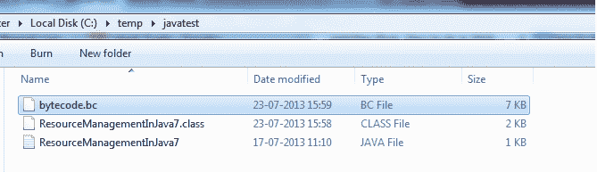
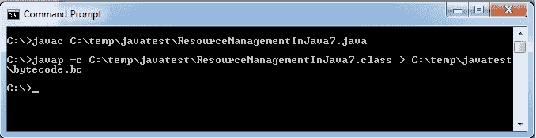

# Java 查看/生成类文件的字节码

> 原文： [https://howtodoinjava.com/java/basics/how-to-view-generate-bytecode-for-a-java-class-file/](https://howtodoinjava.com/java/basics/how-to-view-generate-bytecode-for-a-java-class-file/)

很多时候，我们需要了解编译器在后台执行的操作。 我们正在编写的 Java 语句将如何重新排序和执行。 另外，我们也需要查看字节码以用于学习目的，我很少这样做。 在本教程中，我将给出一个示例，说明如何在 Java 中为类文件生成字节码。

为了演示该示例，我使用了为我的其他教程创建的 java 文件，该教程与 java 7 中的[**自动资源管理**](//howtodoinjava.com/java-7/automatic-resource-management-with-try-with-resources-in-java-7/ "Automatic resource management with try-with-resources in java 7")有关。

## 步骤 1）使用命令`javac`（可选）编译文件`ResourceManagementInJava7.java`

这是可选的，因为您可能已经具有`.class`文件。

```java
prompt > javac C:tempjavatestResourceManagementInJava7.java
```

这将生成`.class`文件`ResourceManagementInJava7.class`。

## 步骤 2）执行`javap`命令并将输出重定向到`.bc`文件

```java
C:>javap -c C:tempjavatestResourceManagementInJava7.class > C:tempjavatestbytecode.bc
```



资料夹检视

让我们看一下在命令提示符下运行的命令。



命令窗口视图

文件`bytecode.bc`文件将在给定位置生成。 将会是这样的：

```java
Compiled from "ResourceManagementInJava7.java"
public class com.howtodoinjava.java7.tryCatch.ResourceManagementInJava7 {
  public com.howtodoinjava.java7.tryCatch.ResourceManagementInJava7();
    Code:
       0: aload_0       
       1: invokespecial #1                  // Method java/lang/Object."<init>":()V
       4: return        

  public static void main(java.lang.String[]);
    Code:
       0: new           #2                  // class java/io/BufferedReader
       3: dup           
       4: new           #3                  // class java/io/FileReader
       7: dup           
       8: ldc           #4                  // String C:/temp/test1.txt
      10: invokespecial #5                  // Method java/io/FileReader."<init>":(Ljava/lang/String;)V
      13: invokespecial #6                  // Method java/io/BufferedReader."<init>":(Ljava/io/Reader;)V
      16: astore_1      
      17: aconst_null   
      18: astore_2      
      19: new           #2                  // class java/io/BufferedReader
      22: dup           
      23: new           #3                  // class java/io/FileReader
      26: dup           
      27: ldc           #7                  // String C:/temp/test2.txt
      29: invokespecial #5                  // Method java/io/FileReader."<init>":(Ljava/lang/String;)V
      32: invokespecial #6                  // Method java/io/BufferedReader."<init>":(Ljava/io/Reader;)V
      35: astore_3      
      36: aconst_null   
      37: astore        4
      39: new           #2                  // class java/io/BufferedReader
      42: dup           
      43: new           #3                  // class java/io/FileReader
      46: dup           
      47: ldc           #8                  // String C:/temp/test3.txt
      49: invokespecial #5                  // Method java/io/FileReader."<init>":(Ljava/lang/String;)V
      52: invokespecial #6                  // Method java/io/BufferedReader."<init>":(Ljava/io/Reader;)V
      55: astore        5
      57: aconst_null   
      58: astore        6
      60: aload         5
      62: ifnull        138
      65: aload         6
      67: ifnull        90
      70: aload         5
      72: invokevirtual #9                  // Method java/io/BufferedReader.close:()V
      75: goto          138
      78: astore        7
      80: aload         6
      82: aload         7
      84: invokevirtual #11                 // Method java/lang/Throwable.addSuppressed:(Ljava/lang/Throwable;)V
      87: goto          138
      90: aload         5
      92: invokevirtual #9                  // Method java/io/BufferedReader.close:()V
      95: goto          138
      98: astore        8
     100: aload         5
     102: ifnull        135
     105: aload         6
     107: ifnull        130
     110: aload         5
     112: invokevirtual #9                  // Method java/io/BufferedReader.close:()V
     115: goto          135
     118: astore        9
     120: aload         6
     122: aload         9
     124: invokevirtual #11                 // Method java/lang/Throwable.addSuppressed:(Ljava/lang/Throwable;)V
     127: goto          135
     130: aload         5
     132: invokevirtual #9                  // Method java/io/BufferedReader.close:()V
     135: aload         8
     137: athrow        
     138: aload_3       
     139: ifnull        219
     142: aload         4
     144: ifnull        166
     147: aload_3       
     148: invokevirtual #9                  // Method java/io/BufferedReader.close:()V
     151: goto          219
     154: astore        5
     156: aload         4
     158: aload         5
     160: invokevirtual #11                 // Method java/lang/Throwable.addSuppressed:(Ljava/lang/Throwable;)V
     163: goto          219
     166: aload_3       
     167: invokevirtual #9                  // Method java/io/BufferedReader.close:()V
     170: goto          219
     173: astore        5
     175: aload         5
     177: astore        4
     179: aload         5
     181: athrow        
     182: astore        10
     184: aload_3       
     185: ifnull        216
     188: aload         4
     190: ifnull        212
     193: aload_3       
     194: invokevirtual #9                  // Method java/io/BufferedReader.close:()V
     197: goto          216
     200: astore        11
     202: aload         4
     204: aload         11
     206: invokevirtual #11                 // Method java/lang/Throwable.addSuppressed:(Ljava/lang/Throwable;)V
     209: goto          216
     212: aload_3       
     213: invokevirtual #9                  // Method java/io/BufferedReader.close:()V
     216: aload         10
     218: athrow        
     219: aload_1       
     220: ifnull        290
     223: aload_2       
     224: ifnull        243
     227: aload_1       
     228: invokevirtual #9                  // Method java/io/BufferedReader.close:()V
     231: goto          290
     234: astore_3      
     235: aload_2       
     236: aload_3       
     237: invokevirtual #11                 // Method java/lang/Throwable.addSuppressed:(Ljava/lang/Throwable;)V
     240: goto          290
     243: aload_1       
     244: invokevirtual #9                  // Method java/io/BufferedReader.close:()V
     247: goto          290
     250: astore_3      
     251: aload_3       
     252: astore_2      
     253: aload_3       
     254: athrow        
     255: astore        12
     257: aload_1       
     258: ifnull        287
     261: aload_2       
     262: ifnull        283
     265: aload_1       
     266: invokevirtual #9                  // Method java/io/BufferedReader.close:()V
     269: goto          287
     272: astore        13
     274: aload_2       
     275: aload         13
     277: invokevirtual #11                 // Method java/lang/Throwable.addSuppressed:(Ljava/lang/Throwable;)V
     280: goto          287
     283: aload_1       
     284: invokevirtual #9                  // Method java/io/BufferedReader.close:()V
     287: aload         12
     289: athrow        
     290: goto          298
     293: astore_1      
     294: aload_1       
     295: invokevirtual #13                 // Method java/io/IOException.printStackTrace:()V
     298: return        
    Exception table:
       from    to  target type
          70    75    78   Class java/lang/Throwable
         110   115   118   Class java/lang/Throwable
          98   100    98   any
         147   151   154   Class java/lang/Throwable
          39   138   173   Class java/lang/Throwable
          39   138   182   any
         193   197   200   Class java/lang/Throwable
         173   184   182   any
         227   231   234   Class java/lang/Throwable
          19   219   250   Class java/lang/Throwable
          19   219   255   any
         265   269   272   Class java/lang/Throwable
         250   257   255   any
           0   290   293   Class java/io/IOException
}

```

学习愉快！