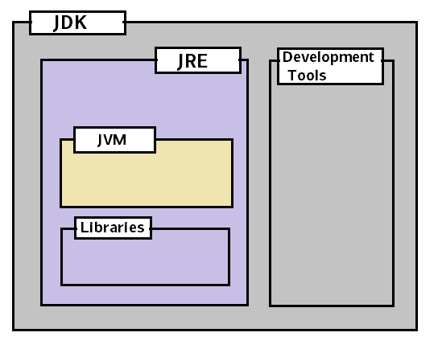

# 什么是 Java 编程语言？

> 原文： [https://howtodoinjava.com/java/basics/what-is-java-programming-language/](https://howtodoinjava.com/java/basics/what-is-java-programming-language/)

Java 是通用计算机**编程语言**，它是[并发](https://howtodoinjava.com/java-concurrency-tutorial/)，基于类，[面向对象](https://howtodoinjava.com/oops/object-oriented-principles/)，并且经过专门设计，以尽可能减少实现依赖 。 旨在让应用程序开发人员“编写一次，随处运行”（WORA），这意味着已编译的 Java 代码可以在支持 Java 的所有平台上运行，而无需重新编译。

例如，您可以在 UNIX 上编写和编译 Java 程序，然后在 Microsoft Windows，Macintosh 或 UNIX 计算机上运行它，而无需对源代码进行任何修改。 通过将 Java 程序编译为称为**字节码**的中间语言来实现`WORA`。 字节码的格式是*与平台无关的*。 称为 [Java 虚拟机（JVM）](https://howtodoinjava.com/java/basics/jdk-jre-jvm/)的虚拟机用于在每个平台上运行字节码。



JDK vs JRE vs JVM

## Java 的历史

Java 最初由 **James Gosling** 在 *Sun Microsystems* （已由 Oracle Corporation 收购）开发，并于 1995 年作为 Sun Microsystems Java 平台的核心组件发布。 该语言的大部分语法均来自 C 和 C++，但与任何一种相比，它的低级特性都更少。

*Oracle 公司*是 Java SE 平台的正式实现的当前所有者，此后于 2010 年 1 月 27 日收购了 Sun Microsystems。该实现基于 Sun 最初的 Java 实现。 Oracle 实现可用于 Microsoft Windows，Mac OS X，Linux 和 Solaris。

Oracle 实现打包为两个不同的发行版：

1.  Java 运行时环境（JRE）包含运行 Java 程序所需的 Java SE 平台部分，供最终用户使用。
2.  Java 开发工具包（JDK）供软件开发人员使用，包括 Java 编译器，Javadoc，Jar 和调试器之类的开发工具。

## 垃圾收集

Java 使用自动[**垃圾收集器**](//howtodoinjava.com/java/garbage-collection/revisiting-memory-management-and-garbage-collection-mechanisms-in-java/)来管理对象生命周期中的内存。 程序员确定何时创建对象，一旦不再使用对象，Java 运行时将负责恢复内存。 一旦没有对对象的引用，则垃圾回收器将有资格自动释放无法访问的内存。

如果程序员的代码持有对不再需要的对象的引用，则通常仍会发生类似于内存泄漏的情况，通常是将不再需要的对象存储在仍在使用的容器中时。 如果调用了不存在的对象的方法，则会引发[**`NullPointerException`**](//howtodoinjava.com/java/exception-handling/how-to-effectively-handle-nullpointerexception-in-java/)。

垃圾收集可能随时发生。 理想情况下，它将在程序空闲时发生。 如果堆上的可用内存不足以分配新对象，则可以保证触发该事件。 这可能会导致程序暂时停止。 在 Java 中无法进行显式内存管理。

## Java Hello World 程序

传统的“你好，世界！” 程序可以用 Java 编写为：

```java
public class HelloWorldApplication {
    public static void main(String[] args) {
        System.out.println("Hello World!"); 	// Prints Hello World! to the console.
    }
}

```

## Java 类文件

1.  Java 源文件必须以它们包含的公共类命名，并在其后附加`.java`后缀，例如`HelloWorldApplication.java`。
2.  必须首先使用 Java 编译器将其编译为字节码，然后生成一个名为`HelloWorldApplication.class`的文件。 只有这样才能执行或“启动”。
3.  Java 源文件只能包含一个公共类，但是可以包含多个类，除了公共访问权限和任何数量的公共内部类之外。
4.  当源文件包含多个类时，将一个类设为`public`，然后使用该公共类名命名源文件。

在下一组教程中，我们将了解有关其他语言特性的更多信息。

学习愉快！