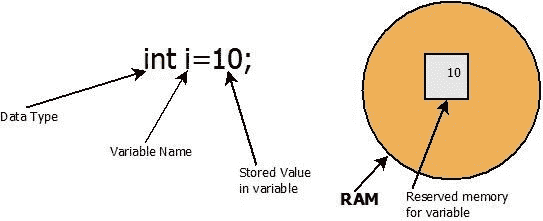

# Java 变量

> 原文： [https://howtodoinjava.com/java/basics/java-variables/](https://howtodoinjava.com/java/basics/java-variables/)

了解 Java 中的 **Java 变量**，**类型的变量**，如何声明变量的示例以及有关变量命名约定的**最佳做法**的示例。

> Java 编程语言使用“ **字段**”和“**变量**”作为其术语的一部分。 字段引用在方法外部声明的变量，而变量引用在方法内部的声明，包括方法参数。

## 1\. 什么是变量

顾名思义，变量的值在运行时可以变化。 在 Java 中，**变量是对存储变量值的存储区**的命名引用。



变量如何工作

#### 1.1 变量声明语法

变量声明具有以下语法：

```java
[data_type] [variable_name] = [variable_value];
```

*   **`data_type`** –指存储在存储区中的信息类型。
*   **`variable_name`** –引用变量的名称。
*   **`variable_value`** –引用要存储在存储区中的值。

例如，以下语句是 Java 中有效的变量声明。

```java
int i = 10;         //Variable of int type

String str = "howtodoinjava.com";   //Variable of string type

Object obj = new Object();      //Variable of object type

int[] scores = [1,2,3,4,5,6,7,8,9];         //Variable of int type

```

#### 1.2 Java 变量示例

```java
int i = 10;
int j = 10;

int sum = i + j;

System.out.println( sum );  

```

程序输出。

```java
20

```

## 2\. 扩大和缩小

#### 2.1 加宽

当较小的原始类型值自动容纳在较大/较宽的原始数据类型中时，这称为变量的扩展。 在给定的示例中，将`int`类型变量分配给`long`类型变量，而没有任何数据丢失或错误。

```java
int i = 10;
long j = i;

System.out.println( i );  
System.out.println( j );  

```

程序输出：

```java
10
10

```

#### 2.2 缩小

如果在较小的原始数据类型中分配了较大的原始类型值，则称为变量变窄。 由于可用于存储数据的位数较少，可能会导致某些数据丢失。 它**需要显式类型广播**到所需的数据类型。

在给定的示例中，将`int`类型变量分配给具有数据丢失的`byte`类型变量。

```java
int i=198;  
byte j=(byte)i;  

System.out.println( i );  
System.out.println( j );  

```

程序输出：

```java
198
-58

```

## 3\. 变量类型

在 Java 中，有[**四种类型的变量**](https://docs.oracle.com/javase/tutorial/java/nutsandbolts/variables.html)。 这些变量可以是**基本类型**，**类类型**或**数组类型**之一。

根据变量的**范围划分所有变量，可以在其中访问它们。**

1.  #### 实例变量

    没有`static`关键字声明的变量（在类中）。 非静态字段也称为实例变量，因为它们的值对于类的每个实例都是唯一的。它们也称为*状态变量*。

    ```java
    public class VariableExample
    {
        int counter = 20;         //1 - Instance variable
    }

    ```

2.  #### 静态变量

    也称为*类变量*。 它是使用`static`修饰符声明的任何字段。 这意味着无论实例已被实例化多少次，该变量的确切副本只有一个。

    ```java
    public class VariableExample
    {
        static float PI = 3.14f;    //2 - Class variable
    }

    ```

    在 Java 中，可以将声明为`public static`的变量视为全局变量。

3.  #### 局部变量

    这些在方法内部使用，因为在方法执行期间存在临时变量。 声明局部变量的语法类似于声明字段。 局部变量只对声明它们的方法可见； 在班上的其他同学中无法访问它们。

    ```java
    public class VariableExample
    {
        public static void main( String[] args ) {

            int age = 30;     //3 - Local variable (inside method body)
        }
    }

    ```

4.  #### 方法参数

    参数是在调用方法时传递给方法的变量。 尽管在调用方法时会为其分配值，但参数**也只能在声明它们的方法**内部访问。

    ```java
    public class VariableExample
    {
        public static void main( String[] args ) {

            print( 40 );
        }

        public static void print ( int param ) {      //4 - Method Argument

            System.out.println ( param );
        }
    }

    ```

## 4\. 实例变量与类变量

*   实例变量（**非静态字段**）对于类的每个实例都是唯一的。
*   类变量（**静态字段**）是使用`static`修饰符声明的字段； 无论实例已被实例化多少次，类变量都只有一个副本。
*   要访问实例变量，必须创建一个新的类实例。 类变量可通过类引用进行访问，并且不需要创建对象实例。

    举个例子。 我们有一个`Data`类，它具有一个实例变量和一个类变量。

    ```java
    public class Data 
    {
        int counter = 20;

        static float PI = 3.14f;
    }

    ```

    我们可以以给定的方式访问两个变量。

    ```java
    public class Main 
    {
        public static void main(String[] args) 
        {
            Data dataInstance = new Data();

            //Need new instance

            System.out.println( dataInstance.counter );    //20

            //Can access using class reference

            System.out.println( Data.PI );                 //3.14 
        }
    }

    ```

## 5\. Java 变量命名约定

有一些规则和约定与**有关如何定义变量名**。

1.  Java 变量名称是**区分大小写**。 变量名称`employee`与`Employee`或`EMPLOYEE`不同。
2.  Java 变量名称**必须以字母**或 `$` 或 `_` 字符开头。
3.  Java 变量名称中的第一个字符之后，名称**也可以包含数字**， `$` 或 `_` 字符。
4.  变量名**在 Java 中不能为保留关键字**。 例如，单词`break`
    或`continue`是 Java 中的保留字。 因此，您不能为它们命名变量。
5.  变量名称应以**小写**编写。 例如，`variable`或`apple`。
6.  如果变量名由多个单词组成，请遵循**驼峰**表示法。 例如，`deptName`或`firstName`。
7.  静态最终字段（*常量*）应在所有大写字母中命名，通常使用 `_` 分隔名称中的单词。 例如`LOGGER`或`INTEREST_RATE`。

学习愉快！