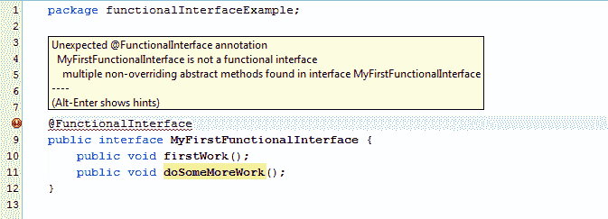

# Java 8 –功能接口

> 原文： [https://howtodoinjava.com/java8/functional-interface-tutorial/](https://howtodoinjava.com/java8/functional-interface-tutorial/)

了解 Java 8 功能接口以及围绕一个接口允许的一种抽象方法的规则。 了解如何通过功能接口中的默认方法添加更多方法。

```java
Table of Contents 

1\. What is functional interface
2\. Do's and Don't's in functional interfaces

```

## 1\. 什么是功能界面

功能接口是 [**java 8**](//howtodoinjava.com/category/java8/ "java 8") 中的新增功能，其中**恰好允许其中的一种抽象方法**。 这些接口也称为**单一抽象方法接口（SAM 接口）**。

在 Java 8 中，功能接口也可以使用 lambda 表达式，方法引用和构造器引用表示。

Java 8 也引入了一个注解，即 **@FunctionalInterface** ，当您注解的接口违反了一种抽象方法的约定时，该注解也可用于编译器级错误。

让我们构建第一个功能界面：

```java
@FunctionalInterface
public interface MyFirstFunctionalInterface 
{
	public void firstWork();
}

```

让我们尝试添加另一个抽象方法：

```java
@FunctionalInterface
public interface MyFirstFunctionalInterface 
{
	public void firstWork();
	public void doSomeMoreWork();	//error
}

```

以上将导致编译器错误，如下所示：

```java
Unexpected @FunctionalInterface annotation
@FunctionalInterface ^ MyFirstFunctionalInterface is not a functional interface
multiple non-overriding abstract methods found in interface MyFirstFunctionalInterface

```



> 阅读更多：[通用功能接口](https://howtodoinjava.com/java8/generic-functional-interfaces/)

## 2\. 功能界面中的“是”与“不”

以下是功能界面中允许和不允许的事物的列表。

*   如上所述， ***在任何功能接口中仅允许使用一种抽象方法*** 。 在功能接口中不允许使用第二种抽象方法。 如果删除 **@FunctionInterface** 注解，则可以添加另一个抽象方法，但是它将使该接口成为非功能性接口。
*   即使`@FunctionalInterface`注释将被省略 ，功能接口也是 ***有效。 它仅用于通知编译器在接口内部强制使用单个[抽象方法](//howtodoinjava.com/object-oriented/exploring-interfaces-and-abstract-classes-in-java/ "Exploring interfaces and abstract classes in java")。***
*   Conceptually, a functional interface has exactly one abstract method. Since [**default methods**](//howtodoinjava.com/java8/default-methods-in-java-8/ "Default methods in java 8") have an implementation, they are not abstract. Since default methods are not abstract you’re ***free to add default methods to your functional interface as many as you like***.

    以下是有效的功能接口：

    ```java
    @FunctionalInterface
    public interface MyFirstFunctionalInterface 
    {
        public void firstWork();

        default void doSomeMoreWork1(){
        //Method body
        }

        default void doSomeMoreWork2(){
        //Method body
        }
    }

    ```

*   If an interface declares an ***abstract method overriding one of the public methods of `java.lang.Object`, that also does not count toward the interface’s abstract method count*** since any implementation of the interface will have an implementation from java.lang.Object or elsewhere. e.g. [**Comparator**](//howtodoinjava.com/search-sort/when-to-use-comparable-and-comparator-interfaces-in-java/ "When to use comparable and comparator interfaces in java") is a functional interface even though it declared two abstract methods. Why? Because one of these abstract methods “`equals()`” which has signature equal to `public` method in `Object` class.

    例如 界面下方是有效的功能界面。

    ```java
    @FunctionalInterface
    public interface MyFirstFunctionalInterface 
    {
    	public void firstWork();

    	@Override
    	public String toString();                //Overridden from Object class

    	@Override
    	public boolean equals(Object obj);        //Overridden from Object class
    }

    ```

这就是 Java 8 中**功能接口的全部内容。**

学习愉快！