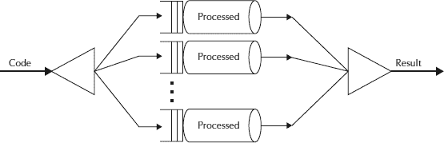

# Fork / Join Framework 教程：ForkJoinPool 示例

> 原文： [https://howtodoinjava.com/java7/forkjoin-framework-tutorial-forkjoinpool-example/](https://howtodoinjava.com/java7/forkjoin-framework-tutorial-forkjoinpool-example/)

在 Java 程序中有效使用并行内核一直是一个挑战。 很少有本地框架可以将工作分配到多个核心，然后将它们加入以返回结果集。 Java 7 已将此功能作为 [**Fork and Join 框架**](https://docs.oracle.com/javase/tutorial/essential/concurrency/forkjoin.html "forkjoin") 合并。

基本上， **Fork-Join 将手头的任务分解为多个微型任务**，直到微型任务足够简单，可以解决而无需进一步分解。 **就像[分而治之算法](https://en.wikipedia.org/wiki/Divide_and_conquer_algorithms "Divide_and_conquer_algorithms")** 一样。 在此框架中要注意的一个重要概念是**，理想情况下，没有工作线程处于空闲状态**。 他们实现了**工作窃取算法**，因为空闲工人`steal`从忙碌的工人那里进行工作。



叉连接框架

它基于 Java 并发性思想领袖 Doug Lea 的工作。 Fork / Join 处理线程的麻烦； 您只需要向框架指出可以分解并递归处理的部分。 它采用伪代码（摘自 Doug Lea 关于该主题的论文）：

```java
Result solve(Problem problem) {
	if (problem is small)
		directly solve problem
	else {
		split problem into independent parts
		fork new subtasks to solve each part
		join all subtasks
		compose result from subresults
	}
}
```

```java
Discussion Points

1) Core Classes used in Fork/Join Framework
    i)  ForkJoinPool
    ii) ForkJoinTask
2) Example Implementations of Fork/Join Pool Framework
    i)  Implementation Sourcecode
    ii) How it works?
3) Difference between Fork/Join Framework And ExecutorService
4) Existing Implementations in JDK
5) Conclusion
```

## Fork / Join 框架中使用的核心类

支持 Fork-Join 机制的核心类是[`ForkJoinPool`](https://docs.oracle.com/javase/7/docs/api/java/util/concurrent/ForkJoinPool.html "ForkJoinPool")和[`ForkJoinTask`](https://docs.oracle.com/javase/7/docs/api/java/util/concurrent/ForkJoinTask.html "ForkJoinTask")。

让我们详细了解他们的角色。

## 货叉池

`ForkJoinPool`基本上是`ExecutorService`的一种特殊实现，用于实现我们上面讨论的窃取算法。 我们通过提供目标并行度，即**处理器**的数量，来创建`ForkJoinPool`的实例，如下所示：

> ForkJoinPool 池=新的 ForkJoinPool（numberOfProcessors）;
> 
> 其中 numberOfProcessors = Runtime.getRunTime（）。availableProcessors（）;

If you use a no-argument constructor, by default, it creates a pool of size that equals the number of available processors obtained using above technique.

尽管您指定了任何初始池大小，但**池会动态调整其大小，以尝试在任何给定时间点维护足够的活动线程**。 与其他`ExecutorService's`相比，另一个重要区别是该程序池无需在程序退出时显式关闭，因为其所有线程均处于守护程序模式。

向`ForkJoinPool`提交任务的方式有三种。

**1）execute（）方法** //所需的异步执行； 调用其 fork 方法在多个线程之间分配工作。
**2）invoke（）方法**：//等待获得结果； 在池上调用 invoke 方法。
**3）Submit（）方法**：//返回一个 Future 对象，可用于检查状态并在完成时获取结果。

## ForkJoinTask

这是用于创建在`ForkJoinPool`中运行的任务的抽象类。 `Recursiveaction`和`RecursiveTask`是`ForkJoinTask`的仅有的两个直接的已知子类。 这两类之间的唯一区别是`RecursiveAction`不返回值，而`RecursiveTask`确实具有返回值并返回指定类型的对象。

> 在这两种情况下，您都需要在子类中实现 compute 方法，该方法执行任务所需的主要计算。

`ForkJoinTask`类提供了几种检查任务执行状态的方法。 如果任务以任何方式完成，则 **isDone（）**方法返回 true。 如果任务未取消就完成或没有遇到异常，则 **isCompletedNormally（）方法返回 true；如果任务被取消，则 **isCancelled（）**返回 true。 最后，如果任务被取消或遇到异常，则 **isCompletedabnormally（）**返回 true。** 

## Fork / Join Pool 框架的示例实现

在此示例中，您将学习如何使用`ForkJoinPool`和`ForkJoinTask`类提供的异步方法来管理任务。 您将实现**程序，该程序将在文件夹及其子文件夹**中搜索具有确定扩展名的文件。 您将要实现的`ForkJoinTask`类将处理文件夹的内容。 对于该文件夹中的每个子文件夹，它将以异步方式将新任务发送到`ForkJoinPool`类。 对于该文件夹中的每个文件，任务将检查文件的扩展名并将其继续添加到结果列表中。

上述问题的解决方案在`FolderProcessor`类中实现，如下所示：

## 实现源代码

**FolderProcessor.java**

```java
package forkJoinDemoAsyncExample;

import java.io.File;
import java.util.ArrayList;
import java.util.List;
import java.util.concurrent.RecursiveTask;

public class FolderProcessor extends RecursiveTask<List<String>>
{
   private static final long serialVersionUID = 1L;
   //This attribute will store the full path of the folder this task is going to process.
   private final String      path;
   //This attribute will store the name of the extension of the files this task is going to look for.
   private final String      extension;

   //Implement the constructor of the class to initialize its attributes
   public FolderProcessor(String path, String extension)
   {
      this.path = path;
      this.extension = extension;
   }

   //Implement the compute() method. As you parameterized the RecursiveTask class with the List<String> type, 
   //this method has to return an object of that type.
   @Override
   protected List<String> compute()
   {
      //List to store the names of the files stored in the folder.
      List<String> list = new ArrayList<String>();
      //FolderProcessor tasks to store the subtasks that are going to process the subfolders stored in the folder
      List<FolderProcessor> tasks = new ArrayList<FolderProcessor>();
      //Get the content of the folder.
      File file = new File(path);
      File content[] = file.listFiles();
      //For each element in the folder, if there is a subfolder, create a new FolderProcessor object 
      //and execute it asynchronously using the fork() method.
      if (content != null)
      {
         for (int i = 0; i < content.length; i++)
         {
            if (content[i].isDirectory())
            {
               FolderProcessor task = new FolderProcessor(content[i].getAbsolutePath(), extension);
               task.fork();
               tasks.add(task);
            }
            //Otherwise, compare the extension of the file with the extension you are looking for using the checkFile() method 
            //and, if they are equal, store the full path of the file in the list of strings declared earlier.
            else
            {
               if (checkFile(content[i].getName()))
               {
                  list.add(content[i].getAbsolutePath());
               }
            }
         }
      }
      //If the list of the FolderProcessor subtasks has more than 50 elements, 
      //write a message to the console to indicate this circumstance.
      if (tasks.size() > 50)
      {
         System.out.printf("%s: %d tasks ran.\n", file.getAbsolutePath(), tasks.size());
      }
      //add to the list of files the results returned by the subtasks launched by this task.
      addResultsFromTasks(list, tasks);
      //Return the list of strings
      return list;
   }

   //For each task stored in the list of tasks, call the join() method that will wait for its finalization and then will return the result of the task. 
   //Add that result to the list of strings using the addAll() method.
   private void addResultsFromTasks(List<String> list, List<FolderProcessor> tasks)
   {
      for (FolderProcessor item : tasks)
      {
         list.addAll(item.join());
      }
   }

   //This method compares if the name of a file passed as a parameter ends with the extension you are looking for.
   private boolean checkFile(String name)
   {
      return name.endsWith(extension);
   }
}

```

并在`FolderProcessor`以上使用，请遵循以下代码：

**Main.java**

```java
package forkJoinDemoAsyncExample;

import java.util.List;
import java.util.concurrent.ForkJoinPool;
import java.util.concurrent.TimeUnit;

public class Main
{
   public static void main(String[] args)
   {
      //Create ForkJoinPool using the default constructor.
      ForkJoinPool pool = new ForkJoinPool();
      //Create three FolderProcessor tasks. Initialize each one with a different folder path.
      FolderProcessor system = new FolderProcessor("C:\\Windows", "log");
      FolderProcessor apps = new FolderProcessor("C:\\Program Files", "log");
      FolderProcessor documents = new FolderProcessor("C:\\Documents And Settings", "log");
      //Execute the three tasks in the pool using the execute() method.
      pool.execute(system);
      pool.execute(apps);
      pool.execute(documents);
      //Write to the console information about the status of the pool every second 
      //until the three tasks have finished their execution.
      do
      {
         System.out.printf("******************************************\n");
         System.out.printf("Main: Parallelism: %d\n", pool.getParallelism());
         System.out.printf("Main: Active Threads: %d\n", pool.getActiveThreadCount());
         System.out.printf("Main: Task Count: %d\n", pool.getQueuedTaskCount());
         System.out.printf("Main: Steal Count: %d\n", pool.getStealCount());
         System.out.printf("******************************************\n");
         try
         {
            TimeUnit.SECONDS.sleep(1);
         } catch (InterruptedException e)
         {
            e.printStackTrace();
         }
      } while ((!system.isDone()) || (!apps.isDone()) || (!documents.isDone()));
      //Shut down ForkJoinPool using the shutdown() method.
      pool.shutdown();
      //Write the number of results generated by each task to the console.
      List<String> results;
      results = system.join();
      System.out.printf("System: %d files found.\n", results.size());
      results = apps.join();
      System.out.printf("Apps: %d files found.\n", results.size());
      results = documents.join();
      System.out.printf("Documents: %d files found.\n", results.size());
   }
}

```

上面程序的输出将如下所示：

```java
Main: Parallelism: 2
Main: Active Threads: 3
Main: Task Count: 1403
Main: Steal Count: 5551
******************************************
******************************************
Main: Parallelism: 2
Main: Active Threads: 3
Main: Task Count: 586
Main: Steal Count: 5551
******************************************
System: 337 files found.
Apps: 10 files found.
Documents: 0 files found.
```

## 怎么运行的？

在`FolderProcessor`类中，每个任务都处理文件夹的内容。 如您所知，此内容包含以下两种元素：

*   档案
*   其他文件夹

**如果任务找到文件夹，它将创建另一个 Task 对象来处理该文件夹，并使用 fork（）方法**将其发送到池中。 如果该任务具有空闲的工作线程或可以创建新的工作线程，则此方法会将任务发送到执行该任务的池。 **方法将立即返回，因此任务可以继续处理**文件夹的内容。 对于每个文件，任务都会将其扩展名与要查找的扩展名进行比较，如果它们相等，则将文件名添加到结果列表中。

**任务处理完分配的文件夹的所有内容后，它将等待使用 join（）方法**完成发送给池的所有任务的完成。 在任务中调用的此方法等待其执行完成，并返回 **compute（）**方法返回的值。 该任务将其发送的所有任务的结果与自己的结果分组，并将该列表作为 compute（）方法的返回值返回。

## Fork / Join 框架和 ExecutorService 之间的区别

Fork / Join 和 Executor 框架之间的**主要区别是工作窃取算法**。 与 Executor 框架不同，当任务正在等待使用 join 操作创建的子任务完成时，正在执行该任务的线程（称为 worker 线程）将寻找尚未执行的其他任务并开始执行它。 通过这种方式，线程可以充分利用其运行时间，从而提高了应用程序的性能。

## JDK 中的现有实现

Java SE 中有一些通常有用的功能，已经使用 fork / join 框架实现了。

**1）** Java SE 8 中引入的一种此类实现由 **java.util.Arrays 类用于其 parallelSort（）方法**。 这些方法类似于 sort（），但是通过 fork / join 框架利用并发性。 在多处理器系统上运行时，大型数组的并行排序比顺序排序要快。

**2）**在 **Stream.parallel（）**中使用的并行性。 阅读有关 Java 8 中此[并行流操作的更多信息。](//howtodoinjava.com/java8/java-8-tutorial-streams-by-examples/ "parallel strems") 

## 结论

设计好的多线程算法很困难，并且**分叉/联接并非在每种情况下都有效**。 它在其自身的适用范围内非常有用，但是最后，您必须确定您的问题是否适合该框架，否则，**您必须准备在此基础上开发自己的解决方案**。 java.util.concurrent 软件包提供的一流工具。

**参考**

[http://gee.cs.oswego.edu/dl/papers/fj.pdf](http://gee.cs.oswego.edu/dl/papers/fj.pdf)
[http://docs.oracle.com/javase/tutorial/essential/concurrency/forkjoin .html](https://docs.oracle.com/javase/tutorial/essential/concurrency/forkjoin.html)
[http://www.packtpub.com/java-7-concurrency-cookbook/book](https://www.packtpub.com/java-7-concurrency-cookbook/book)

**祝您学习愉快！**