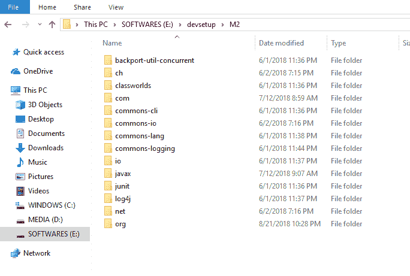

# Maven 本地仓库位置以及如何更改？

> 原文： [https://howtodoinjava.com/maven/change-local-repository-location/](https://howtodoinjava.com/maven/change-local-repository-location/)

在本教程中，学习更改 Maven 本地仓库的位置。 [**Maven**](https://howtodoinjava.com/maven/how-to-install-maven-on-windows/ "maven") 是构建和依赖项管理工具。 它将所需的项目依赖项下载到我们的本地系统，并将其包含到定义的项目编译或运行时中。

## 1\. Maven 的默认本地仓库位置

默认情况下，maven 的本地仓库位于`${user.home}/.m2/repository`上。 在不同的操作系统中，这些路径可以解决：

```java
Windows 7: 		C:/Documents and Settings/<username>/.m2/repository
Windows 10:		C:/Users/<username>/.m2/repository
Linux: 			/home/<username>/.m2/repository
Mac: 			/Users/<username>/.m2/repository

```

我们可以将本地仓库位置更改为我们选择的其他位置。

## 2.更改 Maven 本地仓库位置

Maven 作为存档文件夹分发。 通常，开发人员[下载 Maven ](https://maven.apache.org/download.cgi)并将其解压缩到他们的工作站。

下载了 Maven 之后，请按照给定的简单步骤将 Maven 本地仓库位置更改为其他路径。

*   导航到路径`{M2_HOME}/conf/`，其中`M2_HOME`是 maven 安装文件夹。
*   在某些文本编辑器中以编辑方式打开文件`settings.xml`。
*   细化标签`<localRepository>`。
*   更新此标记值中的所需路径。 保存文件。

    ```java
    	<settings xmlns="http://maven.apache.org/SETTINGS/1.0.0"
              xmlns:xsi="http://www.w3.org/2001/XMLSchema-instance"
              xsi:schemaLocation="http://maven.apache.org/SETTINGS/1.0.0 http://maven.apache.org/xsd/settings-1.0.0.xsd">

    	  <!-- localRepository
    	   | The path to the local repository maven will use to store artifacts.
    	   |
    	   | Default: ${user.home}/.m2/repository -->

    	  <localRepository>E:/devsetup/M2</localRepository>

    	  ...
    	  ...

     	</settings>

    ```

*   恭喜，您完成了。

    

    Maven 本地仓库路径


学习愉快！