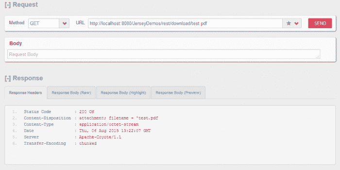
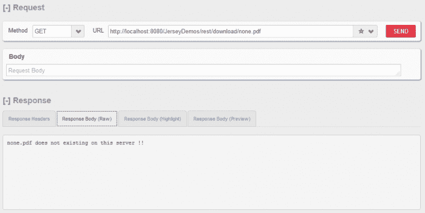

# Jersey 异常处理 – Jersey `ExceptionMapper`示例

> 原文： [https://howtodoinjava.com/jersey/jaxrs-jersey-exceptionmapper/](https://howtodoinjava.com/jersey/jaxrs-jersey-exceptionmapper/)

在 Jersey `ExceptionMapper`示例中，我们将学习在开发 Jersey RESTful Web 服务时使用[`ExceptionMapper`](https://docs.oracle.com/javaee/7/api/javax/ws/rs/ext/ExceptionMapper.html)接口处理**自定义异常**。 出于演示目的，我正在修改为[Jersey 下载文件示例](//howtodoinjava.com/jersey/jax-rs-jersey-2-file-download-example-using-streamingoutput/)编写的源代码。

```java
Table Of Contents

1\. Jersey custom exception with ExceptionMapper
2\. How to throw exception from REST API
3\. Demo
```

## 1\. Jersey `ExceptionMapper` – 创建自定义异常

要在基于 JAX-RS 的 Web 服务中处理自定义异常，您应该创建一个异常类，然后实现`ExceptionMapper`接口。

```java
package com.howtodoinjava.jersey;

import javax.ws.rs.core.Response;
import javax.ws.rs.ext.ExceptionMapper;
import javax.ws.rs.ext.Provider;

@Provider
public class MissingFileException extends Exception implements
				ExceptionMapper<MissingFileException> 
{
	private static final long serialVersionUID = 1L;

	public MissingFileException() {
		super("No File found with given name !!");
	}

	public MissingFileException(String string) {
		super(string);
	}

	@Override
	public Response toResponse(MissingFileException exception) 
	{
		return Response.status(404).entity(exception.getMessage())
									.type("text/plain").build();
	}
}

```

## 2\. 如何从 REST API 引发异常

现在，如果在所需位置找不到用户请求的文件，则可以抛出`MissingFileException`。

```java
package com.howtodoinjava.jersey;

import java.io.File;
import java.io.IOException;
import java.nio.file.Files;
import java.nio.file.Paths;

import javax.ws.rs.GET;
import javax.ws.rs.Path;
import javax.ws.rs.PathParam;
import javax.ws.rs.core.MediaType;
import javax.ws.rs.core.Response;
import javax.ws.rs.core.StreamingOutput;

@Path("/download")
public class JerseyService 
{
	@GET
	@Path("/{fileName}")
	public Response downloadPdfFile(final @PathParam("fileName") String fileName) throws MissingFileException
	{
		final String fullFilePath = "C:/temp/" + fileName;

		File file = new File(fullFilePath);

		if(file.exists() == false){
			throw new MissingFileException(fileName + " does not existing on this server !!");
		}

		StreamingOutput fileStream =  new StreamingOutput()
		{
			@Override
			public void write(java.io.OutputStream output) throws IOException
			{
				try 
				{
					java.nio.file.Path path = Paths.get(fullFilePath);
					byte[] data = Files.readAllBytes(path);
					output.write(data);
					output.flush();
				} 
				catch (IOException e) 
				{
					throw new IOException("Error while reading file :: '"+fileName+"' !!");
				}
			}
		};
		return Response
	            .ok(fileStream, MediaType.APPLICATION_OCTET_STREAM)
	            .header("content-disposition","attachment; filename = '"+fileName)
	            .build();
	}
}

```

## 3\. Jersey 异常处理示例

现在该测试 Jersey 异常映射器了。 现在，让我们看看找不到文件时会发生什么。

#### 3.1 当用户要求正确的文件时



找到文件时没有异常


#### 3.2 当用户要求提供未知文件时



找不到文件时带有自定义消息的 404


#### 3.3 未捕获的异常处理

如果要在进入用户屏幕之前处理所有未捕获的异常，则必须映射`Throwable`本身。

```java
package com.howtodoinjava.jersey.provider;

import javax.ws.rs.core.Response;
import javax.ws.rs.ext.ExceptionMapper;
import javax.ws.rs.ext.Provider;

@Provider
public class UncaughtException extends Throwable implements ExceptionMapper<Throwable>
{
    private static final long serialVersionUID = 1L;

    @Override
    public Response toResponse(Throwable exception)
    {
        return Response.status(500).entity("Something bad happened. Please try again !!").type("text/plain").build();
    }
}

```

请问您有关 *jaxrs 异常映射器示例*的问题。

学习愉快！