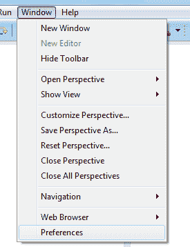
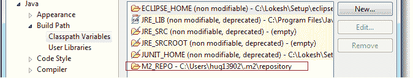
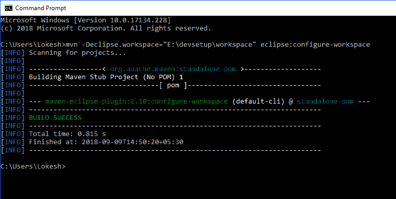

# `M2_REPO` – 在 Eclipse 中更改 Maven 仓库的位置

> 原文： [https://howtodoinjava.com/maven/maven-m2-repo-eclipse/](https://howtodoinjava.com/maven/maven-m2-repo-eclipse/)

可以从 Eclipse IDE 中读取 Maven 依赖关系，该 Maven 通过`M2_REPO`类路径变量公开。 `m2_repo`指向工作区中 maven 的[本地仓库](https://howtodoinjava.com/maven/change-local-repository-location/ "How to change maven local repository path in windows")位置。

在使用 maven 的依赖项之前，必须在构建路径上将`m2_repo`类变量添加到 eclipse 的类路径变量中。

## 1\. 在 Eclipse 中手动更改 Maven 仓库位置

#### 1.1 导航到 Windows > 首选项



#### 1.2 导航到 Java > 构建路径 > Classpath 变量


#### 1.3 定义新的类路径变量`M2_REPO`

创建新变量`M2_REPO`并将其指向 Maven 本地仓库位置。


#### 1.4 确认已添加变量



## 2\. 从命令行 – `eclipse:configure-workspace`更新`M2_REPO`

或者，您可以通过 Maven 命令`"eclipse:configure-workspace"`定义并添加`M2_REPO`。

例如，这是我系统中命令的输出。

```java
Microsoft Windows [Version 10.0.17134.228]
(c) 2018 Microsoft Corporation. All rights reserved.

C:\Users\Lokesh>mvn -Declipse.workspace="E:\devsetup\workspace" eclipse:configure-workspace
[INFO] Scanning for projects...
[INFO]
[INFO] ------------------< org.apache.maven:standalone-pom >-------------------
[INFO] Building Maven Stub Project (No POM) 1
[INFO] --------------------------------[ pom ]---------------------------------
[INFO]
[INFO] --- maven-eclipse-plugin:2.10:configure-workspace (default-cli) @ standalone-pom ---
[INFO] ------------------------------------------------------------------------
[INFO] BUILD SUCCESS
[INFO] ------------------------------------------------------------------------
[INFO] Total time: 0.815 s
[INFO] Finished at: 2018-09-09T14:50:20+05:30
[INFO] ------------------------------------------------------------------------

```



从命令行添加`m2_repo`


学习愉快！