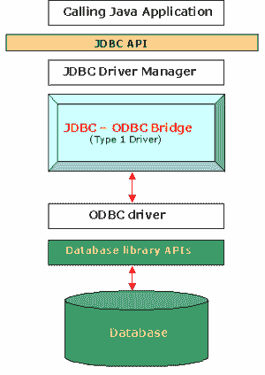
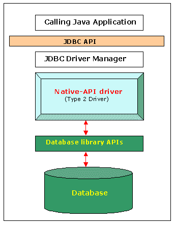
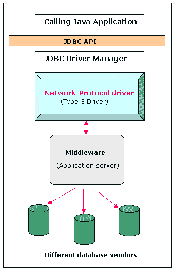
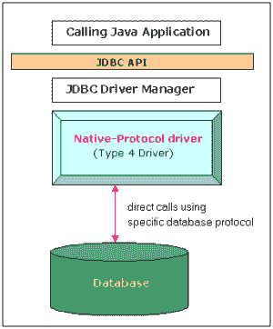

# Java – JDBC 驱动类型

> 原文： [https://howtodoinjava.com/java/jdbc/jdbc-basics-types-of-jdbc-drivers/](https://howtodoinjava.com/java/jdbc/jdbc-basics-types-of-jdbc-drivers/)

[**Java 数据库连接（JDBC）**](https://docs.oracle.com/html/A95261_01/jdgjdbc.htm)是标准应用编程接口（API）的 JavaSoft 规范，允许 Java 程序访问数据库管理系统。 JDBC API 由一组用 Java 编程语言编写的接口和类组成。 使用这些标准接口和类，程序员可以编写连接到数据库的应用，发送以[**结构化查询语言（SQL）**](https://en.wikipedia.org/wiki/SQL)编写的查询，并处理结果。 JDBC 面向关系数据库。

因为 JDBC 是标准规范，所以使用 JDBC API 的 Java 程序可以连接到任何具有 JDBC 驱动的数据库管理系统（DBMS）。

## JDBC 驱动

JDBC API 定义了程序员用来连接数据库和发送查询的 Java 接口和类。

JDBC 驱动程序为特定的 DBMS 供应商实现这些接口和类。

Java 程序（使用 JDBC API）在实际连接到数据库之前为特定的 DBMS 加载指定的驱动。 然后，JDBC 的`DriverManager`类将所有 JDBC API 调用发送到已加载的驱动。

## JDBC 驱动的类型

有 **4 种不同类型的 JDBC 驱动**：

1.  类型 1：JDBC-ODBC 桥驱动
2.  类型 2：本机 API 驱动
3.  类型 3：所有 Java + 中间件翻译驱动
4.  类型 4：纯 Java 驱动

让我们一一看一下。

## 类型 1：JDBC-ODBC 桥驱动

1 类 JDBC 驱动由 Java 部分组成，该 Java 部分将 JDBC 接口**转换为 ODBC 调用**。 ODBC 桥然后调用给定数据库的 ODBC 驱动，即该驱动将 JDBC 方法调用转换为 ODBC 函数调用。 该驱动依赖于平台，因为它使用 ODBC，而 ODBC 又取决于运行 JVM 的基础操作系统的本机库。 另外，使用此驱动还会导致其他安装依赖性。 例如，必须在具有驱动的计算机上安装 ODBC，并且数据库必须支持 ODBC 驱动。 如果可以使用纯 Java 驱动的替代方案，则不建议使用此驱动。

Sun 提供了 JDBC-ODBC 桥驱动：`sun.jdbc.odbc.JdbcOdbcDriver`。 该驱动是本机代码，而不是 Java，并且是封闭源代码。

## 类型 2：本机 API 驱动

2 类 JDBC 驱动类似于 1 类 驱动，不同之处在于 **ODBC 部分被替换为本地代码部分**。 本机代码部分针对特定的数据库产品，即使用数据库产品的客户端库。 驱动将 JDBC 方法调用转换为数据库本机 API 的本机调用。

这种体系结构消除了对 ODBC 驱动的需要，而直接称为数据库供应商提供的本机客户端库。 数据库供应商很快就采用了这种方法，因为它可以快速，廉价地实现，因为他们可以重用现有的基于 C/C++ 的本机库。

## 类型 3：所有 Java + 中间件翻译驱动

3 类 JDBC 驱动是一种全 Java 驱动，**将 JDBC 接口调用发送到中间服务器**。 然后，中间服务器代表 JDBC 驱动连接到数据库。 中间层（应用服务器）将 JDBC 调用直接或间接转换为供应商特定的数据库协议。

3 类驱动试图成为 100% Java 解决方案，但从未真正吸引过很多人。 3 类驱动具有 Java 客户端组件和 Java  服务器组件，后者实际上是在与数据库对话。 尽管从技术上讲这是一个完整的 Java 解决方案，但是数据库供应商不喜欢这种方法，因为这种方法成本高昂 – 他们将不得不重写全部为 C/C++ 的本机客户端库。 此外，这并没有提高架构效率，因为我们实际上仍然是 3 层架构，因此很容易看出为什么它从来都不是流行的选择。

## 类型 4：纯 Java 驱动

JDBC 4 类驱动，也称为直接数据库纯 Java 驱动，是一种数据库驱动实现，**将 JDBC 调用直接转换为供应商特定的数据库协议**。 它是针对特定数据库产品实现的。 今天，大多数 JDBC 驱动都是 4 类驱动。

4 类驱动完全用 Java 编写，因此与平台无关。 它们安装在客户端的 Java 虚拟机中。 它提供了比 1 类和 2 类驱动更好的性能，因为它没有将调用转换为 ODBC 或数据库 API 调用的开销。 与 3 类驱动不同，它不需要关联的软件即可工作。

该体系结构将整个 JDBC API 实现以及用于直接与数据库通信的所有逻辑封装在单个驱动中。 通过在 100% java 程序包中都包含一个单独的层和一个小的驱动，可以轻松进行部署并简化开发过程。

例如，这种类型包括广泛使用的 Oracle 瘦驱动。

“虽然尚未得到 JDBC 专家组的正式批准，但有关 JDBC 社区中新的 5 类驱动提案的讨论很多。”

学习愉快！