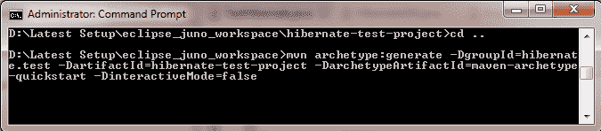

# Hibernate 示例–逐步介绍 hello world 示例

> 原文： [https://howtodoinjava.com/hibernate/hibernate-3-introduction-and-writing-hello-world-application/](https://howtodoinjava.com/hibernate/hibernate-3-introduction-and-writing-hello-world-application/)

**Hibernate** 由 Gavin King 在 2001 年启动，它是使用 EJB2 样式实体 bean 的替代方法。 当时，它的任务是通过简化复杂性并允许缺少功能来为 EJB2 提供更好的持久性**。**

Hibernate 使用其映射文件和配置文件来实现其目标。 随着 JDK 1.5 在 Java 社区中引入**批注**，Hibernate 社区开始致力于支持批注的 [Hibernate 3](http://docs.jboss.org/hibernate/orm/3.3/api/ "hibernate 3") 。 Hiberate 的当前版本是[Hiberate 5](https://howtodoinjava.com/spring5/webmvc/spring5-mvc-hibernate5-example/) 。

在带有注释的**Hiberate 示例中，我们将学习有关 Hiberate 的更多信息，并逐步为初学者构建第一个正在运行的示例应用程序。**

```java
Table of Contents

What is hibernate
How hibernate works
Relation of hibernate with JPA
Hibernate hello world example
```

## 什么是冬眠

Hibernate 是 Java 的开源[对象关系映射](https://en.wikipedia.org/wiki/Object-relational_mapping "object relational mapping")工具。 它提供了一个框架，用于将面向对象的域模型映射到传统的[关系数据库](https://en.wikipedia.org/wiki/Relational_database "Relational database")。 Hibernate 不仅负责从 Java 类到数据库表（以及从 Java 数据类型到 SQL 数据类型）的映射，而且还提供数据查询和检索功能，并且可以显着减少开发时间，否则将花费大量时间在 SQL 和 JDBC 中进行手动数据处理 。

通过配置 XML 文件或使用 Java [批注](https://howtodoinjava.com/hibernate/hibernate-jpa-2-persistence-annotations-tutorial/)将 Java 类映射到数据库表。 提供了用于安排类之间的[一对多](https://howtodoinjava.com/hibernate/hibernate-one-to-many-mapping-using-annotations/)和[多对多](https://howtodoinjava.com/hibernate/hibernate-many-to-many-mapping-using-annotations/)关系的设施。

除了管理对象之间的关联之外，Hibernate 还可以管理**自反关联**，其中对象与自己类型的其他实例具有一对多关系。

## 冬眠如何运作

Hiberate 不会妨碍我们； 也不会迫使我们改变对象的行为方式。 这些对象无需实现任何神奇的接口即可拥有持久的能力。 我们要做的全部工作是将一些元数据放入**注释**的形式，这些注释告诉 hibernate 在与数据库映射时如何使用它们。 在运行时，hibernate 读取这些注释并使用此信息来构建查询以发送到某些关系数据库。

Hibernate 中有一个简单直观的 API，可以对数据库表示的对象执行查询，以更改我们通常在程序中与它们正常交互的那些对象，然后告诉 Hibernate 保存更改。 创建新对象也同样简单。 我们只是以常规方式创建它们，并使用注释将它们告知 Hibernate，以便它们可以存储到数据库中。

## Hiberate 与 JPA 的关系

[JPA（Java 持久性 API）](https://en.wikipedia.org/wiki/Java_Persistence_API "java persistence API")是持久性提供程序要实现的规范。 Hibernate 就是这样的 JPA 规范的实现。 我们可以使用 JPA 批注对批注进行尽可能多的批注，但是如果没有实现，将不会发生任何事情。

> 可以将 JPA 视为必须遵循的准则/规范或接口，而 Hibernate JPA 实现是符合 JPA 定义的 API 并提供底层功能的代码。

*当我们将 Hibernate 与 JPA 一起使用时，实际上是在使用 Hibernate JPA 实现。* 这样做的好处是我们可以将 JPA 的 Hiberate 实现换成 JPA 规范的另一种实现。

当我们使用直接 Hiberate 时，由于其他 ORM 可能使用不同的方法/配置和注释，因此您将锁定到实现中，因此我们不能仅切换到另一个 ORM。

## Java Hibernate hello 世界示例

让我们逐步创建一个 Hiberate 的 hello 世界示例。 在此示例中，我创建了一个`Employee`类并声明了四个属性`id`，`email`，`firstname`和`lastname`。

我希望`id`属性应自动生成，以便应用程序代码不存储员工 ID 的本地缓存。

到目前为止，我们的目标是要在第一个应用程序中进行制作。 让我们确定需要创建的文件。

1.  **hibernate.cfg.xml** -此配置文件将用于存储数据库连接信息和架构级别设置。
2.  **EmployeeEntity.java** -此类将引用具有 Hiberate 注释的 Java POJO。
3.  **HibernateUtil.java** –此类将具有实用程序方法，这些方法将用于创建会话工厂和会话对象。
4.  **TestHibernate.java** -此类将用于测试我们的配置设置和 Emplyee 实体注释。

在进入代码之前，让我们看一下项目的设置并添加 [**maven**](https://maven.apache.org/ "maven") 依赖关系，这些依赖关系需要添加到`pom.xml`以包括所有编译时间和运行时依赖关系。

#### 1\. 创建一个 Maven 项目



#### 2\. 使项目支持 Eclipse


#### 3\. 将 Java 项目导入到 Eclipse 工作区


以上步骤将创建最小设置。 现在该添加 Hiberate 依赖项了。

#### 4\. Hiberate Maven 依赖关系

```java
<dependency>
	<groupid>org.hibernate</groupid>
	<artifactid>hibernate-commons-annotations</artifactid>
	<version>3.0.0.ga</version>
</dependency>
<dependency>
	<groupid>org.hibernate</groupid>
	<artifactid>hibernate-annotations</artifactid>
	<version>3.3.0.ga</version>
</dependency>
<dependency>
	<groupid>mysql</groupid>
	<artifactid>mysql-connector-java</artifactid>
	<version>5.1.6</version>
</dependency>
<dependency>
	<groupid>antlr</groupid>
	<artifactid>antlr</artifactid>
	<version>2.7.6</version>
</dependency>
<dependency>
	<groupid>commons-collections</groupid>
	<artifactid>commons-collections</artifactid>
	<version>3.1</version>
</dependency>
<dependency>
	<groupid>dom4j</groupid>
	<artifactid>dom4j</artifactid>
	<version>1.6.1</version>
</dependency>
<dependency>
	<groupid>javassist</groupid>
	<artifactid>javassist</artifactid>
	<version>3.4.GA</version>
</dependency>
<dependency>
	<groupid>javax.transaction</groupid>
	<artifactid>jta</artifactid>
	<version>1.1</version>
</dependency>
<dependency>
	<groupid>org.slf4j</groupid>
	<artifactid>slf4j-api</artifactid>
	<version>1.5.6</version>
</dependency>
<dependency>
	<groupid>org.slf4j</groupid>
	<artifactid>slf4j-log4j12</artifactid>
	<version>1.5.6</version>
</dependency>

```

请注意，在此 Hiberate 示例中，我们并没有使用所有的 Maven 依赖项，但是当我们开始扩展应用程序时将使用它们。

#### 5\. Hiberate 配置

```java
<?xml version="1.0" encoding="utf-8"?>
<!DOCTYPE hibernate-configuration PUBLIC
"-//Hibernate/Hibernate Configuration DTD 3.0//EN"
"http://hibernate.sourceforge.net/hibernate-configuration-3.0.dtd">
<hibernate-configuration>
    <session-factory>
        <property name="hibernate.connection.driver_class">com.mysql.jdbc.Driver</property>
        <property name="hibernate.connection.url">jdbc:mysql://localhost:3306/hibernatetest</property>
        <property name="hibernate.connection.password">lg225295</property>
        <property name="hibernate.connection.username">root</property>
        <property name="hibernate.dialect">org.hibernate.dialect.MySQLDialect</property>
        <property name="show_sql">true</property>
		<property name="hbm2ddl.auto">update</property>
        <mapping class="hibernate.test.dto.EmployeeEntity"></mapping>
    </session-factory>
</hibernate-configuration>

```

运行此 Hiberate 示例之前，请不要忘记设置正确的密码。

#### 6\. Hiberate 实体类

```java
package hibernate.test.dto;

import java.io.Serializable;

import javax.persistence.Column;
import javax.persistence.Entity;
import javax.persistence.GeneratedValue;
import javax.persistence.GenerationType;
import javax.persistence.Id;
import javax.persistence.Table;
import javax.persistence.UniqueConstraint;

import org.hibernate.annotations.OptimisticLockType;

@Entity
@org.hibernate.annotations.Entity(optimisticLock = OptimisticLockType.ALL)
@Table(name = "Employee", uniqueConstraints = {
		@UniqueConstraint(columnNames = "ID"),
		@UniqueConstraint(columnNames = "EMAIL") })
public class EmployeeEntity implements Serializable {

	private static final long serialVersionUID = -1798070786993154676L;

	@Id
	@GeneratedValue(strategy = GenerationType.IDENTITY)
	@Column(name = "ID", unique = true, nullable = false)
	private Integer employeeId;

	@Column(name = "EMAIL", unique = true, nullable = false, length = 100)
	private String email;

	@Column(name = "FIRST_NAME", unique = false, nullable = false, length = 100)
	private String firstName;

	@Column(name = "LAST_NAME", unique = false, nullable = false, length = 100)
	private String lastName;

	// Accessors and mutators for all four fields
}

```

#### 7\. Hiberate 会话工厂

```java
package hibernate.test;

import java.io.File;

import org.hibernate.SessionFactory;
import org.hibernate.cfg.AnnotationConfiguration;

public class HibernateUtil 
{
	private static final SessionFactory sessionFactory = buildSessionFactory();

	private static SessionFactory buildSessionFactory() 
	{
		try {
			// Create the SessionFactory from hibernate.cfg.xml
			return new AnnotationConfiguration().configure(
					new File("hibernate.cgf.xml")).buildSessionFactory();

		} catch (Throwable ex) {
			// Make sure you log the exception, as it might be swallowed
			System.err.println("Initial SessionFactory creation failed." + ex);
			throw new ExceptionInInitializerError(ex);
		}
	}

	public static SessionFactory getSessionFactory() {
		return sessionFactory;
	}

	public static void shutdown() {
		// Close caches and connection pools
		getSessionFactory().close();
	}
}

```

请不要忘记使用`hibernate.cgf.xml`的正确路径。

#### 8\. 演示

```java
package hibernate.test;

import hibernate.test.dto.EmployeeEntity;
import org.hibernate.Session;

public class TestHibernate {

	public static void main(String[] args) {
		Session session = HibernateUtil.getSessionFactory().openSession();
		session.beginTransaction();

		// Add new Employee object
		EmployeeEntity emp = new EmployeeEntity();
		emp.setEmail("demo-user@mail.com");
		emp.setFirstName("demo");
		emp.setLastName("user");

		session.save(emp);

		session.getTransaction().commit();
		HibernateUtil.shutdown();
	}
}

```

上面的代码将在数据库中创建一个新的表 employee，并在此表中插入一行。 在日志中，您可以验证已执行的插入语句。

```java
Hibernate: insert into Employee (EMAIL, FIRST_NAME, LAST_NAME) values (?, ?, ?)

```

如果您在运行 Hiberate 的 hello 世界示例时遇到问题，请给我评论，我将很高兴与您讨论问题。

学习愉快！

[下载源码](https://drive.google.com/file/d/0B7yo2HclmjI4bnlHNzROYVJMdXM/view?usp=drive_web "下载源码")

参考文献：

[Hiberate 首页](http://hibernate.org/)