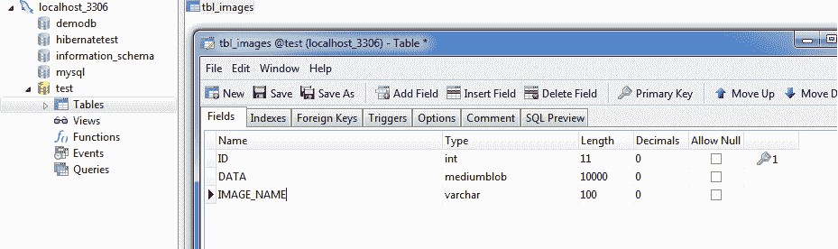

# 从数据库中插入/选择 Blob 的休眠示例

> 原文： [https://howtodoinjava.com/hibernate/hibernate-example-of-insertselect-blob-from-database/](https://howtodoinjava.com/hibernate/hibernate-example-of-insertselect-blob-from-database/)

在先前的 **[休眠教程](//howtodoinjava.com/hibernate-tutorials/ "hibernate tutorials")** 中，我们了解了 [**一级缓存**](//howtodoinjava.com/hibernate/understanding-hibernate-first-level-cache-with-example/ "first level cache") ， [**二级缓存** [](//howtodoinjava.com/hibernate/how-hibernate-second-level-cache-works/) 和一些 [**映射示例**](//howtodoinjava.com/hibernate/hibernate-one-to-one-mapping-using-annotations/) 等。这是 [**休眠相关教程**](//howtodoinjava.com/category/frameworks/hibernate/) 的完整列表。 在本文中，我将举一个使用 hibernate 将 BLOB 数据插入数据库并使用 hibernate 实体从数据库中获取数据的示例。

In short, inserting and fetching BLOB data such as images requires two steps: define database column type as “BLOB” and have a field in entity of type “byte array”.

让我们举个例子，其中，我将 Windows C 驱动器中的“ test.png”图像插入数据库（MySQL）。 然后，我将再次从数据库中读取图像数据并将其存储到其他位置。

## 休眠实体

请注意，我已将数据字段声明为 byte []。

```java
@Entity
@Table(name = "TBL_IMAGES")
public class ImageWrapper implements Serializable {

	private static final long serialVersionUID = 1L;

	@Id
	@GeneratedValue(strategy = GenerationType.IDENTITY)
	@Column(name = "ID", unique = true, nullable = false)
	private Integer id;

	@Column(name = "IMAGE_NAME", unique = false, nullable = false, length = 100)
	private String imageName;

	@Column(name = "DATA", unique = false, nullable = false, length = 100000)
	private byte[] data;

	//Getters and Setters
}

```

## 将 Blob 数据插入数据库

让我们看一下代码：

```java
	Session session = HibernateUtil.getSessionFactory().openSession();
	session.beginTransaction();

	File file = new File("C:\test.png");
	byte[] imageData = new byte[(int) file.length()];

	try {
		FileInputStream fileInputStream = new FileInputStream(file);
		fileInputStream.read(imageData);
		fileInputStream.close();
	} catch (Exception e) {
		e.printStackTrace();
	}

	ImageWrapper image = new ImageWrapper();
	image.setImageName("test.jpeg");
	image.setData(imageData);

	session.save(image);	//Save the data

	session.getTransaction().commit();
	HibernateUtil.shutdown();

```

执行完上述代码后，您可以验证是否已在数据库中创建表。 并且创建了一个 BLOB 列来保存图像数据。

<figure aria-describedby="caption-attachment-3095" class="wp-caption aligncenter" id="attachment_3095" style="width: 600px">

<figcaption class="wp-caption-text" id="caption-attachment-3095">Hibernate blob example</figcaption>

</figure>

## 从数据库读取 Blob 数据

这很简单，实际上您不需要执行任何其他操作。 上面的实体定义可以正常工作。

```java
	Session session = HibernateUtil.getSessionFactory().openSession();
	session.beginTransaction();

	ImageWrapper imgNew = (ImageWrapper)session.get(ImageWrapper.class, 1);
	byte[] bAvatar = imgNew.getData();

	try{
		FileOutputStream fos = new FileOutputStream("C:\temp\test.png"); 
		fos.write(bAvatar);
		fos.close();
	}catch(Exception e){
		e.printStackTrace();
	}

	session.getTransaction().commit();
	HibernateUtil.shutdown();

```

## 休眠配置

作为参考，这是我在此示例中使用的配置：

**hibernate.cfg.xml**

```java
<?xml version="1.0" encoding="utf-8"?>
<!DOCTYPE hibernate-configuration PUBLIC
"-//Hibernate/Hibernate Configuration DTD 3.0//EN"
"http://hibernate.sourceforge.net/hibernate-configuration-3.0.dtd">
<hibernate-configuration>
    <session-factory>
        <property name="hibernate.connection.driver_class">com.mysql.jdbc.Driver</property>
        <property name="hibernate.connection.url">jdbc:mysql://localhost:3306/test</property>
        <property name="hibernate.connection.password">password</property>
        <property name="hibernate.connection.username">root</property>
        <property name="hibernate.dialect">org.hibernate.dialect.MySQLDialect</property>
        <property name="show_sql">true</property>
		<property name="hibernate.hbm2ddl.auto">create</property>
        <mapping class="hibernate.test.dto.ImageWrapper"></mapping>
    </session-factory>
</hibernate-configuration>

```

以下也是 HibernateUtil.java 的代码

**HibernateUtil.java**

```java
public class HibernateUtil {
	private static final SessionFactory sessionFactory = buildSessionFactory();

    @SuppressWarnings("deprecation")
	private static SessionFactory buildSessionFactory() {
        try {
            // Create the SessionFactory from hibernate.cfg.xml
            return new AnnotationConfiguration().configure(new File
            		("D:\Latest Setup\eclipse_juno_workspace\hibernate-test-project\hibernate.cgf.xml"))
            		.buildSessionFactory();

        }
        catch (Throwable ex) {
            // Make sure you log the exception, as it might be swallowed
            System.err.println("Initial SessionFactory creation failed." + ex);
            throw new ExceptionInInitializerError(ex);
        }
    }

    public static SessionFactory getSessionFactory() {
        return sessionFactory;
    }

    public static void shutdown() {
    	getSessionFactory().close();
    }
}

```

如果仍然感到麻烦，请下载随附的源代码。

**[Sourcecode Download](https://docs.google.com/file/d/0B7yo2HclmjI4R0dDNzY5OTR6ZG8/edit?usp=sharing "hibernate blob example")**

**祝您学习愉快！**