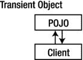
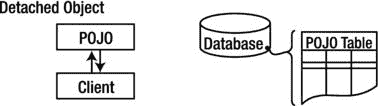

# 休眠实体/持久性生命周期状态

> 原文： [https://howtodoinjava.com/hibernate/hibernate-entity-persistence-lifecycle-states/](https://howtodoinjava.com/hibernate/hibernate-entity-persistence-lifecycle-states/)

如您所知， [**Hibernate**](//howtodoinjava.com/hibernate-tutorials/ "Hibernate Tutorials") 适用于应用程序使用 new 运算符创建的普通 Java 对象。 以原始形式（没有注释），hibernate 将无法识别您的 java 类； 但是当使用所需的注解正确注解它们时，hibernate 将能够识别它们，然后使用它们，例如 存储在数据库中，更新它们等。这些对象可以说是用休眠映射的。

给定一个映射到 Hibernate 的对象的实例，它可以处于四种不同状态中的任何一种：**瞬态，持久，分离或删除**。 今天，我们将在本教程中学习它们。

## 暂态对象

临时对象存在于堆内存中。 Hibernate 不会管理瞬态对象，也不会对瞬态对象进行更改。

Transient objects are independent of Hibernate

要持久保存对瞬态对象的更改，您必须要求会话将瞬态对象保存到数据库，此时，Hibernate 会为该对象分配一个标识符，并将该对象标记为处于持久状态。

## 持久对象

持久对象存在于数据库中，并且 Hibernate 管理持久对象的持久性。

Persistent objects are maintained by Hibernate

如果字段或属性在持久对象上发生更改，则当应用程序将更改标记为要提交时，Hibernate 将使数据库表示保持最新状态。

## 分离物体

分离的对象在数据库中具有表示形式，但是对对象的更改将不会反映在数据库中，反之亦然。 下图显示了对象与数据库的临时分离。

Detached objects exist in the database but are not maintained by Hibernate

可以通过关闭与之关联的会话来创建分离的对象，或者通过调用该会话的 evict（）方法将其从会话中逐出。

One reason you might consider doing this would be to read an object out of the database, modify the properties of the object in memory, and then store the results some place other than your database. This would be an alternative to doing a deep copy of the object.

为了保留对分离对象所做的更改，应用程序必须将其重新附加到有效的 Hibernate 会话。 当您的应用程序通过引用分离对象在新会话上调用 load，refresh，merge，update（）或 save（）方法之一时，分离实例可以与新的 Hibernate 会话关联。 调用之后，分离的对象将是由新的 Hibernate 会话管理的持久对象。

## 移除的物件

删除的对象是由 Hibernate 管理的对象（换句话说，是持久对象），已传递给会话的 remove（）方法。 当应用程序将会话中保存的更改标记为要提交时，将删除数据库中与已删除对象相对应的条目。

现在，我们不要记下本教程的要点。

## 项目符号点

1.  新创建的 POJO 对象将处于过渡状态。 瞬态对象不代表数据库的任何行，即不与任何会话对象相关联。 它是简单的简单 Java 对象。
2.  持久对象代表数据库的一行，并且始终与某些唯一的休眠会话相关联。 休眠跟踪对持久对象的更改，并在提交调用时将其保存到数据库中。
3.  分离的对象是过去曾经持久化的对象，现在它们不再持久化。 要保留对分离对象所做的更改，必须将它们重新连接以休眠会话。
4.  删除的对象是已传递给会话的 remove（）方法的持久对象，并且一旦将会话中保存的更改提交给数据库，它们就会很快被删除。

**祝您学习愉快！**