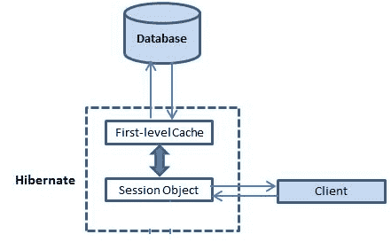

# 通过示例了解 Hibernate 一级缓存

> 原文： [https://howtodoinjava.com/hibernate/understanding-hibernate-first-level-cache-with-example/](https://howtodoinjava.com/hibernate/understanding-hibernate-first-level-cache-with-example/)

缓存是 ORM 框架提供的一项功能，可帮助用户获得快速运行的 Web 应用，同时帮助框架本身减少单个事务中对数据库的查询数量。 Hibernate 通过实现一级缓存来实现第二个目标。

**Hiberate 中的第一级缓存**默认情况下处于启用状态，并且您无需执行任何操作即可使此功能正常工作。 实际上，您甚至不能强行禁用它。

如果我们了解**与会话对象**关联的事实，那么就很容易理解第一级缓存。 我们知道，会话对象是按需从会话工厂创建的，**一旦会话关闭**就会丢失。 同样，与会话对象关联的一级缓存仅在会话对象处于活动状态之前可用。 它仅对会话对象可用，并且**对于应用任何其他部分中的任何其他会话对象**均不可访问。



## **重要事实**

1.  一级缓存与“会话”对象关联，应用中的其他会话对象看不到它。
2.  缓存对象的范围是会话。 一旦会话关闭，缓存的对象将永远消失。
3.  默认情况下，第一级缓存处于启用状态，您不能禁用它。
4.  当我们第一次查询实体时，它是从数据库中检索出来的，并存储在与 Hiberate 会话相关的一级缓存中。
5.  如果我们使用相同的会话对象再次查询相同的对象，则会从缓存中加载该对象，并且不会执行任何 SQL 查询。
6.  可以使用 evict()方法从会话中删除已加载的实体。 如果已使用 evict()方法删除了该实体，则该实体的下一次加载将再次进行数据库调用。
7.  可以使用 clear()方法删除整个会话缓存。 它将删除所有存储在缓存中的实体。

让我们使用示例验证以上事实。

## **一级缓存检索示例**

在此示例中，我使用 Hiberate 会话从数据库中检索 DepartmentEntity 对象。 我将多次检索它，并将观察 sql 日志以查看差异。

```java
//Open the hibernate session
Session session = HibernateUtil.getSessionFactory().openSession();
session.beginTransaction();

//fetch the department entity from database first time
DepartmentEntity department = (DepartmentEntity) session.load(DepartmentEntity.class, new Integer(1));
System.out.println(department.getName());

//fetch the department entity again
department = (DepartmentEntity) session.load(DepartmentEntity.class, new Integer(1));
System.out.println(department.getName());

session.getTransaction().commit();
HibernateUtil.shutdown();

Output:

Hibernate: select department0_.ID as ID0_0_, department0_.NAME as NAME0_0_ from DEPARTMENT department0_ where department0_.ID=?
Human Resource
Human Resource

```

如您所见，**第二个“ session.load()”语句不会再次执行 select 查询并直接加载部门实体**。

## **具有新会话**的一级缓存检索示例

**对于新会话，无论实体是否已存在于应用的任何其他会话中，都将从数据库中再次获取实体。**

```java
//Open the hibernate session
Session session = HibernateUtil.getSessionFactory().openSession();
session.beginTransaction();

Session sessionTemp = HibernateUtil.getSessionFactory().openSession();
sessionTemp.beginTransaction();
try
{
	//fetch the department entity from database first time
	DepartmentEntity department = (DepartmentEntity) session.load(DepartmentEntity.class, new Integer(1));
	System.out.println(department.getName());

	//fetch the department entity again
	department = (DepartmentEntity) session.load(DepartmentEntity.class, new Integer(1));
	System.out.println(department.getName());

	department = (DepartmentEntity) sessionTemp.load(DepartmentEntity.class, new Integer(1));
	System.out.println(department.getName());
}
finally
{
	session.getTransaction().commit();
	HibernateUtil.shutdown();

	sessionTemp.getTransaction().commit();
	HibernateUtil.shutdown();
}

Output:

Hibernate: select department0_.ID as ID0_0_, department0_.NAME as NAME0_0_ from DEPARTMENT department0_ where department0_.ID=?
Human Resource
Human Resource

Hibernate: select department0_.ID as ID0_0_, department0_.NAME as NAME0_0_ from DEPARTMENT department0_ where department0_.ID=?
Human Resource

```

您可以看到，即使部门实体存储在“会话”对象中，当我们使用另一个会话对象“ sessionTemp”时，仍然执行了另一个数据库查询。

## **从一级缓存示例**中删除缓存对象

尽管我们不能在 Hiberate 中禁用一级缓存，但是我们可以在需要时从其中删除一些对象。 这可以通过两种方法完成：

*   evct()
*   明确()

这里 **evict()用于从与会话**关联的缓存中删除特定对象， **clear()方法用于从会话**关联的所有缓存对象中删除。 因此，它们本质上就像删除一个并删除所有。

```java
//Open the hibernate session
Session session = HibernateUtil.getSessionFactory().openSession();
session.beginTransaction();
try
{
	//fetch the department entity from database first time
	DepartmentEntity department = (DepartmentEntity) session.load(DepartmentEntity.class, new Integer(1));
	System.out.println(department.getName());

	//fetch the department entity again
	department = (DepartmentEntity) session.load(DepartmentEntity.class, new Integer(1));
	System.out.println(department.getName());

	session.evict(department);
	//session.clear(); 

	department = (DepartmentEntity) session.load(DepartmentEntity.class, new Integer(1));
	System.out.println(department.getName());
}
finally
{
	session.getTransaction().commit();
	HibernateUtil.shutdown();
}

Output:

Hibernate: select department0_.ID as ID0_0_, department0_.NAME as NAME0_0_ from DEPARTMENT department0_ where department0_.ID=?
Human Resource
Human Resource

Hibernate: select department0_.ID as ID0_0_, department0_.NAME as NAME0_0_ from DEPARTMENT department0_ where department0_.ID=?
Human Resource

```

显然，evict()方法从高速缓存中删除了部门对象，以便再次从数据库中获取它。

希望你喜欢上面的文章。 如果您有任何问题或建议，请发表评论。

学习愉快！