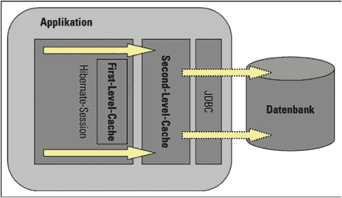

# Hiberate 二级缓存如何工作？

> 原文： [https://howtodoinjava.com/hibernate/how-hibernate-second-level-cache-works/](https://howtodoinjava.com/hibernate/how-hibernate-second-level-cache-works/)

缓存是 ORM 框架提供的功能，可帮助用户获得快速运行的 Web 应用，同时帮助框架本身减少在单个事务中对数据库的查询数量。 Hibernate 还分两层提供此缓存功能。

*   **一级缓存**：默认情况下启用，并在会话范围内工作。 阅读有关 [**Hiberate 一级缓存**](//howtodoinjava.com/hibernate/understanding-hibernate-first-level-cache-with-example/ "Understanding hibernate first level cache with example")的更多信息。
*   **二级缓存**：与一级缓存不同，后者可以在会话工厂范围内全局使用。

以上声明意味着，**二级缓存是在会话工厂范围**中创建的，并且**可用于在使用该特定会话工厂创建的所有会话**中使用。
这也意味着**一旦关闭会话工厂，与之关联的所有缓存都将失效**，并且缓存管理器也会关闭。
此外，这还意味着，如果您有两个会话工厂实例（通常没有应用这样做），则您的应用中将有两个缓存管理器，并且在访问存储在物理存储中的缓存时，您可能会得到不可预测的结果，例如缓存缺失。



Hibernate 一级或二级缓存

在本教程中，我将提供有关 Hiberate 二级缓存的概念，并提供使用代码段的示例。

## **二级缓存的工作方式**

让我们逐点写下所有事实：

1.  每当 Hiberate 会话尝试加载实体时，它首先会在一级缓存（与特定的 Hiberate 会话关联）中寻找实体的缓存副本。
2.  如果一级高速缓存中存在实体的高速缓存副本，则将其作为装入方法的结果返回。
3.  如果第一级高速缓存中没有高速缓存的实体，则在第二级高速缓存中查找高速缓存的实体。
4.  如果二级缓存已缓存实体，则将其作为装入方法的结果返回。 但是，在返回实体之前，它也存储在第一级缓存中，以便对实体的加载方法的下一次调用将从第一级缓存本身返回该实体，而无需再次进入第二级缓存。
5.  如果在一级缓存和二级缓存中均未找到实体，则在作为`load()`方法的响应返回之前，将执行数据库查询并将实体存储在两个缓存级别中。
6.  如果已通过 Hiberate 会话 API 完成了修改，则二级缓存会针对修改后的实体进行自我验证。
7.  如果某些用户或进程直接在数据库中进行更改，则直到该缓存区域的“`timeToLiveSeconds`”持续时间过去之后，二级缓存才能更新自身。 在这种情况下，最好使整个缓存无效，然后让 Hiberate 状态再次构建其缓存。 您可以使用下面的代码片段使整个 Hiberate 二级缓存无效。

```java
/**
 * Evicts all second level cache hibernate entites. This is generally only
 * needed when an external application modifies the databaase.
 */
public void evict2ndLevelCache() {
    try {
        Map<String, ClassMetadata> classesMetadata = sessionFactory.getAllClassMetadata();
        for (String entityName : classesMetadata.keySet()) {
            logger.info("Evicting Entity from 2nd level cache: " + entityName);
            sessionFactory.evictEntity(entityName);
        }
    } catch (Exception e) {
        logger.logp(Level.SEVERE, "SessionController", "evict2ndLevelCache", "Error evicting 2nd level hibernate cache entities: ", e);
    }
}

```

为了使用示例了解更多信息，我编写了一个测试应用，其中将 EhCache 配置为 2 级缓存。 让我们来看看各种场景：

**a）实体是首次获取的**

```java
DepartmentEntity department = (DepartmentEntity) session.load(DepartmentEntity.class, new Integer(1));
System.out.println(department.getName());

System.out.println(HibernateUtil.getSessionFactory().getStatistics().getEntityFetchCount());           //Prints 1
System.out.println(HibernateUtil.getSessionFactory().getStatistics().getSecondLevelCacheHitCount());   //Prints 0

Output: 1 0

```

***说明***：实体不在第一级或第二级缓存中，因此从数据库中获取了该实体。

**b）第二次获取实体**

```java
//Entity is fecthed very first time
DepartmentEntity department = (DepartmentEntity) session.load(DepartmentEntity.class, new Integer(1));
System.out.println(department.getName());

//fetch the department entity again
department = (DepartmentEntity) session.load(DepartmentEntity.class, new Integer(1));
System.out.println(department.getName());

System.out.println(HibernateUtil.getSessionFactory().getStatistics().getEntityFetchCount());           //Prints 1
System.out.println(HibernateUtil.getSessionFactory().getStatistics().getSecondLevelCacheHitCount());   //Prints 0

Output: 1 0

```

***说明***：实体存在于一级缓存中，因此从那里获取它。 无需转到二级缓存。

**c）实体已从一级缓存中逐出并再次获取**

```java
//Entity is fecthed very first time
DepartmentEntity department = (DepartmentEntity) session.load(DepartmentEntity.class, new Integer(1));
System.out.println(department.getName());

//fetch the department entity again
department = (DepartmentEntity) session.load(DepartmentEntity.class, new Integer(1));
System.out.println(department.getName());

//Evict from first level cache
session.evict(department);

department = (DepartmentEntity) session.load(DepartmentEntity.class, new Integer(1));
System.out.println(department.getName());

System.out.println(HibernateUtil.getSessionFactory().getStatistics().getEntityFetchCount());           //Prints 1
System.out.println(HibernateUtil.getSessionFactory().getStatistics().getSecondLevelCacheHitCount());   //Prints 1

Output: 1 1

```

***说明***：首次从数据库中获取实体。 这导致它存储在第一级和第二级缓存中。 从第一级缓存获取第二个加载调用。 然后，我们从一级缓存中逐出实体。 因此，第三次`load()`调用转到第二级缓存，并且`getSecondLevelCacheHitCount()`返回 1。

**d）从另一个会话访问二级缓存**

```java
//Entity is fecthed very first time
DepartmentEntity department = (DepartmentEntity) session.load(DepartmentEntity.class, new Integer(1));
System.out.println(department.getName());

//fetch the department entity again
department = (DepartmentEntity) session.load(DepartmentEntity.class, new Integer(1));
System.out.println(department.getName());

//Evict from first level cache
session.evict(department);

department = (DepartmentEntity) session.load(DepartmentEntity.class, new Integer(1));
System.out.println(department.getName());

department = (DepartmentEntity) anotherSession.load(DepartmentEntity.class, new Integer(1));
System.out.println(department.getName());

System.out.println(HibernateUtil.getSessionFactory().getStatistics().getEntityFetchCount());           //Prints 1
System.out.println(HibernateUtil.getSessionFactory().getStatistics().getSecondLevelCacheHitCount());   //Prints 2

Output: 1 2

```

***说明***：当从同一会话工厂创建的另一个会话尝试获取实体时，将在二级缓存中成功查找该会话，并且不会进行数据库调用。

因此，现在我们清楚了 hibernate 如何使用二级缓存。

[下载源码](https://docs.google.com/file/d/0B7yo2HclmjI4cVdNNXFWQmQ1ZTQ/edit?usp=sharing "hibernate second level cache demo source code")

如果有任何疑问或建议，请给我评论。

**祝您学习愉快！**