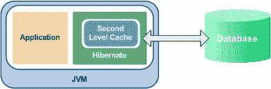

# Hibernate EhCache 配置教程

> 原文： [https://howtodoinjava.com/hibernate/hibernate-ehcache-configuration-tutorial/](https://howtodoinjava.com/hibernate/hibernate-ehcache-configuration-tutorial/)

缓存是 ORM 框架提供的功能，可帮助用户获得快速运行的 Web 应用，同时帮助框架本身减少在单个事务中对数据库的查询数量。 [**Hiberate**](//howtodoinjava.com/hibernate-tutorials/ "hibernate tutorials") 还在两层中提供了此缓存功能。

*   **一级缓存**：默认情况下启用，并在会话范围内工作。 阅读有关 [**Hiberate 一级缓存**](//howtodoinjava.com/hibernate/understanding-hibernate-first-level-cache-with-example/ "Understanding hibernate first level cache with example")的更多信息。
*   **二级缓存**：与一级缓存不同，后者可以在会话工厂范围内全局使用。

在本教程中，我将给出一个使用 ehcache 配置作为 Hiberate 中的[**二级缓存的示例**](//howtodoinjava.com/hibernate/how-hibernate-second-level-cache-works/ "How hibernate second level cache works?")。



Hibernate 和 EhCache


```java
Sections in this post: How second level cache works
About EhCache
Configuring EhCache
Configuring entity objects
Query caching
Example application
源码下载
```

## **二级缓存的工作方式**

让我们逐点写下所有事实：

1.  每当 Hiberate 会话尝试加载实体时，它首先会在一级缓存（与特定的 Hiberate 会话关联）中寻找实体的缓存副本。
2.  如果一级高速缓存中存在实体的高速缓存副本，则将其作为装入方法的结果返回。
3.  如果第一级高速缓存中没有高速缓存的实体，则在第二级高速缓存中查找高速缓存的实体。
4.  如果二级缓存已缓存实体，则将其作为装入方法的结果返回。 但是，在返回实体之前，它也存储在第一级缓存中，以便对实体的加载方法的下一次调用将从第一级缓存本身返回该实体，而无需再次进入第二级缓存。
5.  如果在一级缓存和二级缓存中均未找到实体，则在作为`load()`方法的响应返回之前，将执行数据库查询并将实体存储在两个缓存级别中。
6.  如果已通过 Hiberate 会话 API 完成了修改，则二级缓存会针对修改后的实体进行自我验证。
7.  如果某些用户或进程直接在数据库中进行更改，则直到该缓存区域的“`timeToLiveSeconds`”持续时间过去之后，二级缓存才能更新自身。 在这种情况下，最好使整个缓存无效，然后让 Hiberate 再次构建其缓存。 您可以使用下面的代码片段使整个 Hiberate 二级缓存无效。

## **关于 EhCache**

Terracotta Ehcache 是​​一种流行的开源 Java 缓存，可以用作 Hibernate 二级缓存。 它可以用作独立的二级缓存，也可以配置为群集以提供复制的相干二级缓存。

Hibernate 随附 ehcache 库。 如果需要任何特定版本的 ehcache，请访问 Terracotta **Ehcache 下载站点**：

[http://www.terracotta.org/products/enterprise-ehcache](http://www.terracotta.org/products/enterprise-ehcache)

**maven 依赖项**适用于 Ehcache 2.0，并且任何升级都是：

```java
<dependency>
	<groupId>net.sf.ehcache</groupId>
	<artifactId>ehcache</artifactId>
	<version>[2.0.0]</version>
	<type>pom</type>
</dependency>

```

## **配置 EhCache**

要配置 ehcache，您需要执行两个步骤：

1.  配置 Hibernate 进行二级缓存
2.  指定二级缓存供应器

**Hibernate 4.x 及更高版本**

```java
<property key="hibernate.cache.use_second_level_cache">true</property>
<property name="hibernate.cache.region.factory_class">org.hibernate.cache.ehcache.EhCacheRegionFactory</property>

```

**Hibernate 3.3 及更高版本**

```java
<property key="hibernate.cache.use_second_level_cache">true</property>
<property name="hibernate.cache.region.factory_class">net.sf.ehcache.hibernate.EhCacheRegionFactory</property>

```

**Hibernate 3.2 及更低版本**

```java
<property key="hibernate.cache.use_second_level_cache">true</property>
<property name="hibernate.cache.region.provider_class">net.sf.ehcache.hibernate.EhCacheProvider</property>

```

## **配置实体对象**

这可以以两种方式完成。

1）如果您正在使用`hbm.xml`文件，请使用以下配置：

```java
<class name="com.application.entity.DepartmentEntity" table="...">
    <cache usage="read-write"/>
</class>

```

2）否则，如果您使用的是注释，请使用以下**注释**：

```java
@Entity
@Cache(usage=CacheConcurrencyStrategy.READ_ONLY, 
region="department")
public class DepartmentEntity implements Serializable 
{
	//code
}

```

对于这两个选项，**缓存策略**可以具有以下类型：

*   **`none`**：不进行缓存。
*   **`readonly`**：如果您的应用需要读取而不是修改持久类的实例，则可以使用只读缓存。
*   **`read-write`**：如果应用需要更新数据，则可能需要读写缓存。
*   **`nonstrict-read-write`** ：如果应用仅偶尔需要更新数据（即，如果两个事务很难同时尝试更新同一项目，则非常不可能），并且不需要严格的事务隔离 非严格读写缓存可能是合适的。
*   **`transactional`** ：事务缓存策略为完全事务缓存供应器（例如 JBoss TreeCache）提供支持。 这样的缓存只能在 JTA 环境中使用，并且必须指定 `hibernate.transaction.manager_lookup_class`。

## **查询缓存**

您还可以启用查询缓存。 为此，请在`hbm.xml`中进行配置：

```java
<property key="hibernate.cache.use_query_cache">true</property>

```

以及在代码中定义查询的位置，将方法调用`setCacheable(true)`添加到应缓存的查询中：

```java
sessionFactory.getCurrentSession().createQuery("...").setCacheable(true).list();

```

默认情况下，Ehcache 将为您配置用于缓存的每个实体创建单独的缓存区域。 您可以通过将配置添加到`ehcache.xml`中来更改这些区域的默认值。 要提供此配置文件，请在 Hiberate 配置中使用以下属性：

```java
<property name="net.sf.ehcache.configurationResourceName">/ehcache.xml</property>

```

并使用以下配置覆盖默认配置：

```java
<cache
    name="com.somecompany.someproject.domain.Country"
    maxElementsInMemory="10000"
    eternal="false"
    timeToIdleSeconds="300"
    timeToLiveSeconds="600"
    overflowToDisk="true"
/>

```

请注意，在`ehcache.xml`中，如果`eternal="true"`，那么我们不应编写`timeToIdealSeconds`和`timeToLiveSeconds`，hibernate 会注意这些值
。因此，如果要手动提供值，最好始终使用`eternal=”false”`，以便我们可以手动将值分配给`timeToIdealSeconds`和`timeToLiveSeconds`。

`timeToIdealSeconds="seconds"`表示，如果全局缓存中的对象是理想的，则表示不被任何其他类或对象使用，那么它将等待一段时间，我们指定了该时间，如果时间已从全局缓存中删除 超过了`timeToIdealSeconds`值。

`timeToLiveSeconds="seconds"`表示另一个`Session`或类是否使用此对象，我的意思是它是否正在被其他会话使用，无论情况如何，一旦度过了`timeToLiveSeconds`指定的时间，然后它将被 Hiberate 从全局缓存中删除。

## **示例应用**

在我们的示例应用中，我有一个`DepartmentEntity`，我想使用 ehcache 启用二级缓存。 让我们逐步记录更改：

**1）hibernate.cfg.xml**

```java
<?xml version="1.0" encoding="utf-8"?>
<!DOCTYPE hibernate-configuration PUBLIC
"-//Hibernate/Hibernate Configuration DTD 3.0//EN"
"http://hibernate.sourceforge.net/hibernate-configuration-3.0.dtd">
<hibernate-configuration>
    <session-factory>
        <property name="hibernate.connection.driver_class">com.mysql.jdbc.Driver</property>
        <property name="hibernate.connection.url">jdbc:mysql://localhost:3306/hibernatedemo</property>
        <property name="hibernate.connection.password">password</property>
        <property name="hibernate.connection.username">root</property>
        <property name="hibernate.dialect">org.hibernate.dialect.MySQLDialect</property>
        <property name="show_sql">true</property>
		<property name="hbm2ddl.auto">create</property>
		<property name="hibernate.cache.provider_class">org.hibernate.cache.EhCacheProvider</property>
        <mapping class="hibernate.test.dto.DepartmentEntity"></mapping>
    </session-factory>
</hibernate-configuration>

```

**2）`DepartmentEntity.java`**

```java
package hibernate.test.dto;

import java.io.Serializable;

import javax.persistence.Column;
import javax.persistence.Entity;
import javax.persistence.GeneratedValue;
import javax.persistence.GenerationType;
import javax.persistence.Id;
import javax.persistence.Table;
import javax.persistence.UniqueConstraint;

import org.hibernate.annotations.Cache;
import org.hibernate.annotations.CacheConcurrencyStrategy;

@Entity (name = "dept")
@Table(name = "DEPARTMENT", uniqueConstraints = {
		@UniqueConstraint(columnNames = "ID"),
		@UniqueConstraint(columnNames = "NAME") })

@Cache(usage=CacheConcurrencyStrategy.READ_ONLY, region="department")

public class DepartmentEntity implements Serializable {

	private static final long serialVersionUID = 1L;

	@Id
	@GeneratedValue(strategy = GenerationType.IDENTITY)
	@Column(name = "ID", unique = true, nullable = false)
	private Integer id;

	@Column(name = "NAME", unique = true, nullable = false, length = 100)
	private String name;

	public Integer getId() {
		return id;
	}

	public void setId(Integer id) {
		this.id = id;
	}

	public String getName() {
		return name;
	}

	public void setName(String name) {
		this.name = name;
	}
}

```

**3）`HibernateUtil.java`**

```java
package hibernate.test;

import java.io.File;

import org.hibernate.SessionFactory;
import org.hibernate.cfg.AnnotationConfiguration;

public class HibernateUtil 
{
	private static final SessionFactory sessionFactory = buildSessionFactory();

    private static SessionFactory buildSessionFactory() 
    {
        try 
        {
            // Create the SessionFactory from hibernate.cfg.xml
            return new AnnotationConfiguration().configure(new File("hibernate.cgf.xml")).buildSessionFactory();
        }
        catch (Throwable ex) {
            // Make sure you log the exception, as it might be swallowed
            System.err.println("Initial SessionFactory creation failed." + ex);
            throw new ExceptionInInitializerError(ex);
        }
    }

    public static SessionFactory getSessionFactory() {
        return sessionFactory;
    }

    public static void shutdown() {
    	// Close caches and connection pools
    	getSessionFactory().close();
    }
}

```

**4）`TestHibernateEhcache.java`**

```java
public class TestHibernateEhcache 
{	
	public static void main(String[] args) 
	{
		storeData();

		try
		{
			//Open the hibernate session
			Session session = HibernateUtil.getSessionFactory().openSession();
			session.beginTransaction();

			//fetch the department entity from database first time
			DepartmentEntity department = (DepartmentEntity) session.load(DepartmentEntity.class, new Integer(1));
			System.out.println(department.getName());

			//fetch the department entity again; Fetched from first level cache
			department = (DepartmentEntity) session.load(DepartmentEntity.class, new Integer(1));
			System.out.println(department.getName());

			//Let's close the session
			session.getTransaction().commit();
			session.close();

			//Try to get department in new session
			Session anotherSession = HibernateUtil.getSessionFactory().openSession();
			anotherSession.beginTransaction();

			//Here entity is already in second level cache so no database query will be hit
			department = (DepartmentEntity) anotherSession.load(DepartmentEntity.class, new Integer(1));
			System.out.println(department.getName());

			anotherSession.getTransaction().commit();
			anotherSession.close();
		}
		finally
		{
			System.out.println(HibernateUtil.getSessionFactory().getStatistics().getEntityFetchCount()); //Prints 1
			System.out.println(HibernateUtil.getSessionFactory().getStatistics().getSecondLevelCacheHitCount()); //Prints 1

			HibernateUtil.shutdown();
		}
	}

	private static void storeData()
	{
		Session session = HibernateUtil.getSessionFactory().openSession();
		session.beginTransaction();

		DepartmentEntity department = new DepartmentEntity();
		department.setName("Human Resource");

		session.save(department);
		session.getTransaction().commit();
	}
}

Output:

Hibernate: insert into DEPARTMENT (NAME) values (?)
Hibernate: select department0_.ID as ID0_0_, department0_.NAME as NAME0_0_ from DEPARTMENT department0_ where department0_.ID=?
Human Resource
Human Resource
Human Resource
1
1

```

在上面的输出中，第一次从数据库中获取部门。 但接下来的两次是从缓存中提取的。 最后一次获取来自二级缓存。

要下载上述应用的源代码，请点击以下链接。

[源码下载](https://docs.google.com/file/d/0B7yo2HclmjI4eWpOYmZReWRvcEk/edit?usp=sharing "hibernate ehcache demo source code")

希望你喜欢上面的文章。 如果您有任何问题或建议，请发表评论。

**祝您学习愉快！**

**参考**

[http://www.ehcache.org/documentation/user-guide/hibernate](http://www.ehcache.org/documentation/2.8/hibernate/)

[https://community.jboss.org/wiki/ConfigureEhcacheAsASeecondLevelCache](https://community.jboss.org/wiki/ConfigureEhcacheAsASecondLevelCache)