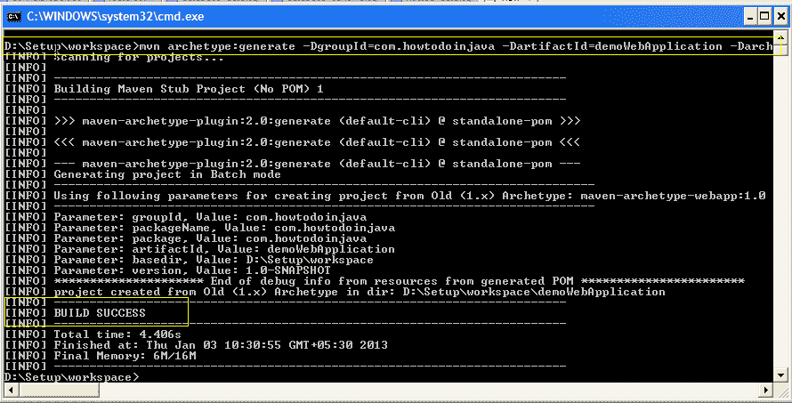
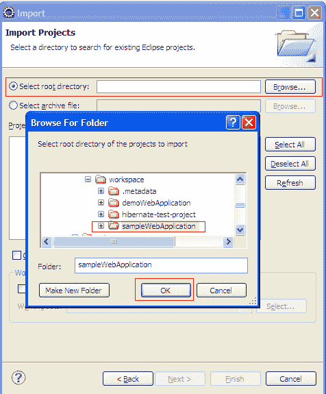

# 在 Eclipse 中逐步创建 Maven Web 项目

> 原文： [https://howtodoinjava.com/maven/maven-web-project-in-eclipse/](https://howtodoinjava.com/maven/maven-web-project-in-eclipse/)

了解**在 Eclipse** 中创建 Maven Web 项目，我们应该能够在 Eclipse IDE 上将其导入以进行进一步开发。

要创建支持 Eclipse 的 Web 项目，我们需要首先创建一个普通的 Maven 应用程序，然后使其与 Eclipse IDE 兼容。

## 1.在 Eclipse 中创建 Maven Web 项目

运行此 maven 命令以创建名为“ *demoWebApplication* ”的 *maven Web 项目*。 [使用的 Maven 原型](https://howtodoinjava.com/eclipse/how-to-import-maven-remote-archetype-catalogs-in-eclipse/)是“ `maven-archetype-webapp`”。

```java
$ mvn archetype:generate 
			-DgroupId=com.howtodoinjava 
			-DartifactId=demoWebApplication
			-DarchetypeArtifactId=maven-archetype-webapp 
			-DinteractiveMode=false

```

这将创建 *maven Web 项目结构*和特定于 Web 应用程序的文件，例如`web.xml`。



## 2.转换为 Eclipse 动态 Web 项目

要将创建的 maven Web 项目转换为 Eclipse 动态 Web 项目，需要运行以下 maven 命令。

```java
$ mvn eclipse:eclipse -Dwtpversion=2.0
```


> 请记住，必须添加“ -Dwtpversion = 2.0”，否则仅使用“ `mvn eclipse:eclipse`”会将其转换为仅普通的 Java 项目（无 Web 支持），并且您将无法将其作为 Web 应用程序运行。

## 3.在 Eclipse 中导入 Web 项目

1.  单击文件菜单，然后单击导入选项。
    
2.  现在，在常规部分中单击“现有项目..”。
    
3.  现在，浏览项目的根文件夹，然后单击“确定”。 完。
    
4.  上面的步骤会将项目导入 Eclipse 工作区。 您可以像这样验证项目结构。
    

在本 Maven 教程中，我们学习了**如何在 Eclipse** 中创建 Maven 动态 Web 项目。 在此示例中，我使用了*蚀氧*。 您可能具有不同的 Eclipse 版本，但遵循的步骤将相同。

学习愉快！