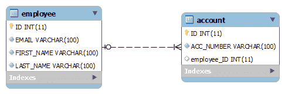

# 休眠一对多映射注释示例

> 原文： [https://howtodoinjava.com/hibernate/hibernate-one-to-many-mapping-using-annotations/](https://howtodoinjava.com/hibernate/hibernate-one-to-many-mapping-using-annotations/)

**在两个实体之间进行休眠的一对多映射**，其中第一个实体可以与多个第二个实体实例有关系，而第二个实体只能与第一个实体的一个实例关联。 其 **1 与 N** 的关系。

例如，在任何公司中，一名员工可以注册多个银行帐户，但是一个银行帐户将与一个且只有一个雇员相关联。 在此[休眠](https://howtodoinjava.com/hibernate-tutorials/)一对多映射注释示例中，我们将学习使用休眠在数据库中进行此类映射。

```java
Table of Contents

When to use one to many mapping
Hibernate one to many mapping solutions
1\. Hibernate one to many mapping with foreign key association
2\. Hibernate one to many mapping with join table
```

## 何时使用一对多映射

使用一个映射来创建实体或对象之间的 **1..N 关系**。

例如，我们必须编写两个实体，即`EmployeeEntity`和`AccountEntity`，以便多个帐户可以与一个雇员相关联，但是一个帐户不能在两个或多个雇员之间共享。

## 休眠一对多映射解决方案

这个问题可以用两种不同的方式解决。

1.  一种是在帐户表中具有**外键列**，即`EMPLOYEE_ID`。 该列将引用`Employee`表的主键。 这样，没有两个帐户可以与多个员工关联。 显然，为了执行此限制，帐号必须唯一。
2.  第二种方法是有一个通用的**联接表**说`EMPLOYEE_ACCOUNT`。 该表将具有两列，即`EMP_ID`将是引用`EMPLOYEE`表中主键的外键，而`ACCOUNT_ID`将会是引用`ACCOUNT`表主键的外键。

## 1.使用外键关联休眠一对多映射

在这种方法中，**这两个实体将负责建立关系**并维护它。 `EmployeeEntity`应该声明这种关系是一对多的，`AccountEntity`应该声明它的关系是多对一的。

#### 1.1。 设计一对多映射关系

首先让我们看一下架构设计。



#### 1.2。 实体类

编写实体类。

```java
package hibernate.test.oneToMany.foreignKeyAsso;

import java.io.Serializable;
import java.util.Set;

import javax.persistence.CascadeType;
import javax.persistence.Column;
import javax.persistence.Entity;
import javax.persistence.GeneratedValue;
import javax.persistence.GenerationType;
import javax.persistence.Id;
import javax.persistence.JoinColumn;
import javax.persistence.OneToMany;
import javax.persistence.Table;
import javax.persistence.UniqueConstraint;

@Entity(name = "ForeignKeyAssoEntity")
@Table(name = "Employee", uniqueConstraints = {
@UniqueConstraint(columnNames = "ID"),
@UniqueConstraint(columnNames = "EMAIL") })
public class EmployeeEntity implements Serializable {

	private static final long serialVersionUID = -1798070786993154676L;

	@Id
	@GeneratedValue(strategy = GenerationType.IDENTITY)
	@Column(name = "ID", unique = true, nullable = false)
	private Integer employeeId;

	@Column(name = "EMAIL", unique = true, nullable = false, length = 100)
	private String email;

	@Column(name = "FIRST_NAME", unique = false, nullable = false, length = 100)
	private String firstName;

	@Column(name = "LAST_NAME", unique = false, nullable = false, length = 100)
	private String lastName;

	@OneToMany(cascade=CascadeType.ALL)
	@JoinColumn(name="EMPLOYEE_ID")
	private Set<AccountEntity> accounts;

	//Getters and setters
}

```

编写 **AccountEntity.java** 。

```java
package hibernate.test.oneToMany.foreignKeyAsso;

import java.io.Serializable;

import javax.persistence.Column;
import javax.persistence.Entity;
import javax.persistence.GeneratedValue;
import javax.persistence.GenerationType;
import javax.persistence.Id;
import javax.persistence.ManyToOne;
import javax.persistence.Table;
import javax.persistence.UniqueConstraint;

@Entity(name = "ForeignKeyAssoAccountEntity")
@Table(name = "ACCOUNT", uniqueConstraints = {
@UniqueConstraint(columnNames = "ID")})
public class AccountEntity implements Serializable
{
	private static final long serialVersionUID = -6790693372846798580L;

	@Id
	@GeneratedValue(strategy = GenerationType.IDENTITY)
	@Column(name = "ID", unique = true, nullable = false)
	private Integer accountId;

	@Column(name = "ACC_NUMBER", unique = true, nullable = false, length = 100)
	private String accountNumber;

	@ManyToOne
	private EmployeeEntity employee;

	//Getters and setters
}

```

#### 1.3。 演示

```java
package hibernate.test.oneToMany;

import hibernate.test.HibernateUtil;
import hibernate.test.oneToMany.foreignKeyAsso.AccountEntity;
import hibernate.test.oneToMany.foreignKeyAsso.EmployeeEntity;

import java.util.HashSet;
import java.util.Set;

import org.hibernate.Session;

public class TestForeignKeyAssociation
{

	public static void main(String[] args)
	{
		Session session = HibernateUtil.getSessionFactory().openSession();
		session.beginTransaction();

		AccountEntity account1 = new AccountEntity();
		account1.setAccountNumber("Account detail 1");

		AccountEntity account2 = new AccountEntity();
		account2.setAccountNumber("Account detail 2");

		AccountEntity account3 = new AccountEntity();
		account3.setAccountNumber("Account detail 3");

		//Add new Employee object
		EmployeeEntity firstEmployee = new EmployeeEntity();
		firstEmployee.setEmail("demo-user-first@mail.com");
		firstEmployee.setFirstName("demo-one");
		firstEmployee.setLastName("user-one");

		EmployeeEntity secondEmployee = new EmployeeEntity();
		secondEmployee.setEmail("demo-user-second@mail.com");
		secondEmployee.setFirstName("demo-two");
		secondEmployee.setLastName("user-two");

		Set<AccountEntity> accountsOfFirstEmployee = new HashSet<AccountEntity>();
		accountsOfFirstEmployee.add(account1);
		accountsOfFirstEmployee.add(account2);

		Set<AccountEntity> accountsOfSecondEmployee = new HashSet<AccountEntity>();
		accountsOfSecondEmployee.add(account3);

		firstEmployee.setAccounts(accountsOfFirstEmployee);
		secondEmployee.setAccounts(accountsOfSecondEmployee);
		//Save Employee
		session.save(firstEmployee);
		session.save(secondEmployee);

		session.getTransaction().commit();
		HibernateUtil.shutdown();
	}
}

```

程序输出：

```java
Hibernate: insert into Employee (EMAIL, FIRST_NAME, LAST_NAME) values (?, ?, ?)
Hibernate: insert into ACCOUNT (ACC_NUMBER, employee_ID) values (?, ?)
Hibernate: insert into ACCOUNT (ACC_NUMBER, employee_ID) values (?, ?)
Hibernate: insert into Employee (EMAIL, FIRST_NAME, LAST_NAME) values (?, ?, ?)
Hibernate: insert into ACCOUNT (ACC_NUMBER, employee_ID) values (?, ?)
Hibernate: update ACCOUNT set EMPLOYEE_ID=? where ID=?
Hibernate: update ACCOUNT set EMPLOYEE_ID=? where ID=?
Hibernate: update ACCOUNT set EMPLOYEE_ID=? where ID=?

```

## 2.使用联接表休眠一对多映射

此方法使用**联接表**存储帐户和员工实体之间的关联。 **@JoinTabl** e 注释已用于建立此关联。

#### 2.1。 设计

让我们看看数据库架构如何：

包

one To Many association in hibernate using join table


#### 2.2。 实体类

```java
package hibernate.test.oneToMany.joinTable;

import java.io.Serializable;
import java.util.Set;

import javax.persistence.CascadeType;
import javax.persistence.Column;
import javax.persistence.Entity;
import javax.persistence.GeneratedValue;
import javax.persistence.GenerationType;
import javax.persistence.Id;
import javax.persistence.JoinColumn;
import javax.persistence.JoinTable;
import javax.persistence.OneToMany;
import javax.persistence.Table;
import javax.persistence.UniqueConstraint;

@Entity(name = "JoinTableEmployeeEntity")
@Table(name = "Employee", uniqueConstraints = {
@UniqueConstraint(columnNames = "ID"),
@UniqueConstraint(columnNames = "EMAIL") })
public class EmployeeEntity implements Serializable
{
	private static final long serialVersionUID = -1798070786993154676L;

	@Id
	@GeneratedValue(strategy = GenerationType.IDENTITY)
	@Column(name = "ID", unique = true, nullable = false)
	private Integer employeeId;

	@Column(name = "EMAIL", unique = true, nullable = false, length = 100)
	private String email;

	@Column(name = "FIRST_NAME", unique = false, nullable = false, length = 100)
	private String firstName;

	@Column(name = "LAST_NAME", unique = false, nullable = false, length = 100)
	private String lastName;

	@OneToMany(cascade=CascadeType.ALL)
	@JoinTable(name="EMPLOYEE_ACCOUNT", joinColumns={@JoinColumn(name="EMPLOYEE_ID", referencedColumnName="ID")}
	, inverseJoinColumns={@JoinColumn(name="ACCOUNT_ID", referencedColumnName="ID")})
	private Set<AccountEntity> accounts;

	//Getters and setters
}

```

```java
package hibernate.test.oneToMany.joinTable;

import java.io.Serializable;

import javax.persistence.Column;
import javax.persistence.Entity;
import javax.persistence.GeneratedValue;
import javax.persistence.GenerationType;
import javax.persistence.Id;
import javax.persistence.Table;
import javax.persistence.UniqueConstraint;

@Entity(name = "JoinTableAccountEntity")
@Table(name = "ACCOUNT", uniqueConstraints = {
@UniqueConstraint(columnNames = "ID")})
public class AccountEntity implements Serializable
{

	private static final long serialVersionUID = -6790693372846798580L;

	@Id
	@GeneratedValue(strategy = GenerationType.IDENTITY)
	@Column(name = "ID", unique = true, nullable = false)
	private Integer accountId;

	@Column(name = "ACC_NUMBER", unique = true, nullable = false, length = 100)
	private String accountNumber;

	//Getters and setters
}

```

#### 2.3。 休眠配置

**我们已经为运行时提供了两个实体，我们必须将它们添加到`hibernate.cfg.xml`文件中。 请注意，只能在配置文件中配置一组实体，否则可能会发生意外结果。**

```java
< ?xml version="1.0" encoding="utf-8"?>
< !DOCTYPE hibernate-configuration PUBLIC
"-//Hibernate/Hibernate Configuration DTD 3.0//EN"
"http://hibernate.sourceforge.net/hibernate-configuration-3.0.dtd">
<hibernate-configuration>
	<session-factory>
		<property name="hibernate.connection.driver_class">com.mysql.jdbc.Driver</property>
		<property name="hibernate.connection.url">jdbc:mysql://localhost:3306/hibernatetest</property>
		<property name="hibernate.connection.password">XXXXXX</property>
		<property name="hibernate.connection.username">root</property>
		<property name="hibernate.dialect">org.hibernate.dialect.MySQLDialect</property>
		<property name="show_sql">true</property>
		<property name="hbm2ddl.auto">create</property>
		<mapping clas="hibernate.test.oneToMany.foreignKeyAsso.AccountEntity"></mapping>
		<mapping clas="hibernate.test.oneToMany.foreignKeyAsso.EmployeeEntity"></mapping>
	</session-factory>
</hibernate-configuration>

```

#### 2.4。 演示

现在，该测试代码了。 我已经编写了以下代码来测试上述实体。

```java
package hibernate.test.oneToMany;

import hibernate.test.HibernateUtil;
import hibernate.test.oneToMany.joinTable.AccountEntity;
import hibernate.test.oneToMany.joinTable.EmployeeEntity;

import java.util.HashSet;
import java.util.Set;

import org.hibernate.Session;

public class TestJoinTable
{
	public static void main(String[] args)
	{
		Session session = HibernateUtil.getSessionFactory().openSession();
		session.beginTransaction();

		AccountEntity account1 = new AccountEntity();
		account1.setAccountNumber("123-345-65454");

		AccountEntity account2 = new AccountEntity();
		account2.setAccountNumber("123-345-6542222");

		//Add new Employee object
		EmployeeEntity emp = new EmployeeEntity();
		emp.setEmail("demo-user@mail.com");
		emp.setFirstName("demo");
		emp.setLastName("user");

		Set<AccountEntity> accounts = new HashSet<AccountEntity>();
		accounts.add(account1);
		accounts.add(account2);

		emp.setAccounts(accounts);
		//Save Employee
		session.save(emp);

		session.getTransaction().commit();
		HibernateUtil.shutdown();
	}
}

```

Program Output:

```java
Hibernate: insert into Employee (EMAIL, FIRST_NAME, LAST_NAME) values (?, ?, ?)
Hibernate: insert into ACCOUNT (ACC_NUMBER) values (?)
Hibernate: insert into ACCOUNT (ACC_NUMBER) values (?)
Hibernate: insert into EMPLOYEE_ACCOUNT (EMPLOYEE_ID, ACCOUNT_ID) values (?, ?)
Hibernate: insert into EMPLOYEE_ACCOUNT (EMPLOYEE_ID, ACCOUNT_ID) values (?, ?)

```

[Download source code](https://docs.google.com/open?id=0B7yo2HclmjI4b2dvbk40cUtvSzQ "hibernate-test-project-one-to-many-association")

在此**使用列表**休眠一对多映射注释示例的过程中，我们学习了使用外键关联和联接表技术在两个实体之间创建`1..N`关系船。

学习愉快！

阅读更多：

[休眠一对一映射注释示例](https://howtodoinjava.com/hibernate/hibernate-one-to-one-mapping-using-annotations/)
[休眠多对多映射注释示例](https://howtodoinjava.com/hibernate/hibernate-many-to-many-mapping-using-annotations/)