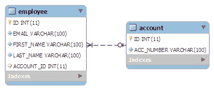
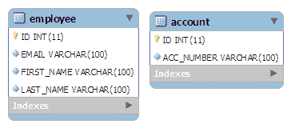

# Hiberate 一对一映射注释示例

> 原文： [https://howtodoinjava.com/hibernate/hibernate-one-to-one-mapping-using-annotations/](https://howtodoinjava.com/hibernate/hibernate-one-to-one-mapping-using-annotations/)

如果您正在处理任何 Hiberate 项目，或者计划将来进行任何处理，那么您可以轻松了解应用程序中多个实体之间的一对一关系。 在此冬眠一对一映射示例中，我们将讨论冬眠支持的此映射的 3 种不同变体。

```java
Table fo contents

Various supported techniques for one to one mapping
1\. Using foreign key association
2\. Using common join table
3\. Using shared primary key
```

对于此 Hiberate 一对一映射示例，我扩展了为[Hiberate hello 世界示例](//howtodoinjava.com/hibernate/hibernate-3-introduction-and-writing-hello-world-application/ "Hibernate 3 introduction and writing hello world application")编写的示例。 这里有两个实体：`Employee`和`Account`。

一名员工可以拥有一个帐户。 同样，一个帐户将仅与一个员工关联。 在此示例中，这是一对一的关系。

## 各种支持的技术

在 Hiberate 状态下，有 3 种方法可在两个实体之间创建一对一关系。 无论哪种方式，我们都必须使用 **[@OneToOne](https://docs.oracle.com/javaee/5/api/javax/persistence/OneToOne.html "one to one annotation")** 注解。

1.  第一种技术使用最广泛，并且在其中一个表中使用**外键列。**
2.  第二种技术使用一种众所周知的解决方案，即具有**第三张表来存储前两个表之间的映射**。
3.  第三种技术是新技术，它在两个表中都使用了**公共主键值。**

## 1\. 使用外键关联 Hiberate 一对一映射

在这种关联中，在**所有者实体**中创建了一个外键列。 例如，如果我们使**为 EmployeeEntity** 为所有者，则将在`Employee`表中创建一个额外的列`"ACCOUNT_ID"`。 此列将存储`Account`表的外键。

表结构将如下所示：



要进行这种关联，请按如下所示引用`EmployeeEntity`类中的`Account`实体：

```java

@OneToOne
@JoinColumn(name="ACCOUNT_ID")
private AccountEntity account;

```

连接列用 [**@JoinColumn**](https://docs.oracle.com/javaee/5/api/javax/persistence/JoinColumn.html "Join Column annotation") 注释声明，看起来像 **[@Column](https://docs.oracle.com/javaee/5/api/javax/persistence/Column.html "Column annotation")** 注释。 它还有一个名为`referencedColumnName`的参数。 此参数在目标实体中声明将用于联接的列。

如果在所有者方未声明`@JoinColumn`，则使用默认值。 将在所有者表中创建一个连接列，其名称将是所有者端关系名称 _（下划线）和所拥有的主键列名称的串联。 侧。

在双向关系中，一方（只有一方）必须是所有者。 所有者负责关联列的更新。 *为了声明对关系不负责的一方，使用了 映射的属性 [**。 “ mappedBy”是指所有者一方的关联的属性名称。**](https://docs.oracle.com/javaee/5/api/javax/persistence/OneToOne.html#mappedBy%28%29 "mappedBy")*

```java

@OneToOne(mappedBy="account")
private EmployeeEntity employee;

```

在“ mappedBy”属性上方，它声明依赖于所有者实体进行映射。

让我们在运行的代码中测试上述映射：

```java

public class TestForeignKeyAssociation {

	public static void main(String[] args) {
		Session session = HibernateUtil.getSessionFactory().openSession();
		session.beginTransaction();

		AccountEntity account = new AccountEntity();
		account.setAccountNumber("123-345-65454");

		// Add new Employee object
		EmployeeEntity emp = new EmployeeEntity();
		emp.setEmail("demo-user@mail.com");
		emp.setFirstName("demo");
		emp.setLastName("user");

		// Save Account
		session.saveOrUpdate(account);
		// Save Employee
		emp.setAccount(account);
		session.saveOrUpdate(emp);

		session.getTransaction().commit();
		HibernateUtil.shutdown();
	}
}

```

运行以上代码可在数据库中创建所需的架构，然后运行这些 SQL 查询。

```java

Hibernate: insert into ACCOUNT (ACC_NUMBER) values (?)
Hibernate: insert into Employee (ACCOUNT_ID, EMAIL, FIRST_NAME, LAST_NAME) values (?, ?, ?, ?)

```

当您运行上述程序时，可以在两个表中验证数据和映射。

## 2\. 使用公共联接表 Hiberate 一对一映射

这种方法对我们所有人都不陌生。 让我们从这种技术的目标 DB 结构开始。


在该技术中，要使用的主要注释是 [**@JoinTable**](https://docs.oracle.com/javaee/5/api/javax/persistence/JoinTable.html "Join table annotation") 。 **此注解用于定义两个表**中的新表名（强制性）和外键。 让我们看看它的用法：

```java
@OneToOne(cascade = CascadeType.ALL)
@JoinTable(name="EMPLOYEE_ACCCOUNT", joinColumns = @JoinColumn(name="EMPLOYEE_ID"),
inverseJoinColumns = @JoinColumn(name="ACCOUNT_ID"))
private AccountEntity account;

```

**@JoinTable** 注释在`EmployeeEntity`类中使用。 它声明将使用两列`EMPLOYEE_ID`（EMPLOYEE 表的主键）和`ACCOUNT_ID`（ACCOUNT 表的主键）创建一个新表`EMPLOYEE_ACCOUNT`。

测试以上实体会在日志文件中生成以下 SQL 查询：

```java
Hibernate: insert into ACCOUNT (ACC_NUMBER) values (?)
Hibernate: insert into Employee (EMAIL, FIRST_NAME, LAST_NAME) values (?, ?, ?)
Hibernate: insert into EMPLOYEE_ACCCOUNT (ACCOUNT_ID, EMPLOYEE_ID) values (?, ?)

```

## 3\. 使用共享主键 Hiberate 一对一映射

在这种技术中，Hiberate 将确保在两个表中都使用一个公共的主键值。 这样，`EmployeeEntity`的主键也可以安全地假定为`AccountEntity`的主键。

Table structure will be like this:



在这种方法中， **[@PrimaryKeyJoinColumn](https://docs.oracle.com/javaee/5/api/javax/persistence/PrimaryKeyJoinColumn.html "PrimaryKeyJoinColumn annotation")** 是要使用的主要注释。 让我们看看如何使用它。

```java

@OneToOne(cascade = CascadeType.ALL)
@PrimaryKeyJoinColumn
private AccountEntity account;

```

在 AccountEntity 端，它将仍然依赖于所有者实体进行映射。

```java

@OneToOne(mappedBy="account", cascade=CascadeType.ALL)
private EmployeeEntity employee;

```

Testing above entities generates following SQL queries in log files:

```java
Hibernate: insert into ACCOUNT (ACC_NUMBER) values (?)
Hibernate: insert into Employee (ACCOUNT_ID, EMAIL, FIRST_NAME, LAST_NAME) values (?, ?, ?, ?)

```

因此，我们已经看到所有 **3 种不同的方式来创建 Hiberate 中支持的一对一映射**。 我建议您下载源代码并使用它。

学习愉快！

[下载源码](https://drive.google.com/file/d/0B7yo2HclmjI4VHJnQk4tYjBueDA/view?usp=drive_web "hibernate one to one mapping tutorial source code")