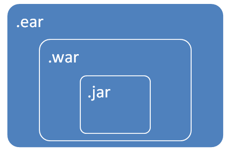

# 多模块 Maven 项目–控制台

> 原文： [https://howtodoinjava.com/maven/multi-module-project-console/](https://howtodoinjava.com/maven/multi-module-project-console/)

了解**如何从控制台** IDE 创建多模块 Maven 项目。 在此 [maven 教程](https://howtodoinjava.com/maven/)中，我们将学习创建*嵌套的 maven 项目* maven cli 命令。

## 1\. Maven 项目

#### 1.1。 Maven 父项目

父 maven 项目的包类型为**'pom'**。 它使项目成为一个聚合器–不会产生进一步的工件。

#### 1.2。 Maven 子项目/模块

*   Maven 子项目是独立的 Maven 项目，但从父项目继承属性。
*   可以使用单个命令来构建父项目中的所有子项目。
*   定义项目之间的关系更加容易。 如 JAR 项目可以打包成 WAR 项目。

## 2.从控制台创建多模块 Maven 项目

让我们创建一个 maven 项目，其中包含包 ear，war 和 jar 类型的模块。 注意如何将`archetypeArtifactId`设置为 **pom-root** 。



Projects Relationship


#### 1.1。 创建父项目-打包类型为“ pom”

创建父项目将在命令下方。

```java
$ mvn archetype:generate -DgroupId=com.howtodoinjava 
						-DartifactId=HelloWorldApp 
						-DarchetypeArtifactId=maven-archetype-quickstart 
						-DinteractiveMode=false

```

打开 pom.xml 文件，并将包类型更改为**'pom'**。

```java
<project xmlns="http://maven.apache.org/POM/4.0.0" xmlns:xsi="http://www.w3.org/2001/XMLSchema-instance"
xsi:schemaLocation="http://maven.apache.org/POM/4.0.0 http://maven.apache.org/maven-v4_0_0.xsd">
	<modelVersion>4.0.0</modelVersion>
	<groupId>com.howtodoinjava</groupId>
	<artifactId>HelloWorldApp</artifactId>

	<!-- chaged fom jar to pom -->
	<packaging>pom</packaging>

	<version>1.0-SNAPSHOT</version>
	<name>HelloWorldApp</name>
	<url>http://maven.apache.org</url>
</project>

```

#### 1.2。 创建 EAR，网络和服务模块

在控制台中，导航到父项目文件夹并为服务（通用代码，例如 DAO），rws（REST 服务或 Web 组件）和 Ear 创建其他模块。

```java
$ cd HelloWorldApp

$ mvn archetype:generate -DgroupId=com.howtodoinjava 
						-DartifactId=HelloWorldApp-ear 
						-DarchetypeArtifactId=maven-archetype-quickstart 
						-DinteractiveMode=false

$ mvn archetype:generate -DgroupId=com.howtodoinjava 
						-DartifactId=HelloWorldApp-service 
						-DarchetypeArtifactId=maven-archetype-quickstart 
						-DinteractiveMode=false

$ mvn archetype:generate -DgroupId=com.howtodoinjava 
						-DartifactId=HelloWorldApp-rws 
						-DarchetypeArtifactId=maven-archetype-webapp 
						-DinteractiveMode=false

```

#### 1.3。 更新 Maven 插件和依赖项

现在该更新添加依赖项（例如，将服务添加到 war 文件中，并将 war 文件添加到 ear 文件中）。 同样，所有用于构建 Ear 和 War 文件工件的 Maven 插件。

```java
<?xml version="1.0" encoding="UTF-8"?>
<project xmlns="http://maven.apache.org/POM/4.0.0"
	xmlns:xsi="http://www.w3.org/2001/XMLSchema-instance"
	xsi:schemaLocation="http://maven.apache.org/POM/4.0.0 
	http://maven.apache.org/maven-v4_0_0.xsd">
	<modelVersion>4.0.0</modelVersion>
	<groupId>com.howtodoinjava</groupId>
	<artifactId>HelloWorldApp</artifactId>
	<packaging>pom</packaging>
	<version>1.0-SNAPSHOT</version>
	<name>HelloWorldApp</name>
	<url>http://maven.apache.org</url>

	<properties>
		<project.build.sourceEncoding>UTF-8</project.build.sourceEncoding>
		<maven.compiler.source>1.8</maven.compiler.source>
		<maven.compiler.target>1.8</maven.compiler.target>
	</properties>

	<modules>
		<module>HelloWorldApp-ear</module>
		<module>HelloWorldApp-service</module>
		<module>HelloWorldApp-rws</module>
	</modules>

</project>

```

```java
<?xml version="1.0"?>
<project
	xsi:schemaLocation="http://maven.apache.org/POM/4.0.0 
	http://maven.apache.org/xsd/maven-4.0.0.xsd"
	xmlns="http://maven.apache.org/POM/4.0.0"
	xmlns:xsi="http://www.w3.org/2001/XMLSchema-instance">
	<modelVersion>4.0.0</modelVersion>
	<parent>
		<groupId>com.howtodoinjava</groupId>
		<artifactId>HelloWorldApp</artifactId>
		<version>1.0-SNAPSHOT</version>
	</parent>
	<artifactId>HelloWorldApp-ear</artifactId>
	<name>HelloWorldApp-ear</name>
	<url>http://maven.apache.org</url>

	<packaging>ear</packaging>

	<dependencies>
		<dependency>
			<groupId>com.howtodoinjava</groupId>
			<artifactId>HelloWorldApp-rws</artifactId>
			<version>1.0-SNAPSHOT</version>
			<type>war</type>
		</dependency>
	</dependencies>

	<build>
	<pluginManagement>
	<plugins>
	<plugin>
		<groupId>org.apache.maven.plugins</groupId>
		<artifactId>maven-ear-plugin</artifactId>
		<version>3.0.1</version>
		<configuration>
			<modules>
				<webModule>
					<groupId>com.howtodoinjava</groupId>
					<artifactId>HelloWorldApp-rws</artifactId>
					<uri>HelloWorldApp-rws-1.0-SNAPSHOT.war</uri>
					<!-- Set custom context root -->
					<contextRoot>/application</contextRoot>
				</webModule>
			</modules>
		</configuration>
	</plugin>
	</plugins>
	</pluginManagement>
	</build>

</project>

```

```java
<?xml version="1.0"?>
<project
	xsi:schemaLocation="http://maven.apache.org/POM/4.0.0 
	http://maven.apache.org/xsd/maven-4.0.0.xsd"
	xmlns="http://maven.apache.org/POM/4.0.0"
	xmlns:xsi="http://www.w3.org/2001/XMLSchema-instance">
	<modelVersion>4.0.0</modelVersion>

	<parent>
		<groupId>com.howtodoinjava</groupId>
		<artifactId>HelloWorldApp</artifactId>
		<version>1.0-SNAPSHOT</version>
	</parent>

	<artifactId>HelloWorldApp-rws</artifactId>
	<packaging>war</packaging>
	<name>HelloWorldApp-rws Maven Webapp</name>
	<url>http://maven.apache.org</url>

	<dependencies>
		 <dependency>
            <groupId>com.howtodoinjava</groupId>
            <artifactId>HelloWorldApp-service</artifactId>
            <version>1.0-SNAPSHOT</version>
        </dependency>
	</dependencies>

	<build>
		<finalName>HelloWorldApp-rws</finalName>
	</build>
</project>

```

```java
<?xml version="1.0"?>
<project
	xsi:schemaLocation="http://maven.apache.org/POM/4.0.0 
	http://maven.apache.org/xsd/maven-4.0.0.xsd"
	xmlns="http://maven.apache.org/POM/4.0.0"
	xmlns:xsi="http://www.w3.org/2001/XMLSchema-instance">
	<modelVersion>4.0.0</modelVersion>

	<parent>
		<groupId>com.howtodoinjava</groupId>
		<artifactId>HelloWorldApp</artifactId>
		<version>1.0-SNAPSHOT</version>
	</parent>

	<artifactId>HelloWorldApp-service</artifactId>
	<name>HelloWorldApp-service</name>
	<url>http://maven.apache.org</url>
</project>

```

> 阅读更多：[如何在 Eclipse 中创建多模块 Maven 项目](https://howtodoinjava.com/maven/multi-module-project-eclipse/)

## 2.项目建设过程

要生成项目，请从控制台运行 **$ mvn clean install** 命令。

```java
E:\devsetup\workspacetemp\HelloWorldApp>mvn clean install
[INFO] Scanning for projects...
[INFO] ------------------------------------------------------------------------
[INFO] Reactor Build Order:
[INFO]
[INFO] HelloWorldApp                                                      [pom]
[INFO] HelloWorldApp-service                                              [jar]
[INFO] HelloWorldApp-rws Maven Webapp                                     [war]
[INFO] HelloWorldApp-ear                                                  [jar]
[INFO]

[INFO] --- maven-jar-plugin:2.4:jar (default-jar) @ HelloWorldApp-service ---
[WARNING] JAR will be empty - no content was marked for inclusion!
[INFO] Building jar: E:\devsetup\workspacetemp\HelloWorldApp\HelloWorldApp-service\target\HelloWorldApp-service-1.0-SNAPSHOT.jar
[INFO]

[INFO] Copying webapp resources [E:\devsetup\workspacetemp\HelloWorldApp\HelloWorldApp-rws\src\main\webapp]
[INFO] Webapp assembled in [47 msecs]
[INFO] Building war: E:\devsetup\workspacetemp\HelloWorldApp\HelloWorldApp-rws\target\HelloWorldApp-rws.war
[INFO] WEB-INF\web.xml already added, skipping
[INFO]

[INFO] --- maven-install-plugin:2.4:install (default-install) @ HelloWorldApp-ear ---
[INFO] Installing E:\devsetup\workspacetemp\HelloWorldApp\HelloWorldApp-ear\target\HelloWorldApp-ear-1.0-SNAPSHOT.ear to E:\devsetup\M2\com\howtodoinjava\HelloWorldApp-ear\1.0-SNAPSHOT\HelloWorldApp-ear-1.0-SNAPSHOT.ear

[INFO] ------------------------------------------------------------------------
[INFO] Reactor Summary:
[INFO]
[INFO] HelloWorldApp 1.0-SNAPSHOT ......................... SUCCESS [  0.324 s]
[INFO] HelloWorldApp-service .............................. SUCCESS [  0.894 s]
[INFO] HelloWorldApp-rws Maven Webapp ..................... SUCCESS [  0.531 s]
[INFO] HelloWorldApp-ear 1.0-SNAPSHOT ..................... SUCCESS [  0.565 s]
[INFO] ------------------------------------------------------------------------
[INFO] BUILD SUCCESS
[INFO] ------------------------------------------------------------------------
[INFO] Total time: 2.487 s
[INFO] Finished at: 2018-11-18T22:44:44+05:30
[INFO] ------------------------------------------------------------------------

```

构建会生成名称为`HelloWorldApp-ear-1.0-SNAPSHOT.ear`的 ear 文件。 可以根据需要随意更改项目名称和生成的软件包。

学习愉快！