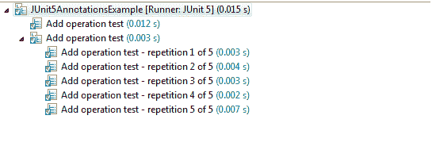

# JUnit 5 @RepeatedTest 注释示例

> 原文： [https://howtodoinjava.com/junit5/repeated-test-annotation-example/](https://howtodoinjava.com/junit5/repeated-test-annotation-example/)

通过 JUnit 5 [@RepeatedTest](http://junit.org/junit5/docs/current/api/org/junit/jupiter/api/RepeatedTest.html) 注释，可以编写可以多次运行的**可重复测试模板**。 频率可以配置为`@RepeatedTest`注释的参数。

## 1\. @RepeatedTest 注释用法

要创建可重复的测试模板方法，请使用`@RepeatedTest`注释该方法。

```java
@DisplayName("Add operation test")
@RepeatedTest(5)
void addNumber(TestInfo testInfo) {
	Calculator calculator = new Calculator();
	Assertions.assertEquals(2, calculator.add(1, 1), "1 + 1 should equal 2");
}

```

在上面的代码中，`addNumber()`测试将重复 5 次。

请注意，每次重复测试**的行为都类似于常规`@Test`方法的执行，并且完全支持相同的生命周期回调和扩展**。 这意味着对于每个单独的调用，将在适合它们的测试生命周期的地方调用[`@BeforeEach`](//howtodoinjava.com/junit-5/before-each-annotation-example/)和`@AfterEach`带注释的方法。

```java
package com.howtodoinjava.junit5.examples;

import org.junit.jupiter.api.AfterAll;
import org.junit.jupiter.api.AfterEach;
import org.junit.jupiter.api.Assertions;
import org.junit.jupiter.api.BeforeAll;
import org.junit.jupiter.api.BeforeEach;
import org.junit.jupiter.api.DisplayName;
import org.junit.jupiter.api.RepeatedTest;
import org.junit.jupiter.api.RepetitionInfo;
import org.junit.jupiter.api.Test;
import org.junit.jupiter.api.TestInfo;
import org.junit.platform.runner.JUnitPlatform;
import org.junit.runner.RunWith;

@RunWith(JUnitPlatform.class)
public class RepeatedTestExample {

	@BeforeAll
	public static void init(){
		System.out.println("Before All init() method called");
	}

	@BeforeEach
	public void initEach(){
		System.out.println("Before Each initEach() method called");
	}

	@DisplayName("Add operation test")
	@RepeatedTest(5)
	void addNumber(TestInfo testInfo, RepetitionInfo repetitionInfo) 
	{
		System.out.println("Running addNumber test -> " + repetitionInfo.getCurrentRepetition());
		Assertions.assertEquals(2, Calculator.add(1, 1), "1 + 1 should equal 2");
	}

	@AfterEach
	public void cleanUpEach(){
		System.out.println("After Each cleanUpEach() method called");
	}

	@AfterAll
	public static void cleanUp(){
		System.out.println("After All cleanUp() method called");
	}
}

```

上面程序的输出：

```java
Before All init() method called

Before Each initEach() method called
After Each cleanUpEach() method called

Before Each initEach() method called
Running addNumber test -> 1
After Each cleanUpEach() method called

Before Each initEach() method called
Running addNumber test -> 2
After Each cleanUpEach() method called

Before Each initEach() method called
Running addNumber test -> 3
After Each cleanUpEach() method called

Before Each initEach() method called
Running addNumber test -> 4
After Each cleanUpEach() method called

Before Each initEach() method called
Running addNumber test -> 5
After Each cleanUpEach() method called

After All cleanUp() method called

```

## 2\. 自定义显示测试名称

除了指定重复次数之外，您还可以**为每个重复**指定自定义显示名称。 此自定义显示名称可以是*静态文本+动态占位符*的组合。 当前，支持 3 个占位符：

*   `{displayName}`：`@RepeatedTest`方法的显示名称。
*   `{currentRepetition}`：当前重复计数。
*   `{totalRepetitions}`：重复总数。

```java
@RunWith(JUnitPlatform.class)
public class JUnit5AnnotationsExample 
{
	@DisplayName("Add operation test")
	@RepeatedTest(value = 5, name = "{displayName} - repetition {currentRepetition} of {totalRepetitions}")
	void addNumber(TestInfo testInfo) {
		Assertions.assertEquals(2, Calculator.add(1, 1), "1 + 1 should equal 2");
	}
}

```

运行以上测试将在下面输出：



JUnit 5 Repeated Test Display Names


您可以使用两种预定义格式之一，即`RepeatedTest.LONG_DISPLAY_NAME`和`RepeatedTest.SHORT_DISPLAY_NAME`。 如果未指定，则`SHORT_DISPLAY_NAME`是默认格式。

*   `RepeatedTest.LONG_DISPLAY_NAME` – {displayName} :: {totalRepetitions}的重复{currentRepetition}
*   `RepeatedTest.SHORT_DISPLAY_NAME` – {totalRepetitions}的重复{currentRepetition}

```java
@DisplayName("Add operation test")
@RepeatedTest(value = 5, name = RepeatedTest.LONG_DISPLAY_NAME)
void addNumber(TestInfo testInfo) {
	Assertions.assertEquals(2, Calculator .add(1, 1), "1 + 1 should equal 2");
}

```

## 3\. RepetitionInfo 接口

[RepetitionInfo](http://junit.org/junit5/docs/current/api/org/junit/jupiter/api/RepetitionInfo.html) 用于将有关重复测试的当前重复的信息注入`@RepeatedTest`，`@BeforeEach`和`@AfterEach`方法中。

```java
@RunWith(JUnitPlatform.class)
public class JUnit5AnnotationsExample {

	@BeforeEach
	public void initEach(RepetitionInfo info){
		int currentRepetition = info.getCurrentRepetition();
        int totalRepetitions = info.getTotalRepetitions();
        //Use information as needed
	}

	@DisplayName("Add operation test")
	@RepeatedTest(value = 5, name="{displayName} :: repetition {currentRepetition} of {totalRepetitions}")
	void addNumber(TestInfo testInfo) {
		Calculator calculator = new Calculator();
		Assertions.assertEquals(2, calculator.add(1, 1), "1 + 1 should equal 2");
	}

	@AfterEach
	public void cleanUpEach(RepetitionInfo info){
		int currentRepetition = info.getCurrentRepetition();
        int totalRepetitions = info.getTotalRepetitions();
        //Use information as needed
	}
}

```

将我的问题放在评论部分。

学习愉快！

[Sourcecode Download](https://github.com/lokeshgupta1981/Junit5Examples/tree/master/JUnit5Examples)