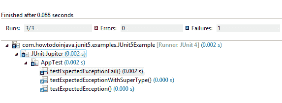

# JUnit 5 预期的异常– assertThrows（）示例

> 原文： [https://howtodoinjava.com/junit5/expected-exception-example/](https://howtodoinjava.com/junit5/expected-exception-example/)

在 JUnit 5 中，要*测试异常情况*，则应使用 [org.junit.jupiter.api.Assertions.assertThrows（）](http://junit.org/junit5/docs/current/api/org/junit/jupiter/api/Assertions.html#assertThrows-java.lang.Class-org.junit.jupiter.api.function.Executable-)方法。 *junit 5 异常测试*还有其他方法，但我建议避免使用它们。

## 1\. Junit 5 assertThrows（）的语法

它断言所提供的`executable`的执行将引发`expectedType`的异常并返回该异常。

```java
public static <T extends Throwable> T assertThrows(Class<T> expectedType, Executable executable)
```

**如果没有引发异常，或者引发了其他类型的异常，则此方法将失败。**

请注意，允许使用相同类型的例外。 例如 如果您期望`NumberFormatException`并且抛出`IllegalArgumentException`，那么该测试也会通过，因为 **NumberFormatException 扩展了 IllegalArgumentException** 类。

## 2\. JUnit 5 预期异常示例

一个非常简单的示例可以是：

```java
@Test
void testExpectedException() {

  Assertions.assertThrows(NumberFormatException.class, () -> {
    Integer.parseInt("One");
  });

}

```

如果参数不是有效数字，则此处的可执行代码为`Integer.parseInt("One")`引发`NumberFormatException`。 在上述代码中，`"One"`不是有效数字，因此代码将引发`assertThrows()`方法所期望的异常-因此测试通过。

## 3.期望异常类的超类型

如前所述，您也可以期望异常类的超类型。 例如 上面的测试也可以用`IllegalArgumentException`编写。

```java
@Test
void testExpectedExceptionWithSuperType() {

  Assertions.assertThrows(IllegalArgumentException.class, () -> {
    Integer.parseInt("One");
  });

}

```

该测试用例也将通过。

## 4.期待其他异常类

如果可执行代码**抛出任何其他异常类型**，则测试将失败；否则，测试将失败。 甚至**如果测试没有引发任何异常**，那么测试也会失败。

例如 在下面的示例中，`"1"`是有效数字，因此不会引发异常。

```java
@Test
void testExpectedExceptionFail() {

  Assertions.assertThrows(IllegalArgumentException.class, () -> {
    Integer.parseInt("1");
  });

}

```

## 5.完整的例子

这是 *junit 5 断言异常消息*的完整代码。

```java
package com.howtodoinjava.junit5.examples.module;

import org.junit.jupiter.api.Assertions;
import org.junit.jupiter.api.Test;

public class AppTest {

  @Test
  void testExpectedException() {

    Assertions.assertThrows(NumberFormatException.class, () -> {
      Integer.parseInt("One");
    });
  }

  @Test
  void testExpectedExceptionWithSuperType() {

    Assertions.assertThrows(IllegalArgumentException.class, () -> {
      Integer.parseInt("One");
    });
  }

  @Test
  void testExpectedExceptionFail() {

    Assertions.assertThrows(IllegalArgumentException.class, () -> {
      Integer.parseInt("1");
    });
  }

}

```

现在，使用[测试套件](//howtodoinjava.com/junit-5/junit5-test-suites-examples/)执行此类。 您可以在 [maven 示例](//howtodoinjava.com/junit-5/junit-5-maven-dependency-pom-xml-example/)中查看完整的项目配置。

```java
package com.howtodoinjava.junit5.examples;

import org.junit.platform.runner.JUnitPlatform;
import org.junit.platform.suite.api.SelectPackages;
import org.junit.runner.RunWith;

@RunWith(JUnitPlatform.class)
@SelectPackages("com.howtodoinjava.junit5.examples")
public class JUnit5Example 
{
}

```

日食测试结果如下图所示：

<figure aria-describedby="caption-attachment-7899" class="wp-caption aligncenter" id="attachment_7899" style="width: 573px">

<figcaption class="wp-caption-text" id="caption-attachment-7899">JUnit 5 Expected Exception Tests</figcaption>

</figure>

这就是 **JUnit 5 异常测试**的全部。 将我的问题放在评论部分。

学习愉快！

[Sourcecode Download](https://github.com/lokeshgupta1981/Junit5Examples/tree/master/JUnit5Examples)