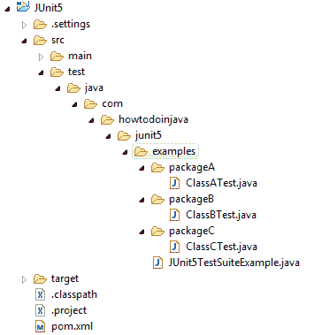
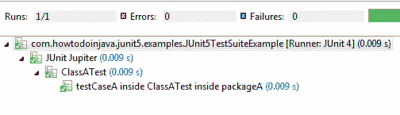
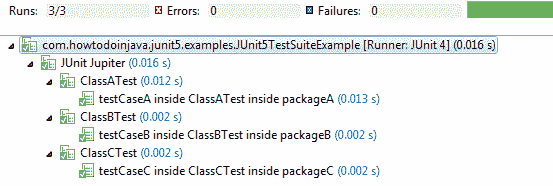

# JUnit 5 测试套件示例

> 原文： [https://howtodoinjava.com/junit5/junit5-test-suites-examples/](https://howtodoinjava.com/junit5/junit5-test-suites-examples/)

使用 **JUnit 5 测试套件**，您可以运行分散到多个测试类和不同包中的测试。 JUnit 5 提供了两个注释： [@SelectPackages](http://junit.org/junit5/docs/current/api/index.html?org/junit/platform/runner/SelectPackages.html) 和 [@SelectClasses](http://junit.org/junit5/docs/current/api/index.html?org/junit/platform/runner/SelectClasses.html) 以创建测试套件。 此外，您可以使用其他注释来过滤测试包，类甚至测试方法。

```java
Table of Contents

Project Structure for Test classes and Suite
Create Test Suite with JUnit 5 @SelectPackages
Create Test Suite with JUnit 5 @SelectClasses
Filtering Packages with @IncludePackages and @ExcludePackages
Filtering Test Classes with @IncludeClassNamePatterns and @ExcludeClassNamePatterns
Filtering Tests with @IncludeTags and @ExcludeTags
```

Its mandatory to have test class names to follow regex pattern `^.*Tests?$`. It means that test class names MUST end with **Test** or **Tests**. e.g. `UserMgmtTests`, `DeviceMgmtTest` etc.

## 1.测试类和套件的项目结构

对于此示例，我使用以下项目结构。

<figure aria-describedby="caption-attachment-7859" class="wp-caption aligncenter" id="attachment_7859" style="width: 355px">

<figcaption class="wp-caption-text" id="caption-attachment-7859">JUnit 5 Test Suite Project Structure</figcaption>

</figure>

## 2.使用@SelectPackages 创建测试套件

`@SelectPackages`指定通过`@RunWith(JUnitPlatform.class)`运行测试套件时要选择的软件包的名称。

#### 指定单个包装

将“ packageName”作为参数传递给`@SelectPackages`批注。

```java
@RunWith(JUnitPlatform.class)
@SelectPackages("com.howtodoinjava.junit5.examples.packageA") 
public class JUnit5TestSuiteExample 
{
}

```

<figure aria-describedby="caption-attachment-7860" class="wp-caption aligncenter" id="attachment_7860" style="width: 504px">

<figcaption class="wp-caption-text" id="caption-attachment-7860">@SelectPackages – Single Package Example</figcaption>

</figure>

#### 指定多个包

将参数中的程序包名称作为字符串数组（在大括号`{}`中）传递给`@SelectPackages`批注。

```java
@RunWith(JUnitPlatform.class)
@SelectPackages({"com.howtodoinjava.junit5.examples.packageA","com.howtodoinjava.junit5.examples.packageB"}) 
public class JUnit5TestSuiteExample 
{
}

```

<figure aria-describedby="caption-attachment-7861" class="wp-caption aligncenter" id="attachment_7861" style="width: 505px">

<figcaption class="wp-caption-text" id="caption-attachment-7861">@SelectPackages – Multiple Packages Example</figcaption>

</figure>

Please note that if we pass ‘packageX’ in `@SelectPackages` annotation, then **test classes present in this package AND all it’s sub-packages** will be selected for test suite.

## 3.使用@SelectClasses 创建测试套件

`@SelectClasses`指定通过`@RunWith(JUnitPlatform.class)`运行测试套件时要选择的类。

#### 指定单班

将`ClassName.class`作为参数传递到`@SelectClasses`批注。

```java
@RunWith(JUnitPlatform.class)
@SelectClasses( ClassATest.class )
public class JUnit5TestSuiteExample 
{
}

```

<figure aria-describedby="caption-attachment-7862" class="wp-caption aligncenter" id="attachment_7862" style="width: 504px">

<figcaption class="wp-caption-text" id="caption-attachment-7862">@SelectClasses – Single Class Example</figcaption>

</figure>

#### 指定多个类别

将参数中的类名称作为数组（在大括号`{}`中）传递给`@SelectClasses`批注。

```java
@RunWith(JUnitPlatform.class)
@SelectClasses( { ClassATest.class, ClassBTest.class, ClassCTest.class } )
public class JUnit5TestSuiteExample 
{
}

```

<figure aria-describedby="caption-attachment-7863" class="wp-caption aligncenter" id="attachment_7863" style="width: 553px">

<figcaption class="wp-caption-text" id="caption-attachment-7863">@SelectClasses – Multiple Test Classes Example</figcaption>

</figure>

## 4\. @IncludePackages 和@ExcludePackages

我们了解到`@SelectPackages`也会导致其所有子包都被扫描以查找测试类别。 如果要排除任何特定的子软件包，或包括任何软件包，则可以使用 [@IncludePackages](http://junit.org/junit5/docs/current/api/org/junit/platform/suite/api/IncludePackages.html) 和 [@ExcludePackages](http://junit.org/junit5/docs/current/api/org/junit/platform/suite/api/ExcludePackages.html) 批注。

#### @IncludePackages 示例

```java
@RunWith(JUnitPlatform.class)
@SelectPackages("com.howtodoinjava.junit5.examples")
@IncludePackages("com.howtodoinjava.junit5.examples.packageC")
public class JUnit5TestSuiteExample 
{
}

```

这只会添加`com.howtodoinjava.junit5.examples.packageC`中的测试类（即`ClassCTest`）中的测试。

#### @ExcludePackages 示例

```java
@RunWith(JUnitPlatform.class)
@SelectPackages("com.howtodoinjava.junit5.examples")
@ExcludePackages("com.howtodoinjava.junit5.examples.packageC")
public class JUnit5TestSuiteExample 
{
}

```

这将添加`com.howtodoinjava.junit5.examples`中测试类的测试，但不包括子包`com.howtodoinjava.junit5.examples.packageC`（即`ClassATest`和`ClassBTest`）中的所有测试类。

## 5\. @IncludeClassNamePatterns 和@ExcludeClassNamePatterns

很多时候，在选择注释中包含所有包或测试类名称是不可行的。 在这种情况下，您可能会提供更广泛的软件包范围，并通过 appy 筛选将哪些测试类包括在套件中或从套件中排除。

要指定要排除或包含的测试类名称模式，可以使用 [@IncludeClassNamePatterns](http://junit.org/junit5/docs/current/api/org/junit/platform/suite/api/IncludeClassNamePatterns.html) 和 [@ExcludeClassNamePatterns](http://junit.org/junit5/docs/current/api/org/junit/platform/suite/api/ExcludeClassNamePatterns.html) 批注。

#### @IncludeClassNamePatterns 示例

包括名称以`ATest`或`ATests`结尾的所有测试类。

```java
@RunWith(JUnitPlatform.class)
@SelectPackages("com.howtodoinjava.junit5.examples")
@IncludeClassNamePatterns({"^.*ATests?$"})
public class JUnit5TestSuiteExample 
{
}

```

#### @ExcludeClassNamePatterns 示例

排除名称以`ATest`或`ATests`结尾的所有测试类。

```java
@RunWith(JUnitPlatform.class)
@SelectPackages("com.howtodoinjava.junit5.examples")
@ExcludeClassNamePatterns({"^.*ATests?$"})
public class JUnit5TestSuiteExample 
{
}

```

You may apply more than one pattern in above annotations. In case of multiple patterns, they are combined using `OR` semantics. It means that if fully qualified name of a class **matches against at least one of the patterns**, the class will be included/excluded from the test suite.

## 6\. @IncludeTags 和@ExcludeTags

在企业应用程序中，您可能已经标记了要在特定环境中运行的测试用例，例如 开发或生产。 您还可以在测试套件中包含或排除基于这些标记的测试。

#### @IncludeTags 示例

此测试套件将运行包`com.howtodoinjava.junit5.examples`（及其子包）中标记有`production`的所有测试。

```java
@RunWith(JUnitPlatform.class)
@SelectPackages("com.howtodoinjava.junit5.examples")
@IncludeTags("production")
public class JUnit5TestSuiteExample 
{
}

```

#### @ExcludeTags 示例

此测试套件将排除软件包`com.howtodoinjava.junit5.examples`（及其子软件包）中所有带有`development`标签的测试。

```java
@RunWith(JUnitPlatform.class)
@SelectPackages("com.howtodoinjava.junit5.examples")
@ExcludeTags("development")
public class JUnit5TestSuiteExample 
{
}

```

显然，有多种方法**在 JUnit 5** 中创建测试套件，并且它强烈支持**过滤测试套件**中的测试。

将我的问题放在评论部分。

学习愉快！

[Sourcecode Download](https://github.com/lokeshgupta1981/Junit5Examples/tree/master/JUnit5Examples)