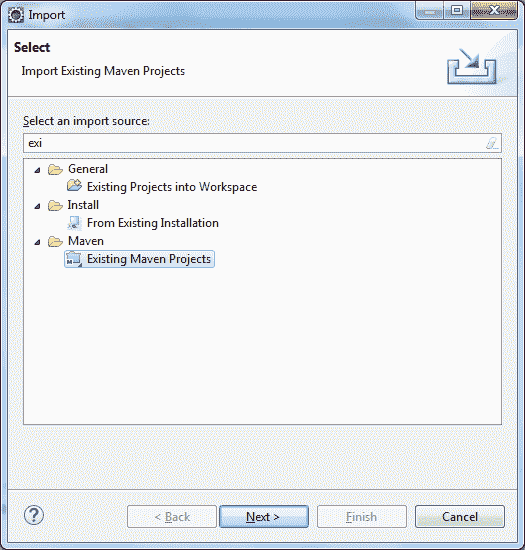
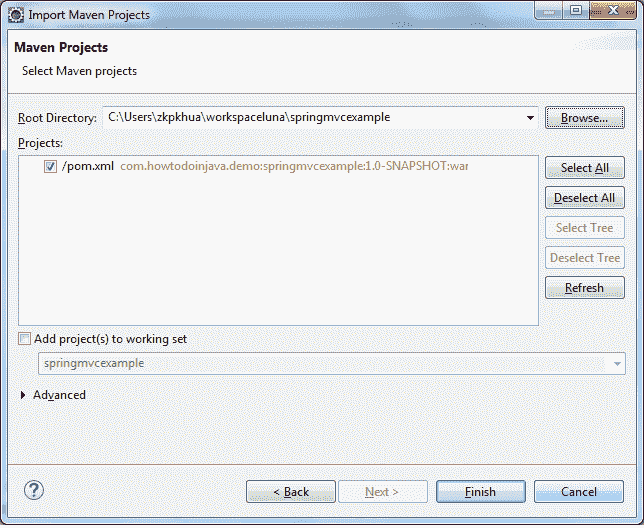
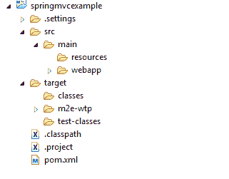
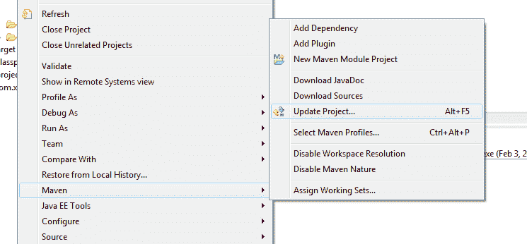
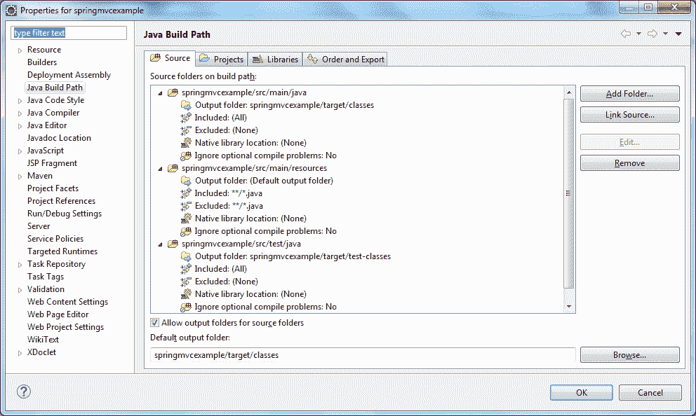

# Maven – 创建 Java 源文件夹

> 原文： [https://howtodoinjava.com/maven/how-to-create-java-source-folders-in-maven-web-application/](https://howtodoinjava.com/maven/how-to-create-java-source-folders-in-maven-web-application/)

这是一个非常奇怪的问题，但这是事实，当您使用“`-DarchetypeArtifactId=maven-archetype-webapp`”创建 Maven Web 应用程序时，没有创建 Java 源文件夹。 而是创建了一个资源文件夹。 当为您的 Web 应用程序创建 war 文件时，放置在`resources`文件夹中的文件将放置在您的类路径中。

> **要创建 Java 源文件夹，必须手动创建它们。 然后将这些文件夹添加到您的生成配置中。**

**1）创建 Maven Web 应用程序**

要创建 maven Web 应用程序，请在您的工作目录中运行以下命令。

```java
//No line breaks in below command

mvn archetype:generate -DgroupId=com.howtodoinjava.demo -DartifactId=springmvcexample -DarchetypeArtifactId=maven-archetype-webapp -DinteractiveMode=false

```

2）上面的命令将为工作目录内的 Web 应用程序特定 Maven 文件夹结构。 现在**使用以下命令将 Eclipse 支持**（或对您最喜欢的 IDE 的支持）添加到此 Web 应用程序中。

```java
//Change current working directory to application folder
cd springmvcexample

//add eclipse support
mvn eclipse:eclipse

```

**3）将 Web 应用程序作为现有 Maven 项目导入到 Eclipse 中**







**4）手动创建源文件夹（是的！ 需要手动执行）**


**5）使用命令 Maven >“更新项目”更新项目构建配置**





就这样。 您的源文件夹已准备就绪。

**祝您学习愉快！**