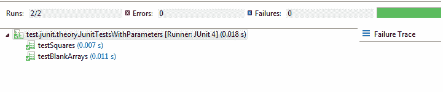

# Junit 参数化测试 – `@Theory`和`@DataPoints`

> 原文： [https://howtodoinjava.com/junit/junit-parameterized-testcases-with-theory-and-datapoints/](https://howtodoinjava.com/junit/junit-parameterized-testcases-with-theory-and-datapoints/)

在我之前关于该主题的文章中，介绍了如何编写带有`@Parameters`注解的**参数化测试用例**。 如果我选择了正确的单词，那么这种方法会很混乱并且不太可读。 不必要地需要大量关注。 嗯，还有另一种方法，您可以借助`@Theory`和`@DataPoints`等注解在 Junit 中编写参数化测试用例。

我将以以前的帖子为例，并将其转换为新方法。 这是有道理的，因为在此之后我们将能够比较哪些变化以及与以前的方法有何不同。

## 1）使用`@DataPoints`馈送输入数据

在此，仅注解已从`@Parameters`更改为`@DataPoints`。 其余的概念是相同的。

以前，提供输入的方法是：

```java
@Parameters(name = "Run #Square of : {0}^2={1}")
public static Iterable<Object []> data() {
	return Arrays.asList(new Object[][] { { 1, 1 }, { 2, 4 }, { 3, 19 },
			{ 4, 16 }, { 5, 25 } });
}

```

现在它是：

```java
@DataPoints
public static int[][] integers()
{
  return new int[][]{{1, 1}, {2, 4}, {3, 9}, {4, 16}, {5, 25}, {}};
}

```

请注意，您可以使用`@DataPoint`注解分别编写输入。

```java
@DataPoint
public static int[] input6 = new int[]{6, 36};

@DataPoint
public static int[] input7 = new int[]{7, 49};

```

我将返回类型从“`Iterable<object[]>`”更改为“`int[][]`”，因为这些输入馈送到测试用例的方式略有不同。 您将在下一部分中看到不同之处。

## 2）用`@Theory`编写测试用例

**从结构上讲，基于理论的类比参数化测试类简单**。 类声明应使用`@RunWith(Theories.class)`进行注解，并且必须提供两个实体：

1.  生成并返回测试数据的数据方法
2.  一个理论

数据方法必须使用`@DataPoints`进行注解，每个理论都必须使用`@Theory`进行注解。 与普通的单元测试一样，每个理论都应至少包含一个断言。

在以前的方法中，我们编写了如下的测试用例：

```java
@Test
public void testUserMapping() {
	// You can use here assert also
	Assert.assertEquals(resultExpected, MathUtils.square(input));
}

```

其中`input`和`resultExpected`被声明为类成员，并使用参数化构造器进行填充。 如您所见，上面的`testUserMapping()`方法没有任何参数。

在新方法中，测试使用`@Theory`注解进行注解。 例如：

```java
@Theory
public void testSquares(final int[] inputs)
{
  Assume.assumeTrue(inputs[0] > 0 && inputs[1] > 0);
  Assert.assertEquals(inputs[1], MathUtils.square(inputs[0]));
}

```

您会看到参数现在已成为测试用例的一部分，这是概念的最佳组成部分。 假定`True()`确保参数为正数，并且`assertEquals()`检查我们需要测试的函数逻辑。

要调整上述测试用例，请按以下方式用`@RunWith`注解类。

```java
@RunWith(Theories.class)
public class JunitTestsWithParameters
{
	//Testcases
}

```

如果您认为某些测试用例在执行操作时可能会引发异常，请使用`@Rule`注解和`ExpectedException`类对其进行处理。 下面给出一个更完整的工作示例：

```java
package test.junit.theory;

import org.junit.Assert;
import org.junit.Assume;
import org.junit.Rule;
import org.junit.experimental.theories.DataPoint;
import org.junit.experimental.theories.DataPoints;
import org.junit.experimental.theories.Theories;
import org.junit.experimental.theories.Theory;
import org.junit.rules.ExpectedException;
import org.junit.runner.RunWith;

@RunWith(Theories.class)
public class JunitTestsWithParameters
{
   @Rule
   public ExpectedException expectedException = ExpectedException.none();

   @DataPoints
   public static int[][] integers()
   {
      return new int[][]{{1, 1}, {2, 4}, {3, 9}, {4, 16}, {5, 25}, {}};
   }

   @DataPoint
   public static int[] input6 = new int[]{6, 36};
   @DataPoint
   public static int[] input7 = new int[]{7, 49};

   @Theory
   public void testSquares(final int[] inputs)
   {
      Assume.assumeTrue(inputs.length == 2);
      Assume.assumeTrue(inputs[0] > 0 && inputs[1] > 0);
      Assert.assertEquals(inputs[1], MathUtils.square(inputs[0]));
   }

   @Theory
   public void testBlankArrays(final int[] inputs)
   {
      Assume.assumeTrue(inputs.length == 0);
      expectedException.expect(ArrayIndexOutOfBoundsException.class);
      Assert.assertEquals(inputs[1], MathUtils.square(inputs[0]));
   }
}

```

运行上述测试用例，结果将如下所示：



Junit 理论示例输出


> 请注意，将测试数据从测试/理论实现中分离出来，除了简洁以外，还可以带来另一个积极影响：您可能会开始考虑独立于要测试的实际内容的测试数据。

但是同时，您应该已经注意到，没有办法将特定结果与特定数据点配对。 当您可以以断言的形式表达数据点与预期结果之间的一般关系时，以及当该关系对于所有数据都成立时，应该使用理论。

因此，**应在适当考虑的情况下**在理论和参数化测试用例之间谨慎选择。 它们不是参数化测试用例的精确替代，而是它们的补充。

 **祝您学习愉快！**