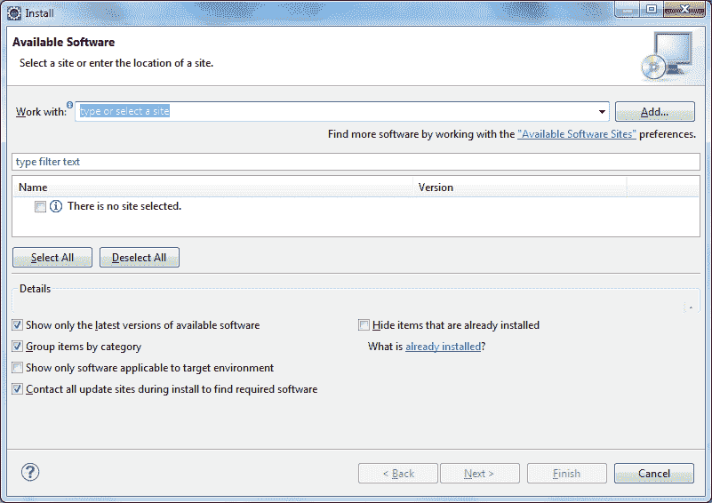
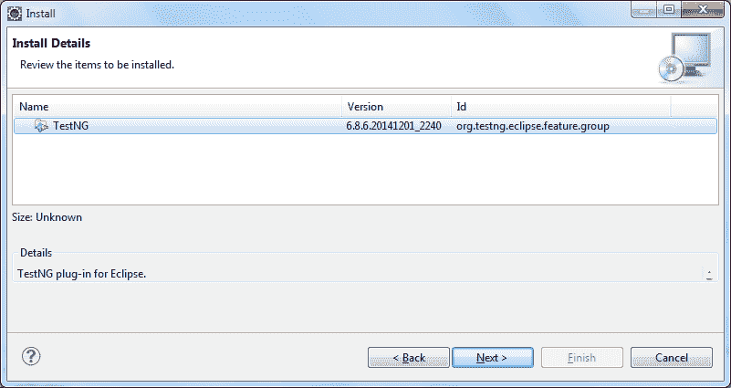
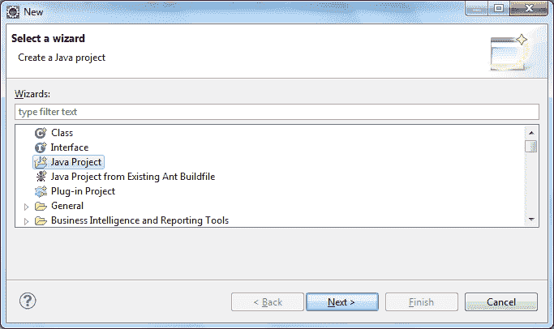
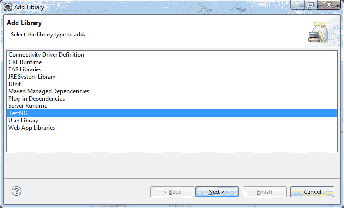
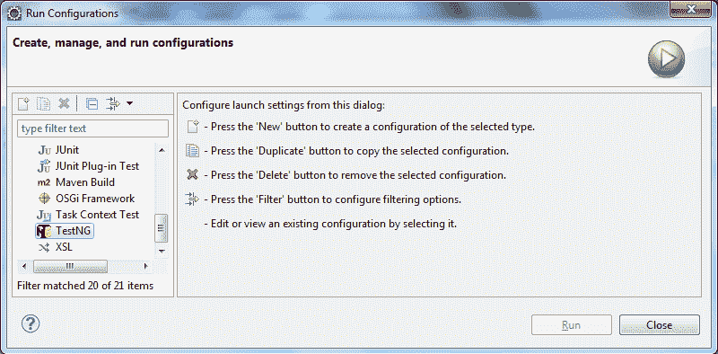

# TestNG 教程（使用 Eclipse）

> 原文： [https://howtodoinjava.com/testng/testng-tutorial-with-eclipse/](https://howtodoinjava.com/testng/testng-tutorial-with-eclipse/)

您可能知道[**测试**](https://en.wikipedia.org/wiki/Software_testing "testing")的过程是根据预期的工作方式来验证和验证某个软件或硬件是否在工作。 测试是[**软件开发生命周期（SDLC）**](https://en.wikipedia.org/wiki/Systems_development_life_cycle "sdlc")的重要组成部分，因为它有助于提高开发产品的质量。 测试有多种类型和级别，例如白盒，黑盒，单元，集成，系统，验收，性能，安全性，功能，非功能性等等。 这些类型的测试中的每一种都是使用自动化工具手动完成或通过自动化完成的。

顾名思义，[**测试自动化**](https://en.wikipedia.org/wiki/Test_automation "Test_automation")是指自动化测试过程。 测试自动化具有以多种方式运行测试的优势，例如以固定的间隔或作为应用构建的一部分。 这有助于在开发本身的初始阶段识别错误，从而缩短了产品时间线并提高了产品质量。 它还有助于减少重复的手动测试工作，并使手动测试团队能够专注于测试新功能和复杂场景。

```java
Table of Contents

Introduction of TestNG
Advantages of TestNG
Installing TestNG onto Eclipse
Creating Java Project with TestNG Dependencies
Creating your first TestNG class
Running TestNG test

```

## TestNG 的介绍

[TestNG](http://testng.org/doc/index.html "testng")，其中 **NG 代表“下一代”**，是受 [JUnit](//howtodoinjava.com/junit/ "JUnit Tutorials") （Java）和 NUnit（C#）启发的测试自动化框架。 它可以用于单元，功能，集成和端到端测试。 TestNG 在短时间内获得了很大的普及，并且是 Java 开发人员中使用最广泛的测试框架之一。 它主要使用 Java 注解来配置和编写测试方法。

TestNG 在 JUnit 4 上具有的一些功能是：

*   额外的之前和之后注解，例如“之前/之后”套件和“之前/之后”组
*   依赖项测试
*   测试方法分组
*   多线程执行
*   内置报告框架

它是用 Java 编写的，可以与 Java 以及与 Java 相关的语言（例如 Groovy）一起使用。 在 TestNG 中，套件和测试主要通过 XML 文件进行配置或描述。 默认情况下，文件的名称是`testng.xml`，但是如果需要，我们可以给它提供任何其他名称。 TestNG 允许用户通过 XML 文件进行测试配置，并允许他们在测试套件中包括（或排除）各自的程序包，类和方法。 它还允许用户将测试方法分组为特定的命名组，并将其包括或排除为测试执行的一部分。

## TestNG 的优点

现在，让我们发现 TestNG 提供的更多功能/优势。

1.  多个前后注解选项
2.  基于 XML 的测试配置和测试套件定义
3.  相关方法
4.  小组/小组
5.  依赖群体
6.  测试方法的参数化
7.  数据驱动的测试
8.  多线程执行
9.  更好的报告

我们将在接下来的教程中更详细地讨论这些功能。

## 将 TestNG 安装到 Eclipse

在我们可以下载并开始使用 TestNG 之前，请确保您的系统上已安装 Java JDK5 或更高版本。 还要确保在系统路径中设置了 JDK。

如果您只想下载 TestNG JAR，可以从以下 URL 获取：

TestNG Jar – [http://testng.org/testng-6.8.zip](http://testng.org/testng-6.8.zip "download testng jar")

现在，让我们开始将 TestNG 安装到 Eclipse 上。 我将尝试捕获该过程中的所有步骤。

1）打开您的 Eclipse 应用。

2）转到“**帮助 | 安装新软件**”。



3）**单击“使用”文本框旁边的“添加…”按钮**。


4）**在名称框中输入 TestNG 站点**，在位置中输入 URL `http://beust.com/eclipse`。 完成后，单击“确定”按钮。


5）单击确定，将 TestNG 更新站点添加到 Eclipse。 可用的软件窗口将显示可在 TestNG 站点下下载的工具。



6）**选择 TestNG，然后单击“Next”**。

7）Eclipse 将计算下载所选 TestNG 插件的软件要求，并显示“安装详细信息”屏幕。 **在详细信息屏幕**上单击“下一步”。

8）**接受许可信息，然后单击“完成”**。 这将开始将 TestNG 插件下载并安装到 Eclipse。


9）如果出现以下**警告窗口**，请单击“确定”按钮。


10）安装完成后，Eclipse 将提示您**重新启动它**。 在窗口提示上单击“是”。

11）重新启动 Eclipse 后，通过转至“窗口 | 偏好”**来验证 TestNG 插件的安装**。 您将在首选项窗口下看到一个 TestNG 部分。


我们已成功将 TestNG 插件安装到 Eclipse 安装中。 这将帮助我们使用 Eclipse 执行 TestNG 测试或套件。

## 创建具有 TestNG 依赖项的 Java 项目

在编写第一个 TestNG 测试之前，我们必须在 Eclipse 中创建一个 Java 项目并添加我们的 TestNG 测试依赖项。

1）转到“**文件 | 新增 | 其他**”。 将显示一个带有多个选项的窗口。

2）**选择 Java 项目**，如以下屏幕截图所示，然后单击“下一步”。



3）在下一个屏幕上，**输入 Java 项目的项目名称**，例如`TestNGExamples`，如以下屏幕截图所示，然后单击“完成”：


这将在 Eclipse 中创建一个新的 Java 项目。

4）现在**转到“项目 | 属性”**。 **在“属性”窗口左侧选择“Java 构建路径”**，如以下屏幕截图所示。 这将显示新创建的项目的构建路径。


5）**单击库选项卡，然后单击“添加库…”选项**。

6）在“添加库”窗口中选择 TestNG，如以下屏幕截图所示，然后单击“下一步”：



7）**在下一个窗口中单击“完成”**。 这会将 TestNG 库添加到您的 Eclipse 项目中。


太好了，我们已经在 Eclipse 中成功创建了一个新的 Java 项目，并将 TestNG 库添加到了项目的构建路径。

## 创建您的第一个 TestNG 类

执行以下步骤来创建您的第一个 TestNG 类：

1）**转到“文件 | 新增 | 其他”**。 这将在 Eclipse 中打开一个新的“添加”向导窗口。


2）**从“添加”向导窗口中选择 TestNG 类**，然后单击“下一步”。


3）在下一个窗口上，**单击“浏览”按钮**，然后选择需要在其中添加类的 Java 项目。


4）**输入包名称和测试类名称**，然后单击“完成”。


5）此窗口还为您提供了一个选项，可以在创建新的 TestNG 类时选择不同的注解。 如果选择，则插件将在生成类时为这些注解生成伪方法。 这将为您的项目添加一个新的 TestNG 类。

```java
package com.howtodoinjava.test;

import org.testng.annotations.AfterTest;
import org.testng.annotations.BeforeTest;
import org.testng.annotations.Test;

public class MyFirstTest {
	@Test
	public void f() {
	}

	@BeforeTest
	public void beforeTest() {
	}

	@AfterTest
	public void afterTest() {
	}
}

```

我们已成功将新的 TestNG 测试类添加到 Eclipse 中新创建的 Java 项目中。 随时根据需要修改代码。 现在，让我们通过 Eclipse 运行新创建的测试类。

## 运行 TestNG 测试

执行以下步骤以通过 Eclipse 运行测试：

1）**在 Eclipse 中选择 Java 项目，然后转到“运行 | 运行配置”**。



2）**在给定的选项中选择 TestNG**，然后单击“新建”按钮以创建新配置。


3）请注意，TestNG 插件提供了多个用于运行测试用例的选项，如下所示：

*   **类**：使用此选项，您可以提供类名称和程序包，以仅运行所述特定测试类。
*   方法：使用此方法，您只能在测试类中运行特定的方法。
*   **组**：如果您想运行属于特定 TestNG 组的特定测试方法，则可以在此处输入用于执行它们的方法。
*   **包**：如果要在包中执行所有测试，则可以在此框中指定这些测试。
*   **套件**：如果您具有`testing.xml`文件形式的套件文件，则可以在此处选择要执行的文件。

让我们输入配置名称`TestNGRunConfig`，然后在“类”部分下选择新创建的类，然后单击“应用”。

4）现在，如果您想运行新创建的配置，只需在单击“应用”之后单击“运行”。 这将编译并运行我们编写的 TestNG 测试类。 测试执行的结果显示在 Eclipse 的“控制台”和“结果”窗口中，如以下屏幕快照所示。

```java
[TestNG] Running:
  C:\Users\somelocalpath\testng-customsuite.xml

PASSED: f
===============================================
    Default test
    Tests run: 1, Failures: 0, Skips: 0
===============================================

===============================================
Default suite
Total tests run: 1, Failures: 0, Skips: 0
===============================================

[TestNG] Time taken by org.testng.reporters.XMLReporter@177b3cd: 23 ms
[TestNG] Time taken by [FailedReporter passed=0 failed=0 skipped=0]: 0 ms
[TestNG] Time taken by org.testng.reporters.jq.Main@b8deef: 46 ms
[TestNG] Time taken by org.testng.reporters.JUnitReportReporter@10ab323: 12 ms
[TestNG] Time taken by org.testng.reporters.EmailableReporter2@5e176f: 13 ms
[TestNG] Time taken by org.testng.reporters.SuiteHTMLReporter@d1e89e: 142 ms

```

您还可以通过选择测试类，然后右键单击它，从菜单中选择“运行方式”，然后选择“TestNG 测试”，来运行测试类。


在 **TestNG 教程**中，我们了解了 TestNG，TestNG 提供的功能，将 TestNG 插件安装到 Eclipse 中以及通过 Eclipse 编写和执行 TestNG 测试类。

在接下来的教程中，我们将学习 TestNG 的更多高级功能。

**祝您学习愉快！**

**参考**：[http://testng.org/](http://testng.org/)