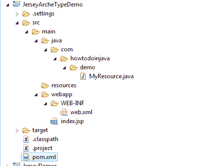

# 在 Eclipse 中导入 Maven 远程原型目录

> 原文： [https://howtodoinjava.com/eclipse/how-to-import-maven-remote-archetype-catalogs-in-eclipse/](https://howtodoinjava.com/eclipse/how-to-import-maven-remote-archetype-catalogs-in-eclipse/)

本教程为**在 Eclipse** 中导入 Maven 远程原型目录提供了简单的说明，以使您在配置项目时获得领先。 使用原型自动导入所有基本的运行时依赖项，并使用最基本的配置来配置项目，您可以在数分钟内直接将其直接用于构建 hello world 应用。

## 第 1 步：在 Eclipse 中打开 Maven 首选项

转到`Windows`->`Preferences`->`Maven`->`Archetypes`。

Eclipse 中的 Maven 原型选项

## 步骤 2：添加远程目录文件

单击添加远程目录按钮。 将目录文件填写为“`http://repo1.maven.org/maven2/archetype-catalog.xml`”和一些自定义描述。

填写原型网址和名称

单击确定按钮。 大功告成。

## 步骤 3：验证远程原型

为了验证您现在可以访问所有原型，请创建一个新的 maven 项目。

选择您创建的新的自定义目录。

Jersey 远程原型

第一次，将花费一些时间来收集所有原型。 您可以在 IDE 的右下角看到进度。 完成后，您应该可以看到原型。

填写项目的组 ID 和工件 ID。

填写组 ID 和工件 ID

单击确定以创建项目。 您将在工作区上看到已完成所有依赖关系和基本配置的新项目创建。

具有自动配置的新 Maven 项目

如果您在任何步骤中遇到任何问题，请随时向我提问。

**祝您学习愉快！**