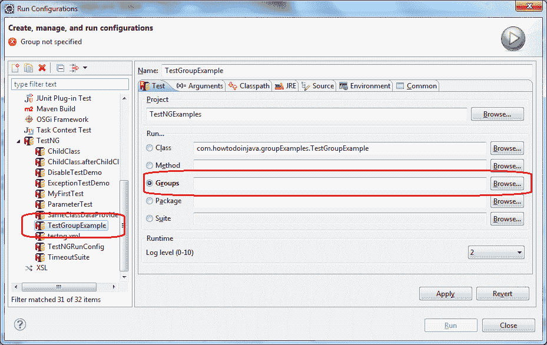
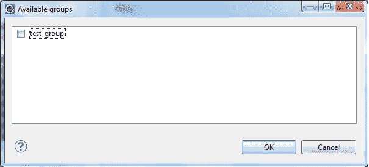

# TestNG – 测试组，元组，默认组示例

> 原文： [https://howtodoinjava.com/testng/testng-test-groups-meta-group-default-group-examples/](https://howtodoinjava.com/testng/testng-test-groups-meta-group-default-group-examples/)

**分组测试方法**是 TestNG 的最重要功能之一。 在 TestNG 中，用户可以将多种测试方法分组为一个命名组。 您还可以执行属于一个或多个组的一组特定的测试方法。 此功能允许将测试方法分为不同的部分或模块。 例如，您可以拥有一组属于健全性测试的测试，而其他测试则可能属于回归测试。 您还可以**根据测试方法验证的功能/特征**分离测试。 这有助于在需要时仅执行一组特定的测试。

在本教程中，我们将在以下步骤/部分中了解有关 TestNG 中测试分组的信息。

```java
Table of Contents

Grouping tests example
Running a TestNG group through Eclipse
Running a TestNG group through testng.xml
Writing tests which belong to multiple groups
Including and excluding groups
Using regular expressions
Default group
Group of groups

```

## 分组测试示例

让我们创建一个测试类，其中包含属于某个组的某些测试方法。

```java
package com.howtodoinjava.groupExamples;

import org.testng.annotations.Test;

public class TestGroupExample 
{
	@Test(groups = { "test-group" })
	public void testMethodOne() {
		System.out.println("Test method one belonging to group.");
	}

	@Test
	public void testMethodTwo() {
		System.out.println("Test method two not belonging to group.");
	}

	@Test(groups = { "test-group" })
	public void testMethodThree() {
		System.out.println("Test method three belonging to group.");
	}
}

```

如果您将在 eclipse 中正常运行上述测试，则​​测试执行将不考虑要执行的组，因此将执行指定测试类中的所有测试。 如果只想在某个特定组下执行方法，则将以以下两节中讨论的任一种方式执行它们。

## 通过 Eclipse 运行 TestNG 组

在前面的部分中，我们创建了一个测试类，其中包含属于测试组的某些测试方法。 现在，让我们使用 Eclipse 运行测试组。

1）**转到“运行 | 运行配置”**

2）**从可用配置列表中选择 TestNG，然后单击“新的配置”图标**。

3）在新的配置窗口中，**提供配置名称**，例如`TestGroupExample`。

4）转到项目部分，然后单击“浏览”按钮。 **选择先前创建的项目**，即`TestNGExamples`。



5）转到“分组”部分，然后单击“浏览”按钮。 **从列表中选择要执行的组**，在这种情况下为测试组。



6）**单击“应用”按钮，然后单击“运行”**。 以下结果将显示在 Eclipse 的 TestNG 的“结果”窗口中：

```java
Test method one belonging to group.
Test method three belonging to group.
PASSED: testMethodOne
PASSED: testMethodThree

===============================================
    GRP-test-group
    Tests run: 2, Failures: 0, Skips: 0
===============================================

```

恭喜，您已经使用 Eclipse 中的 TestNG 运行器配置成功执行了属于特定组的测试方法。 您还可以通过在“浏览”部分中选择相应的组来使用该实用程序执行多个组。 通常，最好使用基于 TestNG-XML 的执行来执行属于特定组的测试方法。

## 通过`testng.xml`运行 TestNG 组

现在让我们学习如何创建一个 testng XML 文件来执行属于特定组的测试方法。 **此方法是执行组的首选且简便的方法。 而且，这些 testng XML 文件然后可以与构建工具一起使用以执行 TestNG 测试套件。**

1）打开 Eclipse 并在先前创建的项目中创建一个名称为`testng.xml`的新文件。

2）在上述文件中添加以下代码：

```java
<suite name="Time test Suite" verbose="1">
  <test name="Group Test">
    <groups>
      <run>
        <include name="test-group" />
      </run>
    </groups>
    <classes>
      <class name="com.howtodoinjava.groupExamples.TestGroupExample" />
    </classes>
  </test>
</suite>

```

该 xml 文件在套件中仅包含一个测试。 它包含通过使用`groups`标记定义的`groups`部分，如代码所示。 运行标签表示需要运行的组。 `include`标记代表需要执行的组的名称。

3）选择先前创建的 testng XML 文件并将其作为 TestNG 套件运行。 您将看到以下测试结果：

```java
Test method one belonging to group.
Test method three belonging to group.

===============================================
Time test Suite
Total tests run: 2, Failures: 0, Skips: 0
===============================================

```

很棒。 我们成功创建了一个 testng XML 文件，该文件中包含一个组，从而在上述套件中创建了一个测试。 这是通过将上述组包含在运行部分中来完成的。 运行部分又是测试内部`groups`标签部分的一部分。 TestNG 将在测试的类部分中提到的类下查找属于该组的测试方法。 用户还可以提供测试包。 TestNG 将搜索添加到测试中的所有类，以包括或排除属于特定组的特定测试方法。 一旦找到，这些测试方法将由 TestNG 作为测试套件执行。

## 编写属于多个组的测试

之前我们了解了创建属于单个组的测试的方法，但是 TestNG 允许**测试方法也属于多个组**。 这可以通过在`@Test`注解的`groups`属性中以数组形式提供组名称来完成。 让我们创建一个包含多个小组的示例程序，以了解其操作方法。

```java
package com.howtodoinjava.groupExamples;

import org.testng.annotations.Test;

public class MultiGroupExample 
{
	@Test(groups = { "group-one" })
	public void testMethodOne() {
		System.out.println("Test method one belonging to group.");
	}

	@Test(groups = { "group-one", "group-two" })
	public void testMethodTwo() {
		System.out.println("Test method two belonging to both group.");
	}

	@Test(groups = { "group-two" })
	public void testMethodThree() {
		System.out.println("Test method three belonging to group.");
	}
}

```

上一类包含三种测试方法。 其中两种测试方法分别属于一组，其中一种方法属于两组，分别是第一组和第二组。

现在，编辑`testng.xml`文件，如下所示：

```java
<suite name="Multi Group Suite" verbose="1">
  <test name="Group Test one">
    <groups>
      <run>
        <include name="group-one" />
      </run>
    </groups>
    <classes>
      <class name="com.howtodoinjava.groupExamples.MultiGroupExample" />
    </classes>
  </test>
  <test name="Group Test two">
    <groups>
      <run>
        <include name="group-two" />
      </run>
    </groups>
    <classes>
      <class name="com.howtodoinjava.groupExamples.MultiGroupExample" />
    </classes>
  </test>
</suite>

```

前面的 testng XML 套件包含两个测试，每个测试都执行属于特定组的测试方法。 选择 testng XML 文件并将其作为 TestNG 套件运行。 您将看到以下测试结果：

```java
Test method one belonging to group.
Test method two belonging to both group.

Test method three belonging to group.
Test method two belonging to both group.

===============================================
Multi Group Suite
Total tests run: 4, Failures: 0, Skips: 0
===============================================

```

在这里，我们成功创建了一个测试方法，该方法属于多个组并且可以成功执行。 如您在先前的测试结果中看到的，在测试套件的两个测试中都执行了`testMethodTwo()`。 这是因为它属于两个由 TestNG 执行测试方法的组。

## 包括和排除组

TestNG 还允许您**从测试执行**中包括和排除某些组。 这有助于仅执行一组特定的测试，而排除某些测试。 一个简单的例子是某个功能损坏时，您需要从执行中排除一组固定的测试，因为这些测试将在执行时失败。 修复功能之后，您可以通过执行相应的测试组来验证功能。

让我们创建一个示例程序，并学习如何排除一组测试。

```java
package com.howtodoinjava.groupExamples;

import org.testng.annotations.Test;

public class ExcludeGroupTest 
{
	@Test(groups = { "include-group" })
	public void testMethodOne() {
		System.out.println("Test method one belonging to include group.");
	}

	@Test(groups = { "include-group" })
	public void testMethodTwo() {
		System.out.println("Test method two belonging to include group.");
	}

	@Test(groups = { "include-group", "exclude-group" })
	public void testMethodThree() {
		System.out.println("Test method three belonging to exclude/include groups.");
	}
}

```

上一类包含三种测试方法，这些方法在执行时将消息打印到控制台上。 这三种方法都属于组`include-group`，而`testMethodThree()`方法也属于组`exclude-group`。

```java
<suite name="Exclude Group Suite" verbose="1">
  <test name="Exclude Group Test">
    <groups>
      <run>
        <include name="include-group" />
        <exclude name="exclude-group" />
      </run>
    </groups>
    <classes>
      <class name="com.howtodoinjava.groupExamples.ExcludeGroupTest" />
    </classes>
  </test>
</suite>

```

现在在`testng.xml`文件上方运行，它将产生以下结果。

```java
Test method one belonging to include group.
Test method two belonging to include group.

===============================================
Exclude Group Suite
Total tests run: 2, Failures: 0, Skips: 0
===============================================

```

从先前的测试结果中可以看出，TestNG 执行了**组`include-group`中的两种方法**，并排除了属于**组`exclude-group`的第三种方法**，它从测试执行中排除。

如果测试方法既属于包含组又属于排除组，则排除组具有优先权，并且该测试方法将从测试执行中排除。

## 使用正则表达式

在将测试配置为包含或排除组时，TestNG 允许用户使用[**正则表达式**](//howtodoinjava.com/java-regular-expression-tutorials/ "Java Regular Expression Tutorial")。 这类似于包含和排除我们前面介绍的测试方法。 这可以帮助用户根据名称搜索包含和排除组。

让我们学习如何排除基于基于正则表达式的名称匹配的测试。

```java
package com.howtodoinjava.groupExamples;

import org.testng.annotations.Test;

public class RegularExpressionGroupTest
{
	@Test(groups = { "include-test-one" })
	public void testMethodOne() {
		System.out.println("Test method one");
	}

	@Test(groups = { "include-test-two" })
	public void testMethodTwo() {
		System.out.println("Test method two");
	}

	@Test(groups = { "test-one-exclude" })
	public void testMethodThree() {
		System.out.println("Test method three");
	}

	@Test(groups = { "test-two-exclude" })
	public void testMethodFour() {
		System.out.println("Test method Four");
	}
}

```

和`testng.xml`文件。

```java
<suite name="Regular Exp. Group Suite" verbose="1">
  <test name="Regular Exp. Test">
    <groups>
      <run>
        <include name="include.*" />
        <exclude name=".*exclude" />
      </run>
    </groups>
    <classes>
      <class name="com.howtodoinjava.groupExamples.RegularExpressionGroupTest" />
    </classes>
  </test>
</suite>

```

前面的 XML 包含一个简单的测试，其中包含名称以`include`开头的所有组，而名称以`exclude`结尾的所有组都从测试执行中排除。

现在运行`testng.xml`文件，您将在控制台中获得以下结果。

```java
Test method one
Test method two

===============================================
Regular Exp. Group Suite
Total tests run: 2, Failures: 0, Skips: 0
===============================================

```

在此，TestNG 执行了两个名称以`include`开头的组的方法，并排除了名称以`exclude`结尾的组的测试方法。

要使用正则表达式包含和排除组，必须使用`.*`来匹配名称。 通过在搜索字符串的开头和结尾使用表达式（例如，`.*name.*`），我们也可以将其用于搜索名称中包含某个字符串的组。

## 分配默认组

有时我们可能需要**将默认组**分配给属于一个类的一组测试方法。 这样，属于所述类的所有公共方法将自动成为 TestNG 测试方法，并成为所述组的一部分。

这可以通过在类级别使用`@Test`注解并在所述`@Test`注解中定义默认组来实现。

```java
@Test(groups={"default-group"})
public class DefaultGroup {
  public void testMethodOne(){
    System.out.println("Test method one.");
  }

  public void testMethodTwo(){
    System.out.println("Test method two.");
  }

  @Test(groups={"test-group"})
  public void testMethodThree(){
    System.out.println("Test method three.");
  }
}  

```

## 组中组或“元组”

TestNG 允许用户从现有组中创建组，然后在创建测试套件时使用它们。 **您可以通过包含和排除某些组来创建新组，然后使用它们。**

让我们创建一个示例测试程序，并学习如何创建称为**元组**的组中组。

```java
package com.howtodoinjava.groupExamples;

import org.testng.annotations.Test;

public class RegularExpressionGroupTest
{
	@Test(groups = { "include-test-one" })
	public void testMethodOne() {
		System.out.println("Test method one");
	}

	@Test(groups = { "include-test-two" })
	public void testMethodTwo() {
		System.out.println("Test method two");
	}

	@Test(groups = { "test-one-exclude" })
	public void testMethodThree() {
		System.out.println("Test method three");
	}

	@Test(groups = { "test-two-exclude" })
	public void testMethodFour() {
		System.out.println("Test method Four");
	}
}

```

现在创建`testng.xml`文件，如下所示：

```java
<suite name="Group of group Suite" verbose="1">
  <test name="Group of group Test">
    <groups>
      <define name="include-group">
        <include name="include-test-one" />
        <include name="include-test-two" />
      </define>
      <define name="exclude-group">
        <include name="test-one-exclude" />
        <include name="test-two-exclude" />
      </define>
      <run>
        <include name="include-group" />
        <exclude name="exclude-group" />
      </run>
    </groups>
    <classes>
      <class name="com.howtodoinjava.groupExamples.RegularExpressionGroupTest" />
    </classes>
  </test>
</suite>

```

这里在测试内部定义了两组，然后将这些组用于测试执行。 使用`groups`标签内的`define`标签创建元组。 使用`define`标签下的`name`属性定义新组的名称。 通过使用`include`和`exclude`标签从新组中排除组。

现在运行`testng.xml`测试，它将在控制台中产生以下结果：

```java
Test method one
Test method two

===============================================
Group of group Suite
Total tests run: 2, Failures: 0, Skips: 0
===============================================

```

在这里，testNG 仅执行两种方法，如在`include-group`组中提到的，并排除了属于`exclude-group`的测试方法。 您可以根据需要定义任意多个组。

此功能有助于为回归，健全性和模块测试创建特定的组。

这些都与 TestNG 中的测试组有关。 让我知道您是否有任何疑问。

学习愉快！